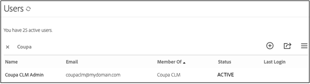

# [!DNL Coupa] Guida all’installazione{#coupa-installation-guide}

[**Contatta il supporto di Adobe Sign**](https://adobe.com/go/adobesign-support-center_it)

## Panoramica {#overview}

Questo documento spiega come configurare l’account Adobe Sign per l’integrazione [!DNL Coupa BSM Suite] per raccogliere firme.

Prerequisiti:

* Abbonamento ad Adobe Sign Enterprise, [Adobe Sign Developer Edition](https://www.adobe.com/sign/developer-form.html)o [Versione di prova di Adobe Sign Enterprise](https://www.adobe.com/sign/business.html)
* Accesso amministratore Adobe Sign
* [!DNL Coupa BSM Suite] Istanza standard o avanzata

I passaggi di alto livello per completare l&#39;integrazione sono:

* Configurare un gruppo Adobe Sign da utilizzare con [!DNL Coupa BSM Suite]
* Connetti [!DNL Coupa BSM Suite] ad Adobe Sign
* Creare un webhook di Adobe Sign per la notifica [!DNL Coupa BSM Suite] istanza

## Configurazione di Adobe Sign Group per [!DNL Coupa BSM Suite] {#configure-adobe-sign-for-coupa}

Possibilità di utilizzare Adobe Sign per [!DNL Coupa] all&#39;interno di un&#39;organizzazione, gli amministratori devono creare un gruppo Adobe Sign specifico per [!DNL Coupa BSM Suite] uso. Questo gruppo di Adobe Sign deve disporre di un unico account utente amministratore del gruppo che funge da account del servizio. Poiché questo account di servizio viene utilizzato per tutte le richieste di firma, deve essere mantenuto anonimo, ad esempio, `Legal@xyz.com`, `Purchasing@xyz.com`o `CoupaCLM@xyz.com`, anziché personali, ad esempio `Bob.Smith@xyz.com`.

### Creare un gruppo e un utente in Adobe Sign {#create-sign-user-group}

Per creare un utente in Adobe Sign:

1. Accedere ad Adobe Sign come amministratore dell&#39;account..
1. Passa a **[!UICONTROL Account]** > **[!UICONTROL Utenti]**.
1. Per creare un nuovo utente, fai clic sul pulsante  icona.
1. Nella finestra di dialogo visualizzata, fornisci i dettagli del nuovo utente:

   1. Fornisci un indirizzo e-mail funzionale a cui puoi accedere.

      * Questo utente stabilisce e mantiene la relazione OAuth.
      * L’indirizzo e-mail deve essere un indirizzo effettivo per la verifica.
   1. Immettere i valori appropriati per [!UICONTROL Nome] e [!UICONTROL Cognome].
   1. Nel [!UICONTROL Gruppo principale] , seleziona **[!UICONTROL Creare un nuovo gruppo per questo utente]**.
   1. Nel [!UICONTROL Nuovo nome gruppo] , specificare un nome di gruppo intuitivo, ad esempio *[!DNL Coupa BSM Suite]*.

   

1. Seleziona **[!UICONTROL Salva]**.

   Una volta salvati i dettagli, la proprietà [!UICONTROL Utenti] mostra il nuovo utente con un [!UICONTROL CREATO] stato.

   

   Il [!UICONTROL CREATO] indica che l’utente non ha ancora verificato il proprio indirizzo e-mail.

1. Per verificare l’indirizzo e-mail:
   1. Accedi all’e-mail del nuovo utente.
   2. Trova l’e-mail &quot;Benvenuti in Adobe Sign&quot;. Se necessario, controlla le cartelle spam/junk.
   3. Fai clic sull&#39;indicazione **[!UICONTROL Fai clic qui per impostare la tua password]**.
   4. Imposta la password..

   Una volta verificato l’indirizzo e-mail, lo stato dell’utente cambia da [!UICONTROL CREATO] a [!UICONTROL ATTIVO].

   

### Definire l’utente che esegue l’autenticazione {#define-authenticating-user}

Una volta creati un gruppo e un utente in tale gruppo, devi rendere l’utente un &quot;amministratore del gruppo&quot;.

Per promuovere il nuovo utente nel [!DNL Coupa BSM Suite] gruppo:

1. Passa al [!UICONTROL Utenti] (se non è già presente).
2. Fai doppio clic sull’utente.

   Si apre un [!UICONTROL Modifica] pagina delle autorizzazioni utente.

3. Nella sezione Iscrizione al gruppo, seleziona la proprietà **[!UICONTROL Amministratore del gruppo]** e **[!UICONTROL Può inviare]** opzioni.
4. Deseleziona la proprietà **[!UICONTROL L’utente è un amministratore dell’account]** e **[!UICONTROL L’utente può firmare i documenti]** opzioni.
5. Fai clic su **[!UICONTROL Salva]**.

   

## Configura il [!DNL Coupa BSM Suite] istanza {#configure-coupa}

Per completare la connessione tra [!DNL Coupa BSM Suite ] istanza e Adobe Sign, è necessario stabilire una relazione affidabile tra i servizi.

Per configurare la proprietà [!DNL Coupa BSM Suite]:

1. Collega il tuo [!DNL Coupa BSM Suite] all&#39;account del servizio Adobe Sign creato precedentemente.
1. Crea un’istanza webhook di Adobe Sign per notificare all’istanza di Coupa BSM Suite gli aggiornamenti agli accordi.

Per ulteriori dettagli su come collegare il [!DNL Coupa BSM Suite] e come creare e registrare un webhook, fai riferimento a [Documentazione di supporto dell&#39;istanza di Adobe Sign Coupa BSM Suite](https://success.coupa.com/Support/Docs/Power_Apps/CLM_Standard/Signing_and_Approvals/Enable_E-Signatures_Through_Adobe_Sign_and_DocuSign){target=&quot;_blank&quot;}.

## Crea [!DNL Webhook] in Adobe Sign {#create-webhook}

L’integrazione Coupa CLM utilizza le notifiche webhook di Adobe Sign per inviare aggiornamenti sullo stato dell’accordo. È fondamentale completare la configurazione del webhook, altrimenti gli accordi inviati per la firma rimangono incompleti o gli accordi firmati non vengono restituiti in Coupa CLM.

Per creare un webhook in Adobe Sign:

1. Accedi ad Adobe Sign utilizzando l’amministratore del gruppo creato sopra, ad esempio `coupaclm@MyDomain.com`.

1. Passa a **Gruppi** > **Webhook**.

   

1. Per creare una nuova connessione, seleziona  icona.

1. Nella finestra di dialogo Crea visualizzata, compila i campi obbligatori.

   **Nota:** È necessario ottenere l’URL del gestore webhook da Coupa.

   

1. Selezionate i parametri di notifica richiesti.

1. Seleziona **Salva**.

## Supporto {#support}

### [!DNL Coupa BSM Suite] supporto {#coupa-support}

[!DNL Coupa BSM Suite ] è il proprietario dell&#39;integrazione e deve essere il primo punto di contatto per le domande sull&#39;ambito dell&#39;integrazione, le richieste di funzioni o i problemi che si verificano giorno per giorno nell&#39;integrazione.

Per eventuali domande, contatta [Supporto Coupa](https://success.coupa.com/Support/Welcome_to_Coupa_Support){target=&quot;_blank&quot;}.

### Supporto Adobe Sign {#adobe-sign-support}

Adobe Sign è il partner di integrazione e deve essere contattato se l’integrazione non riesce a ottenere le firme o se la notifica delle firme in sospeso non riesce.

Per assistenza sull’utilizzo o la configurazione di Adobe Sign, contatta il Customer Success Manager (CSM) o contatta [Supporto Adobe Sign](https://adobe.com/go/adobesign-support-center).

Gli amministratori di Adobe Sign possono inoltre aprire i biglietti e ottenere assistenza tramite la Guida (?) in alto a destra nel portale di Adobe Sign.

