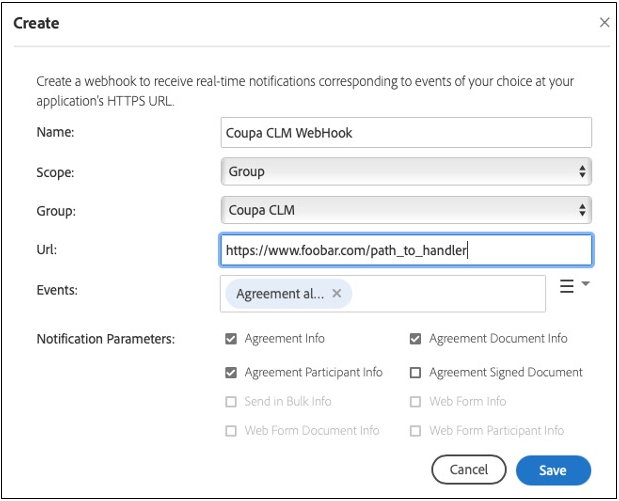

# [!DNL Coupa] Guida all’installazione{#coupa-installation-guide}

[**Contatta il supporto di Adobe Sign**](https://adobe.com/go/adobesign-support-center_it)

## Panoramica {#overview}

In questo documento viene illustrato come configurare l&#39;account Adobe Sign per l&#39;integrazione dell&#39;istanza [!DNL Coupa BSM Suite] per il recupero delle firme.

Prerequisiti:

* Sottoscrizione a Adobe Sign Enterprise, [Adobe Sign Developer Edition](https://www.adobe.com/sign/developer-form.html) o [Adobe Sign Enterprise Trial](https://www.adobe.com/sign/business.html)
* Accesso amministratore di Adobe Sign
* [!DNL Coupa BSM Suite] Istanza standard o avanzata

Le fasi di alto livello per completare l&#39;integrazione sono:

* Configurare un gruppo di segni Adobe per l&#39;utilizzo con [!DNL Coupa BSM Suite]
* Connetti [!DNL Coupa BSM Suite] a Adobe Sign
* Creare un webhook di Adobe Sign per la notifica dell&#39;istanza [!DNL Coupa BSM Suite]

## Configura Adobe Sign Group per [!DNL Coupa BSM Suite] {#configure-adobe-sign-for-coupa}

Per utilizzare Adobe Sign per [!DNL Coupa] in un&#39;organizzazione, gli amministratori devono creare un gruppo Adobe Sign specificatamente per l&#39;utilizzo [!DNL Coupa BSM Suite]. Questo gruppo di Adobe Sign deve avere un singolo account utente amministratore di gruppo che funge da account di servizio. Poiché questo account del servizio viene utilizzato per tutte le richieste di firma, deve essere mantenuto anonimo, ad esempio `Legal@xyz.com`, `Purchasing@xyz.com` o `CoupaCLM@xyz.com`, anziché personale, ad esempio `Bob.Smith@xyz.com`.

### Creare un gruppo e un utente in Adobe Sign {#create-sign-user-group}

Per creare un utente in Adobe Sign:

1. Accedere ad Adobe Sign come amministratore dell&#39;account..
1. Passare a **[!UICONTROL Account]** > **[!UICONTROL Utenti]**.
1. Per creare un nuovo utente, fare clic sull&#39;icona .
1. Nella finestra di dialogo visualizzata, fornire i dettagli del nuovo utente:

   1. Fornire un&#39;e-mail funzionale a cui è possibile accedere.

      * Questo utente stabilisce e mantiene la relazione OAuth.
      * L&#39;indirizzo di posta elettronica deve essere un indirizzo effettivo per la verifica.
   1. Immettere i valori appropriati per [!UICONTROL Nome] e [!UICONTROL Cognome].
   1. Nel campo [!UICONTROL Gruppo primario], selezionare **[!UICONTROL Crea un nuovo gruppo per l&#39;utente]**.
   1. Nel campo [!UICONTROL Nuovo nome gruppo], specificare un nome di gruppo intuitivo come *[!DNL Coupa BSM Suite]*.

   

1. Selezionare **[!UICONTROL Salva]**.

   Una volta salvati i dettagli, la pagina [!UICONTROL Utenti] mostra il nuovo utente con uno stato [!UICONTROL CREATED].

   

   Lo stato [!UICONTROL CREATED] indica che l&#39;utente non ha ancora verificato l&#39;indirizzo di posta elettronica.

1. Per verificare l&#39;indirizzo e-mail:
   1. Accedere all&#39;e-mail del nuovo utente.
   2. Trova l&#39;e-mail &quot;Benvenuto in Adobe Sign&quot;. Se necessario, controllare le cartelle Posta indesiderata/Posta indesiderata.
   3. Fai clic sull&#39;indicazione **[!UICONTROL Fai clic qui per impostare la tua password]**.
   4. Imposta la password..

   Una volta verificato l&#39;indirizzo di posta elettronica, lo stato dell&#39;utente passa da [!UICONTROL CREATED] a [!UICONTROL ACTIVE].

   

### Definire l&#39;utente che esegue l&#39;autenticazione {#define-authenticating-user}

Una volta creato un gruppo e un utente in tale gruppo, è necessario fare dell&#39;utente un &#39;Amministratore gruppo&#39;.

Per promuovere il nuovo utente nel gruppo [!DNL Coupa BSM Suite]:

1. Passare alla pagina [!UICONTROL Utenti] (se non è già presente).
2. Fare doppio clic sull&#39;utente.

   Apre una pagina [!UICONTROL Modifica] per le autorizzazioni utente.

3. Nella sezione Appartenenza al gruppo selezionare le opzioni **[!UICONTROL Amministratore gruppo]** e **[!UICONTROL Invia]**.
4. Deselezionare le opzioni **[!UICONTROL Utente è un amministratore di account]** e **[!UICONTROL L&#39;utente può firmare documenti]**.
5. Fai clic su **[!UICONTROL Salva]**.

   

## Configurare l&#39;istanza [!DNL Coupa BSM Suite] {#configure-coupa}

Per completare la connessione tra l&#39;istanza [!DNL Coupa BSM Suite ] e Adobe Sign, è necessario stabilire una relazione attendibile tra i servizi.

Per configurare [!DNL Coupa BSM Suite]:

1. Collegare l&#39;istanza [!DNL Coupa BSM Suite] al proprio account del servizio Adobe Sign creato in precedenza.
1. Creare un&#39;istanza del webhook di Adobe Sign per notificare all&#39;istanza di Coupa BSM Suite gli aggiornamenti ai contratti.

Per ulteriori informazioni su come connettere l&#39;oggetto [!DNL Coupa BSM Suite] e su come creare e registrare webhook, fare riferimento a [Adobe Sign Coupa BSM Suite Instance Support Documentation](https://success.coupa.com/Support/Docs/Power_Apps/CLM_Standard/Signing_and_Approvals/Enable_E-Signatures_Through_Adobe_Sign_and_DocuSign){target=&quot;_blank&quot;}.

## Crea [!DNL Webhook] in Adobe Sign {#create-webhook}

L&#39;integrazione Coupa CLM utilizza le notifiche webhook di Adobe Sign per inviare aggiornamenti sullo stato del contratto. È fondamentale completare l&#39;impostazione del webhook altrimenti gli accordi inviati per la firma rimangono incompleti o gli accordi firmati non vengono restituiti a Coupa CLM.

Per creare webhook in Adobe Sign:

1. Accedere ad Adobe Sign utilizzando l&#39;utente amministratore di gruppo creato sopra, ad esempio `coupaclm@MyDomain.com`.

1. Passare a **Gruppi** > **Webhooks**.

   

1. Per creare una nuova connessione, selezionare l&#39;icona .

1. Nella finestra di dialogo Crea che viene aperta, inserire i campi obbligatori.

   **Nota:** È necessario ottenere l&#39;URL per il gestore webhook da Coupa.

   

1. Selezionare i parametri di notifica obbligatori.

1. Selezionare **Salva**.

## Supporto {#support}

### [!DNL Coupa BSM Suite] sostegno {#coupa-support}

[!DNL Coupa BSM Suite ] è il proprietario dell&#39;integrazione e deve essere il primo punto di contatto per le domande sulla portata dell&#39;integrazione, sulle richieste di funzionalità o sui problemi nella funzione quotidiana dell&#39;integrazione.

Per qualsiasi query, contattare [Supporto Coupa](https://success.coupa.com/Support/Welcome_to_Coupa_Support){target=&quot;_blank&quot;}.

### Supporto di Adobe Sign {#adobe-sign-support}

Adobe Sign è il partner di integrazione e deve essere contattato se l&#39;integrazione non riesce a ottenere firme o se la notifica delle firme in sospeso non riesce.

Per informazioni sull&#39;utilizzo o la configurazione di Adobe Sign, è possibile contattare il Customer Success Manager (CSM) o contattare il supporto [Adobe Sign](https://adobe.com/go/adobesign-support-center).

Gli amministratori di Adobe Sign possono anche aprire i biglietti e ottenere il supporto tramite la Guida (?) in alto a destra del portale Adobe Sign.

