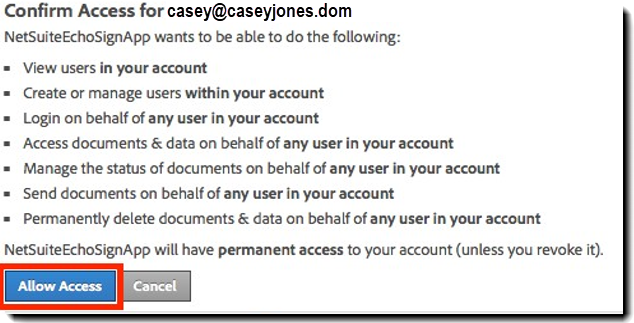
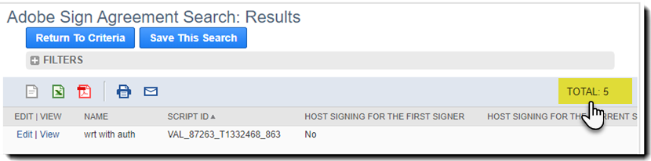
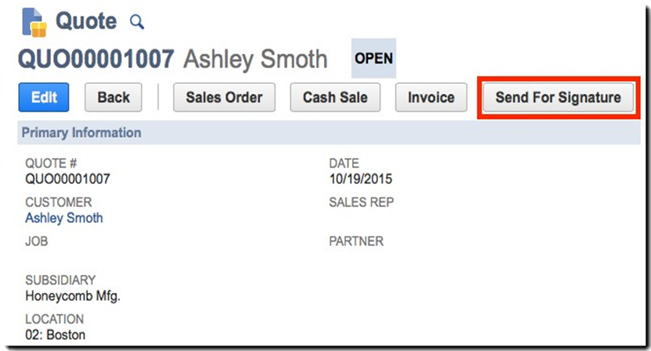
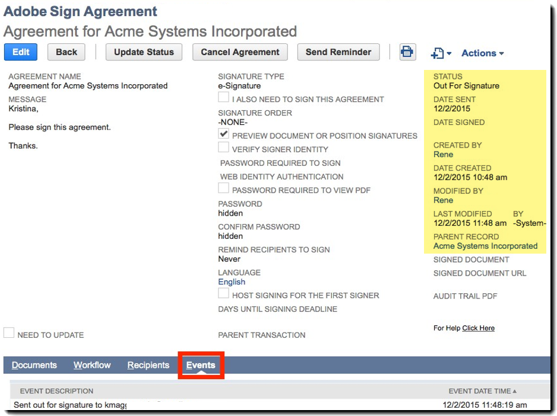

# [!DNL NetSuite] Guida all&#39;installazione e alla personalizzazione (v4.0.4) {#install-customize-NetSuite}

## Panoramica {#overview}

Adobe Sign for [!DNL NetSuite] fornisce un&#39;integrazione completa eSignature con [!DNL NetSuite]. È possibile utilizzare Adobe Sign per l&#39;integrazione [!DNL NetSuite] per inviare contratti, preventivi e altri documenti che richiedono firme elettroniche ai destinatari direttamente da [!DNL NetSuite]. È possibile creare e inviare contratti Adobe Sign da clienti, lead, preventivi e altri record [!DNL NetSuite]. Adobe Sign aggiorna [!DNL NetSuite] con lo stato dei contratti e memorizza i contratti con i record [!DNL NetSuite] associati una volta eseguiti completamente. È possibile visualizzare la cronologia di tutti i contratti inviati da [!DNL NetSuite] dal prodotto.

Per ulteriori informazioni, consultare il [Adobe Sign for [!DNL NetSuite] release notes](https://experienceleague.adobe.com/docs/sign-integrations/using/netsuite/release-notes.html?lang=en).

## Installare il bundle e configurare OAuth {#install}

Solo un amministratore [!DNL NetSuite] può installare o aggiornare il bundle. Per configurare OAuth, l&#39;amministratore [!DNL NetSuite] deve disporre dell&#39;accesso Admin a Adobe Sign. Prima di installare il bundle nell&#39;account di produzione, è necessario installare e testare il bundle in un account sandbox [!DNL NetSuite].

Per ulteriori informazioni sui test, vedere [Creare un accordo di Adobe Sign](#createagreement).

>[!CAUTION]
>
>I clienti che eseguono l&#39;aggiornamento a v4.0.4 NON devono rimuovere la chiave API esistente.
>
>Per ulteriori informazioni sull&#39;utilizzo della chiave API, vedere [Impostare le preferenze personalizzate](#configure).

### Installa il bundle per la prima volta

1. Passare a [!UICONTROL **Personalizzazione > SuiteBundler > Cerca e installa bundle**].

1. Nella pagina *Cerca e installa bundle*, immettere **Adobe Sign** come parola chiave e selezionare **[!UICONTROL Cerca]**.

1. Selezionare il nome del bundle **Adobe Sign**.

   

1. Nella pagina *[!UICONTROL Dettagli bundle]* selezionare **[!UICONTROL Installa]**.
1. Nella pagina *[!UICONTROL Anteprima installazione bundle]* selezionare **[!UICONTROL Installa bundle]**.

   (Non è necessario modificare i valori predefiniti nella pagina)

   

1. Nella finestra di dialogo Installa visualizzata, selezionare **[!UICONTROL OK]** per continuare.

   Durante il processo di installazione, lo stato del bundle viene visualizzato come *[!UICONTROL In sospeso]*.

   

1. Per visualizzare uno stato aggiornato, selezionare **[!UICONTROL Aggiorna]**.

   Al termine dell&#39;installazione del bundle, *Adobe Sign for[!DNL NetSuite]* viene visualizzato nella pagina *[!UICONTROL Installed Bundles]*.

   

1. Se sei già un account cliente di Adobe Sign, segui la procedura [Configura OAuth dopo l&#39;installazione o l&#39;aggiornamento](#oauth).

   Se non si dispone di un account Adobe Sign, è possibile [iscriversi a un account enterprise trial](https://esign.adobe.com/adobe-sign-[!DNL NetSuite]-trial-Registration.html) per verificare il sistema. Seguire i passaggi di registrazione online per attivare l&#39;account Adobe Sign.

## Configurare OAuth dopo l&#39;installazione o l&#39;aggiornamento {#oauth}

Adobe Sign utilizza OAuth 2.0 per autenticare l&#39;account Adobe Sign all&#39;interno di [!DNL NetSuite].

Questo protocollo autorizza il bundle [!DNL NetSuite] installato a comunicare con Adobe Sign senza richiedere la password. Poiché le informazioni riservate non vengono condivise direttamente tra le applicazioni, la probabilità che il tuo account venga compromesso è più bassa.

L&#39;autenticazione non influisce sull&#39;implementazione, ma è necessario eseguire una configurazione unica dopo l&#39;installazione o l&#39;aggiornamento del bundle nell&#39;account Production o Sandbox.

L&#39;amministratore [!DNL NetSuite] che configura OAuth deve inoltre disporre di un accesso amministrativo a livello di account a Adobe Sign.

1. In [!DNL NetSuite], passare alla pagina di elenco *Adobe Sign Config*.

1. Cercare **[!UICONTROL Adobe Sign Config]** (un tipo di record personalizzato) utilizzando il campo Search nell&#39;intestazione.

1. Nella pagina Risultati ricerca selezionare **Visualizza** per il record *Adobe Sign Config*.

   .

1. Nella pagina Elenco di configurazione dei segni di Adobe, selezionare **[!UICONTROL Visualizza]** per il record *Uso di OAuth per accedere alle API dei segni di Adobe*.

   

1. Nella pagina Adobe Sign Config, selezionare **[!UICONTROL Accesso con Adobe Sign]**

   

1. Nella pagina di accesso di Adobe Sign visualizzata, immettere le credenziali e selezionare **[!UICONTROL Accedi]**.

   

1. Nella pagina Conferma accesso (per OAuth) visualizzata, selezionare **[!UICONTROL Consenti accesso]**

   

1. Una volta completata l&#39;autorizzazione, viene reindirizzato alla pagina Adobe Sign Config in [!DNL NetSuite], come illustrato di seguito.

   

   >[!NOTE]
   >
   >Quando si configura OAuth nel proprio account Sandbox, è possibile che si verifichi l&#39;errore &quot;Impossibile determinare l&#39;ID di composizione cliente&quot; al termine dell&#39;autorizzazione.
   >
   >
   >Per continuare, è necessario modificare la parte relativa al dominio account dell&#39;URL (sistema.[!DNL NetSuite].com) nel browser per tornare alla  [!DNL NetSuite] sandbox come segue:
   >
   >
   >Cambia:
   >
   >
   >sistema.[!DNL NetSuite].com/app/site/hosting/scriptlet.nl?script=745&amp;deploy=1&amp;web_access_point=https://echosign.com
   >
   >
   >A:
   >
   >
   >sistema.**sandbox.**[!DNL NetSuite].com/app/site/hosting/scriptlet.nl?script=745&amp;deploy=1&amp;web_access_point=https://echosign.com

## Aggiorna il bundle (utenti esistenti)

[!DNL NetSuite] Gli aggiornamenti dei pacchetti vengono pubblicati regolarmente da Adobe. Gli utenti esistenti di Adobe Sign per l&#39;integrazione [!DNL NetSuite] possono aggiornarsi all&#39;ultimo bundle.

>[!CAUTION]
>
>I clienti che eseguono l&#39;aggiornamento a una versione più recente NON devono rimuovere la chiave API esistente.
>
>Per ulteriori informazioni sull&#39;utilizzo della chiave API, vedere [Impostazione delle preferenze personalizzate](#configure).

### Prerequisiti {#prerequisites}

Il tempo necessario per l&#39;aggiornamento al bundle v4.0.4 dipende dal numero di contratti che hanno attualmente lo stato &#39;Out for Signature&#39;. Di solito ci vogliono 7 - 10 minuti per aggiornare 100 accordi. Nota il numero di record per stimare il tempo di aggiornamento.

Per determinare il numero di accordi in uscita per la firma:

1. Passare a **[!UICONTROL Personalizzazione > Elenchi, record e file > Tipi di record]**, quindi individuare *Contratto firma Adobe.*

   In alternativa, cercare Adobe Sign Agreements nella barra di ricerca.

1. Per il record [!UICONTROL Contratti segno Adobe], selezionare **[!UICONTROL Cerca]**.

   

1. Dall&#39;elenco a discesa **[!UICONTROL Stato]**, selezionare **[!UICONTROL Esci per Firma]** e quindi selezionare **[!UICONTROL Invia]**.

   

   Nota il numero di record per stimare il tempo di aggiornamento.

   

### Aggiorna il bundle {#updating-the-bundle}

1. Passare a **[!UICONTROL Personalizzazione > SuiteBundler > Ricerca e installazione > Elenco]** e individuare il bundle corrente, come illustrato di seguito.

   >[!NOTE]
   >
   >Se esiste una nuova versione del bundle, viene visualizzata un&#39;icona del punto esclamativo a destra del numero *Versione* del bundle corrente.

1. Dal menu a discesa Azione, selezionare **[!UICONTROL Aggiorna]**.

   

1. Nella pagina Aggiornamento bundle anteprima, selezionare **[!UICONTROL Aggiorna bundle]** senza modificare i valori predefiniti visualizzati nella pagina.

   Durante l&#39;installazione, lo stato del bundle viene visualizzato come *In sospeso*.

    bundle.

   >[!NOTE]
   >
   >Quando si aggiorna il bundle, è possibile ricevere un messaggio di avviso come mostrato di seguito. Se i record [!DNL NetSuite] eSignature non sono stati personalizzati, è possibile continuare. Se non si è sicuri, è consigliabile installare il bundle in un account sandbox per verificarlo prima di aggiornare il bundle in un account di produzione.

   

1. Per visualizzare uno stato aggiornato, selezionare **[!UICONTROL Aggiorna]**.

   

   >[!NOTE]
   >
   >Se l&#39;aggiornamento richiede molto tempo a causa di diversi accordi con stato *Out per la firma*, è possibile controllare la scheda secondaria **[!UICONTROL Log di esecuzione]** per lo script *Installazione bundle di Adobe Sign* per determinare lo stato di avanzamento dell&#39;aggiornamento. Per ulteriori informazioni, vedere [Determinazione dello stato di avanzamento dell&#39;aggiornamento](#determineprogress).

   Al termine dell&#39;aggiornamento del bundle, *Adobe Sign for[!DNL NetSuite]* viene visualizzato nella pagina *Installed Bundles*.

   

## Configurare il bundle {#configure}

### Imposta preferenze personalizzate  {#set-custom-preferences}

È possibile utilizzare le preferenze personalizzate per specificare la modalità di creazione e archiviazione dei contratti in [!DNL NetSuite]. Inoltre, la preferenza *Auto Provisioning User in Adobe Sign* consente di specificare se gli utenti [!DNL NetSuite] vengono automaticamente forniti nei servizi Sign quando inviano accordi da [!DNL NetSuite].

1. Passare a **[!UICONTROL Imposta > Società > Preferenze generali]**.
1. Scorrere verso il basso la pagina, quindi selezionare la scheda secondaria **[!UICONTROL Preferenze personalizzate]**.

   

1. Abilitare e configurare le preferenze di Adobe Sign in base alle esigenze:

   * **Immettere la chiave API EchoSign per l&#39;account**: Non aggiungere o modificare alcun valore in questo campo.
   * **Usa contatto record padre come firmatario**: Se abilitato, il contatto record padre viene impostato come primo firmatario quando vengono creati accordi. Il mittente può rimuovere o modificare facilmente il firmatario predefinito o aggiungere altri sottoscrittori al contratto prima dell&#39;invio.
   * **Utilizza Trans. Contatto come firmatario se presente**: Questa preferenza è valida solo se è abilitata anche la preferenza *Usa contatto record padre come firmatario*. Se abilitata, quando si genera un contratto da un record transazione (ad esempio, Preventivo), il contatto transazione principale viene impostato come primo firmatario. Per ulteriori informazioni, vedere [Record transazione](#transrecords). Se non è presente alcun contatto principale per la transazione o se si invia da un record di oggetti [!DNL NetSuite] (ad esempio, record cliente, record partner), il destinatario predefinito è il contatto principale per la posta elettronica del cliente. Il mittente può rimuovere o modificare facilmente il firmatario predefinito o aggiungere altri sottoscrittori al contratto prima dell&#39;invio.
   * **Consenti contrassegni destinatari come approvatori**: Se abilitato, i mittenti possono contrassegnare i destinatari come approvatori. I destinatari contrassegnati come approvatori possono rivedere e approvare gli accordi, ma non sono tenuti a firmarli. Gli approvatori possono essere tenuti a inserire dati nei campi durante il processo di approvazione.
   * **ID** cartella contratto preferito: Consente di specificare la cartella in cui sono archiviati i contratti firmati finali. Se non si imposta un valore per questo campo, i contratti firmati finali vengono salvati nella stessa cartella del file di documento originale per impostazione predefinita. L&#39;ID cartella deve essere un numero.
   * **PDF** transazione collegamento automatico: Se abilitata, i PDF delle transazioni vengono automaticamente associati ai contratti quando vengono creati nuovi contratti dai record delle transazioni.
   * **Aggiungi PDF firmato come (allegato o collegamento)**: Se  ** Liste è selezionato dall&#39;elenco a discesa, il PDF firmato viene aggiunto automaticamente come collegamento al file. Se *Attachment* è selezionato dall&#39;elenco a discesa, il PDF firmato viene memorizzato in [!DNL NetSuite] come allegato nel record del contratto.
   * **Includi PDF traccia di controllo con contratto**: Se abilitata, i file PDF di audit trail vengono automaticamente allegati ai record del contratto dopo la firma dei contratti.
   * **Metodo di verifica dell&#39;identità applicabile**: L&#39;abilitazione di uno qualsiasi dei metodi di verifica dell&#39;identità determina a chi viene applicato il metodo di verifica dell&#39;identificazione. Le opzioni sono *Tutti i segnali, Solo segnali esterni* o *Solo segnali interni*.

   **Metodi di verifica dell&#39;identità** {#identity-verification-methods}

   È possibile selezionare i metodi di verifica dell&#39;identità abilitati durante la creazione di un contratto. Se qui è abilitato più di un metodo di verifica dell&#39;identità, nella pagina Adobe Sign Agreement viene visualizzata l&#39;opzione **[!UICONTROL Verifica identità firmataria]**.

   * **Attiva password richiesta per la firma**: Richiedi ai firmatari di immettere una password unica specificata.

   * **Abilita autenticazione** basata su conoscenze: Richiedere ai firmatari di fornire il proprio nome, indirizzo e facoltativamente le ultime quattro cifre del proprio SSN, quindi rispondere a un elenco di domande per verificare le informazioni fornite. Disponibile solo negli Stati Uniti.

   * **Abilita autenticazione** identità Web: Richiedere ai firmatari di verificare la propria identità accedendo a uno dei seguenti siti: Facebook, Google, LinkedIn, Microsoft Live, Twitter o Yahoo!

   * **Provisioning automatico utente in Adobe Sign**: Se abilitato, gli utenti che inviano contratti in  [!DNL NetSuite] vengono automaticamente automaticamente dotati di un account utente Adobe Sign.

1. Selezionare **[!UICONTROL Salva]** per salvare le preferenze.

## Configura aggiornamenti di stato automatici {#asu}

Il bundle di integrazione di Adobe Sign consente di ricevere automaticamente aggiornamenti in [!DNL NetSuite] sullo stato dei contratti inviati da [!DNL NetSuite]. Quando questa funzionalità è abilitata, [!DNL NetSuite] riflette sempre lo stato dei contratti. È possibile attivare gli aggiornamenti di stato automatici come segue:

1. Passare a **[!UICONTROL Imposta > Società > Attiva funzionalità].**
1. Selezionare la scheda secondaria **[!UICONTROL SuiteCloud]**.
1. Abilitare le opzioni seguenti:

   * Nella sezione SuiteBuilder abilitare l&#39;opzione **[!UICONTROL Record personalizzati]**.

   * Nella sezione SuiteScript, abilitare le opzioni **[!UICONTROL Client SuiteScript]** e **[!UICONTROL Server SuiteScript]** e accettare i termini del servizio per entrambi.

1. Selezionare **[!UICONTROL Salva]**.

   Le opzioni sono impostate come mostrato nell&#39;immagine.

   

## Oggetti e tipi di record {#objects}

Il bundle di integrazione di Adobe Sign espone già l&#39;oggetto Adobe Sign Agreement con molti oggetti standard [!DNL NetSuite], tra cui: Record relativi a clienti, stime, lead, opportunità e partner. Potete utilizzare il bundle Adobe Sign anche con altri tipi di record, inclusi record personalizzati.

La scheda Contratto può essere visualizzata con due tipi di record [!DNL NetSuite]: Record di entità e transazione. In genere si suppone che un record di transazione sia un record (ad esempio un preventivo) che può essere convertito in un documento PDF. mentre un record Entità non può essere convertito in PDF.

## Record transazione {#transrecords}

Se il contratto viene creato da un record Transazione, il primo documento nel record del contratto è la versione PDF del record da cui proviene e il primo destinatario è l&#39;indirizzo di posta elettronica del record. Se non si desidera che il primo documento sia una versione PDF del record da cui proviene, andare a **[!UICONTROL Imposta > Società > Preferenze generali > scheda secondaria Preferenze personalizzate]** e disattivare l&#39;opzione **[!UICONTROL Collegamento automatico PDF transazione]**. Per ulteriori informazioni, vedere [Impostazione delle preferenze personalizzate](#configure).

In Preferenze personalizzate è inoltre possibile attivare **[!UICONTROL Usa transazione. Contatta come preferenza Primo firmatario]** se si desidera che il contatto della transazione primaria venga aggiunto automaticamente come primo firmatario. Se associato a un record di transazione, visualizza i tasti **[!UICONTROL Contratti]** e **[!UICONTROL Invia per firma]**.

## Record entità {#entity-records}

Se il contratto viene creato da un record Entità, il primo destinatario è l&#39;indirizzo di posta elettronica del record. Se associato a un record Entità, viene visualizzata solo la scheda Contratti.

## Personalizzare l&#39;aggregazione {#customize}

La personalizzazione del bundle include quanto segue:

* Distribuzione degli script per la scheda secondaria Contratti e il pulsante Invia per firma per i tipi di record appropriati.
* Impostazione delle autorizzazioni per il ruolo per i tipi di record di Adobe Sign.
* Modifica delle autorizzazioni per concedere l&#39;accesso alla scheda secondaria *Accordi* e al pulsante *Invia per firma*.

### Configura accordi Adobe Sign per altri tipi di record  {#configuring-adobe-sign-agreements-for-additional-record-types}

Per distribuire la scheda secondaria *Contratti* e il pulsante *Invia per firma* per i tipi di record appropriati:

1. Passare a **[!UICONTROL Personalizzazione > Script > Script].**

1. Nella pagina di elenco *Script* visualizzata individuare lo script da distribuire, quindi selezionare ****[!UICONTROL Visualizza]****.

   * Per aggiungere il pulsante *Invia per firma*, selezionare lo script **[!UICONTROL Pulsante stima segno Adobe]**.

   * Per aggiungere la scheda *Contratti*, selezionare **[!UICONTROL Caricatore accordo di Adobe Sign]**.

1. Nella pagina Script selezionare **[!UICONTROL Distribuisci script]**.

   

1. Nella pagina Distribuzione script eseguire le operazioni seguenti:

   * Dall&#39;elenco *Si applica a*, selezionare il tipo di record.
   * È possibile inserire l&#39;ID distribuzione script.

      Per ulteriori informazioni, consultare l&#39;argomento *Creazione di un ID distribuzione script personalizzato* nell&#39;Help Center [!DNL NetSuite]. Se non si immette un ID, ne viene generato uno.

   * Selezionare la casella di controllo **[!UICONTROL Distribuito]**.

   

   * Impostare *Stato* su **[!UICONTROL Rilasciato]**.

      Non è necessario specificare un *Tipo di evento* o *Livello log*.

   * Dall&#39;elenco a discesa [!UICONTROL *Esegui come ruolo]*, selezionare **[!UICONTROL Esegui come amministratore]**.

   * Con la scheda secondaria **[!UICONTROL Audience]** attiva (attiva per impostazione predefinita), selezionare i ruoli specifici o gli utenti a cui si desidera concedere l&#39;accesso. Se si desidera concedere l&#39;accesso a tutti i ruoli e utenti, abilitare le rispettive opzioni **[!UICONTROL Seleziona tutte]**.

   * Selezionare **[!UICONTROL Salva]**. Quando viene visualizzata la conferma della modifica, selezionare **[!UICONTROL Vai indietro]**.

1. selezionare **[!UICONTROL Elenco]** nella parte superiore della pagina Distribuzione script per tornare alla pagina di elenco *Script*.
1. Ripetere i passaggi 2 e 3 per l&#39;altro script.

## Impostazione delle autorizzazioni per i ruoli per i tipi di record di Adobe Sign {#setting-role-permissions-for-adobe-sign-record-types}

La maggior parte dei ruoli [!DNL NetSuite] deve disporre dell&#39;autorizzazione per utilizzare Adobe Sign senza ulteriori personalizzazioni. È tuttavia possibile concedere autorizzazioni per qualsiasi altro ruolo personalizzato creato.

1. Passare a **[!UICONTROL Personalizzazione > Elenchi, record e file > Tipi di record]**.

   

   >[!NOTE]
   >
   >Se l&#39;elemento *Tipi di record* non viene visualizzato, passare a **[!UICONTROL Imposta > Società > Attiva funzionalità > scheda Cloud Suite]** e attivare l&#39;opzione *Record personalizzati*.

1. Nella pagina *Tipi di record*, selezionare **[!UICONTROL Accordo di firma Adobe]** per selezionarlo

   

1. Nella pagina *Tipo di record personalizzato* selezionare **[!UICONTROL Usa elenco autorizzazioni]** dall&#39;elenco a discesa *Tipo di accesso*.

   

   >[!NOTE]
   >
   >Il tipo di record *Adobe Sign Agreement* è l&#39;unico tipo di record Adobe Sign che ha richiesto il tipo di accesso *Utilizza elenco autorizzazioni*.
   >
   >
   >Per istruzioni sull&#39;impostazione del tipo di accesso per gli altri tipi di record di Adobe Sign, vedere il punto 6.

1. Selezionare la scheda secondaria **[!UICONTROL Autorizzazioni]**.

   Viene visualizzato l&#39;elenco dei ruoli e delle autorizzazioni.

   

1. Impostare le autorizzazioni come segue per i ruoli personalizzati aggiuntivi aggiunti al tipo di record &quot;[!UICONTROL Adobe Sign Agreement]&quot;.

   >[!NOTE]
   >
   >Vedere *[Impostazione di un elenco autorizzazioni per un tipo di record personalizzato](https://system).[!DNL NetSuite].com/app/help/helpcenter.nl?fid=section_N2879931.html)* argomento nell&#39; [!DNL NetSuite] Help Center per ulteriori informazioni

   1. Selezionare il ruolo dall&#39;elenco *Ruolo*.
   1. Impostare *Level* su **[!UICONTROL Full]**.
   1. Impostare *Modulo predefinito* su **[!UICONTROL Modulo contratto EchoSign personalizzato]**.
   1. Selezionare la casella di controllo **[!UICONTROL Limita modulo]**.
   1. Selezionare **[!UICONTROL Aggiungi]** per salvare le modifiche per la riga del ruolo.

   

   La nuova riga viene visualizzata come illustrato di seguito:

   

   Ripetere i passaggi da a a e sopra per tutti i ruoli personalizzati aggiuntivi.

   * selezionare **[!UICONTROL Salva]** nella pagina *Tipo di record personalizzato* quando sono state impostate le autorizzazioni per tutti i ruoli.
   Viene visualizzata nuovamente la pagina *[!UICONTROL Tipo di record cliente]*.

1. Ripetere i passaggi da 1 a 3 per impostare il *Tipo di accesso* per tutti gli altri tipi di record di Adobe Sign su

   **[!UICONTROL Nessuna autorizzazione richiesta].** Ciò si applica ai seguenti tipi di record:

   * Configurazione di Adobe Sign
   * Documento Adobe Sign
   * Evento Adobe Sign
   * Lingua dei segni Adobe
   * Errori script segni Adobe
   * Contratto firmato con Adobe Sign
   * Firmatario Adobe

### Concedere l&#39;accesso alla scheda Contratto e al pulsante Invia per firma  {#granting-access-to-the-agreement-tab-and-send-for-signature-button}

Il bundle di integrazione di Adobe Sign espone già l&#39;oggetto Adobe Sign Agreement con molti oggetti standard [!DNL NetSuite] (Cliente, Stima [Preventivo], Lead e altro). La scheda secondaria *Contratto* è abilitata automaticamente per i seguenti tipi di oggetti: Cliente, Lead, Opportunità, Partner, Prospetto, Preventivo e Fattura fornitore.

Il pulsante *[!UICONTROL Invia per firma]* è attivato automaticamente **o[!UICONTROL solo per l&#39;oggetto Quote]**.

[!DNL NetSuite] gli amministratori possono estendere la possibilità di creare accordi a oggetti CRM aggiuntivi modificando le autorizzazioni per aggiungere la scheda secondaria  ** Accordi,  *Invia per* firma o entrambi a tali oggetti.

#### Modifica delle autorizzazioni per concedere l&#39;accesso al pulsante Invia per firma  {#modifying-permissions-to-grant-access-to-the-send-for-signature-button}

1. Passare a **[!UICONTROL Personalizzazione > Script > Script]**.

   Viene visualizzata la pagina di elenco *Script*.

   * Se necessario, utilizzare i filtri per individuare gli script di Adobe Sign

1. Nella pagina *Script*, individuare lo script *Pulsante di stima dei segni Adobe* (controlla il pulsante *Invia per firma*), quindi selezionare **Visualizza**.

   

1. Nella pagina *Script* eseguire le operazioni seguenti:

   * selezionare la scheda secondaria **[!UICONTROL Distribuzioni]**

   * In &quot;*Si applica a*&quot; selezionare il collegamento per l&#39;entità che si desidera modificare.

      * **** Quotein questo esempio

   

   * selezionare il pulsante **[!UICONTROL Modifica]** nella pagina *Distribuzione script*

   

   * Con la scheda secondaria **[!UICONTROL Audience]** attiva, selezionare i ruoli specifici o gli utenti a cui si desidera concedere l&#39;accesso.

      * Se si desidera concedere l&#39;accesso a tutti i ruoli e utenti, abilitare le rispettive opzioni **[!UICONTROL Seleziona tutte]**
   * selezionare **[!UICONTROL Salva]**

   

#### Modifica delle autorizzazioni per concedere l&#39;accesso alla scheda Contratti  {#modifying-permissions-to-grant-access-to-the-agreements-tab}

1. Passare a **[!UICONTROL Personalizzazione > Script > Script]**
1. Nella pagina [!UICONTROL Script] individuare lo script *[!UICONTROL Adobe Sign Agreement Loader]* (controlla la scheda *Contratti*), quindi selezionare **[!UICONTROL View]**.
1. Nella pagina *Script* eseguire le operazioni seguenti:

   1. Selezionare la scheda secondaria **[!UICONTROL Distribuzioni]**
   1. In &quot;*[!UICONTROL Si applica a]*&quot; selezionare il collegamento per l&#39;entità per cui si desidera modificare l&#39;accesso
   1. Nella pagina *[!UICONTROL Distribuzione script]*, selezionare il pulsante **[!UICONTROL Modifica]**
   1. Con la scheda secondaria **[!UICONTROL Audience]** attiva (è attiva per impostazione predefinita), selezionare i ruoli specifici o gli utenti a cui si desidera concedere l&#39;accesso. Se si desidera concedere l&#39;accesso a tutti i ruoli e utenti, abilitare le rispettive opzioni **[!UICONTROL Seleziona tutte]**
   1. selezionare **[!UICONTROL Salva]**

## Utilizzo del bundle Adobe Sign per [!DNL NetSuite]

Per inviare accordi da [!DNL NetSuite] e ricevere aggiornamenti su tali contratti, gli utenti devono avere lo stesso ID di accesso (indirizzo di posta elettronica) in [!DNL NetSuite] e in Adobe Sign.

### Creazione di un accordo di Adobe Sign

Dopo aver installato un nuovo bundle in una sandbox o in un account di produzione, è necessario testare il bundle creando un nuovo contratto. È possibile creare accordi di Adobe Sign da un record di entità, da un record di transazione o come contratto autonomo.

>[!NOTE]
>
>Il processo di creazione di un accordo varia leggermente a seconda della sua creazione. Il processo generale prevede la specifica delle opzioni per il contratto, l&#39;aggiunta di uno o più documenti del contratto e la specifica dei destinatari. Il processo descritto di seguito presuppone la creazione del contratto da un record cliente.

1. Selezionare o creare un record cliente da cui si desidera inviare un contratto oppure selezionare un altro tipo di record [!DNL NetSuite] con la scheda Contratti abilitata.

1. Dal record, selezionare la scheda secondaria **[!UICONTROL Contratti]**.
1. Selezionare **[!UICONTROL Nuovo contratto]**.

   

1. Nella pagina *[!UICONTROL Adobe Sign Agreement]*, selezionare **[!UICONTROL Edit]**.

   

1. Specificare le opzioni per il contratto come segue:

   * **Nome**  contratto Immettere un nome per il contratto.
   * **Messaggio** - Immettere un messaggio personalizzato per il destinatario.
   * **Tipo**  firma— Selezionare il tipo di firma accettata per il documento. Le opzioni sono *e-Signature* e *Fax Signature*.

   * **Devo inoltre firmare il presente accordo** . Abilitare questa opzione per indicare che anche il mittente deve firmare il contratto.
   * **Ordine** firma - Se l&#39;opzione  *Devo anche firmare questa* convenzione è abilitata, selezionare l&#39;ordine in cui il mittente e i destinatari devono firmare. Le opzioni sono &quot;Firma, quindi firma destinatari&quot;, &quot;Destinatari, quindi firma&quot; e &quot;Nessuno&quot;.

   * **Anteprima firme documento o posizione (o campi modulo)** — Abilitare questa opzione per consentire ai mittenti di visualizzare in anteprima il contratto e consentire loro di aggiungere campi (trascinare la firma, eliminare i campi iniziali e altri campi modulo) al contratto prima di inviarlo ai destinatari.
   * **Verifica identità**  firmataria - Attiva questa opzione, quindi seleziona una delle seguenti opzioni di verifica dell&#39;identità

      * Questa opzione viene visualizzata solo quando in Preferenze personalizzate sono abilitati più dei tre metodi di verifica dell&#39;identità del firmatario elencati di seguito. Per ulteriori informazioni, vedere [Impostazione delle preferenze personalizzate](#customize). Se è abilitata una sola preferenza, l&#39;opzione **[!UICONTROL Verifica identità firmataria]** non viene visualizzata.

   **Metodi di verifica dell&#39;identità**

   * **Password obbligatoria per l&#39;iscrizione** — Richiedi ai firmatari di immettere una password unica specificata.
   * **Autenticazione**  basata sulla conoscenza Richiedere ai firmatari di fornire il proprio nome, indirizzo e facoltativamente le ultime quattro cifre del proprio SSN, quindi rispondere a un elenco di domande per verificare le informazioni fornite. Disponibile solo negli Stati Uniti.
   * **Autenticazione**  identità Web Richiedere ai firmatari di verificare la propria identità accedendo a uno dei seguenti siti: Facebook, Google, LinkedIn, Twitter, Yahoo! o Microsoft Live.
   * **Password Necessaria Per Visualizzare PDF** — Abilitare questa opzione per richiedere che un destinatario immetta una password prima di aprire un PDF del contratto o del contratto firmato. Il file PDF inviato a tutti è crittografato e richiede la password per aprirlo. Non perdere la password perché non è recuperabile. Se si perde la password, è necessario eliminare la transazione e ricominciare.
   * **Password/Conferma password** — Se l&#39;opzione  *Password necessaria per la visualizzazione di* PDF è abilitata, immettere la password da utilizzare per visualizzare il contratto.
   * **Richiedi ai destinatari da firmare** — Specificare se e con quale frequenza i promemoria vengono inviati ai destinatari. Le opzioni sono *Never*, *Daily* o *Weekly*.
   * **Lingua:** specificare la lingua in cui vengono visualizzate le notifiche tramite pagina di firma e posta elettronica ai destinatari.
   * **Firma host per il primo firmatario** — Abilitare questa opzione per consentire la firma personale dell&#39;host mittente per il primo firmatario.
   * **Giorni fino alla scadenza**  della firma— Immettere un numero intero per indicare il termine di firma per il contratto (data odierna + numero di giorni).
   * **Record**  padre - Se lo si desidera, selezionare un record padre per collegarlo al contratto.

   

1. Selezionare la scheda **[!UICONTROL Documenti]**.

   

1. Nella scheda secondaria *Documenti* allegare un documento esistente dall&#39;archivio file utilizzando l&#39;elenco a discesa *Adobe Sign Document*, quindi selezionare **[!UICONTROL Allega]**.

   In alternativa, fare clic su **[!UICONTROL Nuovo documento di Adobe Sign]** per accedere alla pagina *[!UICONTROL Adobe Sign Document]*, quindi digitare il nome di un documento nell&#39;archivio file [!DNL NetSuite], selezionare i file dal record Transazione (se applicabile) o allegare un nuovo documento.

   È possibile aggiungere più documenti a un contratto.

1. Selezionare la scheda secondaria **[!UICONTROL Destinatari]** e specificare il destinatario selezionando dall&#39;elenco contatti o digitando un indirizzo di posta elettronica.

   

   Ogni destinatario può essere contrassegnato come Firmatario o Cc. Se è abilitata la preferenza personalizzata *Consenti ai destinatari del contrassegno come approvatori firmatari*, i destinatari possono essere contrassegnati come approvatori. Per ulteriori informazioni, vedere [Impostazione delle preferenze personalizzate](#customize).

   * **** I firmatari devono firmare l&#39;accordo.
   * **** Gli approvatori devono approvare il contratto, ma non firmarlo, e possono facoltativamente aggiungere dati a un contratto.
   * **I** destinatari CC vengono informati degli aggiornamenti del contratto e della firma e del completamento del contratto. I destinatari CC non sono parte del processo di firma o approvazione.

      Se la preferenza personalizzata *Usa contatto record padre come firmatario* è abilitata solo o in combinazione con *Usa transazione. Contatta come preferenza Firmatario*, il primo destinatario è predefinito, ma può essere modificato.

1. Selezionare **[!UICONTROL Aggiungi]** dopo aver immesso ogni destinatario.

1. Selezionare **[!UICONTROL Salva]** per salvare il contratto.

### Invia contratti per firma

Quando il contratto è pronto per essere inviato, selezionare il pulsante **[!UICONTROL Invia per firma]**.

* Se l&#39;opzione *Anteprima documento o posizione firme* è abilitata, fare clic su **[!UICONTROL Invia per firma]**. Nella finestra visualizzata, visualizzare in anteprima il documento o trascinare i campi modulo nel documento prima di inviarlo. Selezionare **[!UICONTROL Invia]** per inviare il contratto al destinatario.

* Se l&#39;opzione *[!UICONTROL Firma host per primo firmatario]* è abilitata, fare clic su **[!UICONTROL Invia per firma]**. Nella finestra visualizzata, consentire al firmatario di firmare il documento con il mittente presente.

   Accanto al campo *Firma host per il firmatario corrente* viene visualizzato anche un collegamento *Firma host per il primo firmatario*, a cui è possibile accedere fino alla firma del documento. Utilizzare questo collegamento per firmare il contratto host per più sottoscrittori o per riaprire la finestra popup se è stata chiusa accidentalmente.

Una volta inviato il contratto, i destinatari ricevono un&#39;e-mail con la quale si informano dei documenti in attesa della firma.

Dopo che i destinatari hanno firmato il documento, il mittente riceve una notifica via e-mail attestante che il documento è stato firmato.

#### Invia da un preventivo

Adobe Sign ha un&#39;integrazione diretta con le offerte in [!DNL NetSuite] in modo che un PDF del preventivo venga generato automaticamente e collegato al record del contratto.

Quando si visualizza un preventivo, selezionare **[!UICONTROL Invia per firma]**. Genera e visualizza l&#39;offerta associata al contratto. È inoltre possibile aggiungere il pulsante *Invia per firma* ad altri tipi di record delle transazioni. Per ulteriori informazioni, vedere [Oggetti e tipi di record](#objects).

### Tieni traccia dello stato e invia promemoria

Dopo aver inviato un contratto:

* Lo stato del documento passa a *Out per Signature* nella sezione Dettagli contratto
* Il pulsante *Invia per firma* è sostituito dai tre pulsanti seguenti:

   * **Stato**  aggiornamento— Per aggiornare manualmente lo stato se gli aggiornamenti di stato non sono stati configurati. Per ulteriori informazioni, vedere [Configurazione degli aggiornamenti automatici di stato](#asu).
   * **Invia promemoria** — Per inviare un promemoria al firmatario corrente.
   * **Annulla contratto**  — Per annullare un contratto. Un accordo può essere annullato dopo che è stato inviato per la firma se tutti i destinatari non hanno ancora firmato.

Nel record del contratto viene visualizzata una nuova scheda secondaria *Eventi* in cui è possibile tenere traccia dello stato del contratto.

È possibile visualizzare una cronologia degli eventi del contratto, che include informazioni su quando il contratto è stato inviato, visualizzato e firmato.

Dopo la firma dell&#39;accordo:

* Lo stato cambia in *Firmato*.
* È possibile collegarsi nuovamente al record padre per questo contratto utilizzando il collegamento.
* È possibile utilizzare i collegamenti &quot;download&quot; in Documento firmato e Audit Trail per accedere a questi documenti.
* Viene visualizzata una scheda secondaria *Documento firmato* per visualizzare le miniature del documento firmato.

>[!NOTE]
>
>Dopo aver inviato un contratto per la firma, non è possibile modificare il record. Si tratta di preservare la documentazione degli eventi.

## Disinstalla il bundle

Per disinstallare il bundle, attenersi alla procedura descritta nella Guida [!DNL NetSuite]. Per ulteriori informazioni, vedere l&#39;argomento *[Disinstallazione di un bundle](https://docs.oracle.com/cloud/latest/[!DNL NetSuite]cs_gs/NSBDL/NSBDL.pdf)* nella Guida in linea [!DNL NetSuite].

Quando si disinstalla il bundle, gli accordi non firmati vengono eliminati. Gli accordi firmati e i relativi file PDF di controllo non sono interessati.

NON disinstallare il bundle se è necessario mantenere i contratti non firmati.

## Risoluzione dei problemi

### Determina lo stato di avanzamento dell&#39;aggiornamento

Se l&#39;aggiornamento sembra richiedere più tempo, è possibile controllare la scheda secondaria Log di esecuzione per lo script di installazione di Adobe Sign Bundle per determinare lo stato di avanzamento dell&#39;aggiornamento come segue:

1. Passare a **[!UICONTROL Personalizzazione > Script > Script]**.
1. Nella pagina [!UICONTROL Script] individuare lo script *[!UICONTROL Installazione bundle di Adobe Sign]*, quindi selezionare **[!UICONTROL Modifica]**.
1. Nella pagina [!UICONTROL Script] selezionare la scheda secondaria **Log di esecuzione**.
1. selezionare **Aggiorna**.

   Il registro di esecuzione viene aggiornato per riflettere lo stato. Nella colonna *Dettagli* viene visualizzato lo stato di avanzamento degli aggiornamenti ai contratti.

   

### Risolvi problemi token di accesso

Durante l&#39;interazione con i contratti è possibile che venga visualizzato un messaggio &quot;Token di accesso fornito non valido o scaduto&quot;.

Ciò può verificarsi per i seguenti motivi:

* L&#39;amministratore di [!DNL NetSuite]/Adobe Sign che ha configurato OAuth ha revocato il token di accesso
* Il token di accesso è scaduto perché non sono stati inviati accordi da [!DNL NetSuite] negli ultimi 60 giorni
* L&#39;amministratore di [!DNL NetSuite]/Adobe Sign non ha completato correttamente la configurazione OAuth iniziale

Per risolvere il problema, eseguire nuovamente il processo di configurazione OAuth. Per ulteriori informazioni, vedere [Configurazione di OAuth dopo l&#39;installazione o l&#39;aggiornamento](#oauth).

### Risolvi problemi di stato del documento {#resolvestatus}

Se [gli aggiornamenti automatici di stato](#asu) sono configurati, ma lo stato del contratto non viene aggiornato dopo l&#39;invio dei contratti, provare a eseguire le operazioni seguenti:

1. Controllare il registro di esecuzione della distribuzione per lo script *Adobe Sign External Update* per vedere se si ricevono chiamate da Adobe Sign come segue:

   1. Passare a **[!UICONTROL Personalizzazione > Esecuzione script > Distribuzioni script]**
   1. Nella pagina *Distribuzioni script* individuare lo script *Aggiornamento esterno segno Adobe*, quindi selezionare **[!UICONTROL Modifica]**
      1. Nella pagina *[!UICONTROL Distribuzione script]* selezionare la scheda secondaria **[!UICONTROL Log di esecuzione]**.
      * È necessario visualizzare una voce *Record contratto aggiornato* per ogni ID contratto

1. Controllare il registro di esecuzione della distribuzione per lo script *Adobe Sign Update Agreements* per verificare se vi sono errori nel modo seguente:

   1. Passare a **[!UICONTROL Personalizzazione > Esecuzione script > Distribuzioni script]**.
   1. Nella pagina [!UICONTROL Distribuzioni script] individuare lo script *[!UICONTROL Contratti aggiornamento segni Adobe]* con lo stato &quot;[!UICONTROL Programmato]&quot;, quindi selezionare **[!UICONTROL Modifica]**.
   1. Nella pagina [!UICONTROL Distribuzione script] selezionare la scheda secondaria **[!UICONTROL Log di esecuzione]**.
   1. In [!UICONTROL Tipo], selezionare **[!UICONTROL Errore]** per filtrare i risultati.

1. Infine, controllare il registro di esecuzione per individuare eventuali errori nello script *Adobe Sign Manager* seguendo le istruzioni riportate al punto 2.

### Risolvi errori di tipo MIME  {#resolving-mime-type-errors}

Se durante l&#39;invio di un contratto viene visualizzato un errore relativo al tipo MIME, è possibile che il nome nel campo Nome file non corrisponda al nome del file e all&#39;estensione del file caricato. Se si lascia vuoto il campo Nome file, viene automaticamente inserito il nome file e l&#39;estensione corretti.

### Visualizza registri script {#viewing-script-logs}

È inoltre possibile visualizzare i registri di esecuzione della distribuzione per gli script non correlati a problemi di stato del documento. Per ulteriori informazioni, vedere [Risoluzione dei problemi di stato del documento](#resolvestatus).

1. Passare a **[!UICONTROL Personalizzazione > Script > Script]**.

   Viene visualizzata la pagina di elenco *Script*. Se necessario, utilizzare i filtri per individuare lo script appropriato.

1. Selezionare **[!UICONTROL Visualizza]** per lo script corrispondente.

1. Selezionare la scheda secondaria **[!UICONTROL Log di esecuzione]** nella pagina per visualizzare il registro script.

## Supporto {#support}

Visitare il portale [Supporto dei segni di Adobe](https://adobe.com/go/adobesign-support-center_it) per accedere a domande frequenti, documentazione, articoli della Knowledge Base o per contattare il supporto tecnico Adobe.
