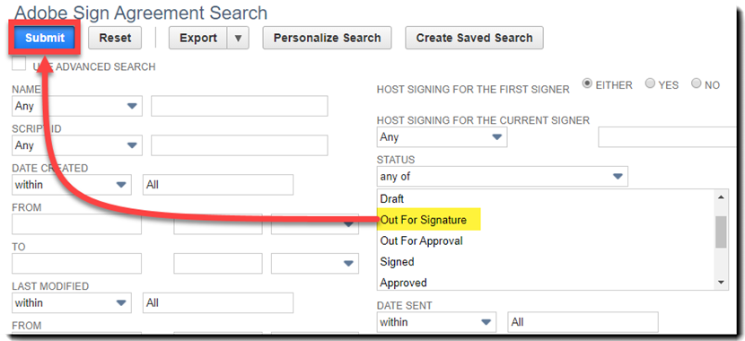

# [!DNL NetSuite] Guida all’installazione e personalizzazione (v4.0.4) {#install-customize-NetSuite}

## Panoramica {#overview}

Adobe Sign per [!DNL NetSuite] offre una completa integrazione di eSignature con [!DNL NetSuite]. È possibile utilizzare Adobe Sign per [!DNL NetSuite] per inviare accordi quali contratti, preventivi e altri documenti, che richiedono firme elettroniche, direttamente ai destinatari [!DNL NetSuite]. Puoi creare e inviare accordi Adobe Sign da clienti, lead, preventivi e altri [!DNL NetSuite] record. Aggiornamenti di Adobe Sign [!DNL NetSuite] con lo stato degli accordi e memorizza gli accordi con i [!DNL NetSuite] una volta completata l&#39;esecuzione. Puoi visualizzare la cronologia di tutti gli accordi inviati da [!DNL NetSuite] dall&#39;interno del prodotto.

Fare riferimento al metodo [Note sulla versione di Adobe Sign per NetSuite](https://experienceleague.adobe.com/docs/sign-integrations/using/netsuite/release-notes.html?lang=en) per ulteriori informazioni.

## Installare il pacchetto e configurare OAuth {#install}

Solo un [!DNL NetSuite] l’amministratore può installare o aggiornare il pacchetto. Per configurare OAuth, la proprietà [!DNL NetSuite] l’amministratore deve avere accesso come amministratore ad Adobe Sign. Prima di installare il pacchetto nel vostro account di produzione, dovete installare e provare il pacchetto in un [!DNL NetSuite] Account sandbox.

Vedere [Creare un accordo Adobe Sign](#createagreement) per ulteriori informazioni sui test.

>[!CAUTION]
>
>I clienti che eseguono l’aggiornamento alla versione 4.0.4 NON devono rimuovere la chiave API esistente.
>
>Vedere [Impostare le preferenze personalizzate](#configure) per ulteriori informazioni su come viene utilizzata la chiave API.

### Installazione del pacchetto per la prima volta

1. Passa a [!UICONTROL **Personalizzazione > SuiteBundler > Bundle di ricerca e installazione**].

1. Sulla *Pacchetti di ricerca e installazione* pagina, immettere **Adobe Sign** come parola chiave e seleziona **[!UICONTROL Ricerca]**.

1. Selezionate la proprietà **Adobe Sign** nome pacchetto.

   

1. Sulla *[!UICONTROL Dettagli pacchetto]* pagina, seleziona **[!UICONTROL Installa]**.
1. Nel *[!UICONTROL Installazione pacchetto di anteprima]* pagina, seleziona **[!UICONTROL Pacchetto di installazione]**.

   (Non è necessario modificare nessuno dei valori predefiniti della pagina)

   

1. Nella finestra di dialogo Installa visualizzata, seleziona **[!UICONTROL OK]** per procedere.

   Durante il processo di installazione, lo stato del pacchetto viene visualizzato come *[!UICONTROL In sospeso]*.

   

1. Per visualizzare uno stato aggiornato, selezionate **[!UICONTROL Aggiorna]**.

   Al termine dell&#39;installazione del pacchetto, *Adobe Sign per[!DNL NetSuite]* viene visualizzato sul *[!UICONTROL Pacchetti installati]* pagina.

   

1. Se sei già un cliente Adobe Sign, segui i passaggi per  [Configurare OAuth dopo l’installazione o l’aggiornamento](#oauth).

   Se non disponi di un account Adobe Sign, puoi [richiedi una versione di prova aziendale](https://esign.adobe.com/adobe-sign-DNL NetSuite-trial-registration.html) account per provare il sistema. Segui i passaggi di registrazione online per abilitare il tuo account Adobe Sign.

## Configurare OAuth dopo l’installazione o l’aggiornamento {#oauth}

Adobe Sign utilizza OAuth 2.0 per autenticare il tuo account Adobe Sign all&#39;interno di [!DNL NetSuite].

Questo protocollo autorizza l&#39;installazione [!DNL NetSuite] per comunicare con Adobe Sign senza richiedere la password. Poiché le informazioni riservate non vengono condivise direttamente tra le applicazioni, la probabilità che il tuo account venga compromesso è più bassa.

Questa autenticazione non influisce sull&#39;implementazione, ma è necessario eseguire una configurazione una tantum dopo aver installato o aggiornato il pacchetto nell&#39;account Production o Sandbox.

Il [!DNL NetSuite] l’amministratore che configura OAuth deve anche disporre di un accesso amministratore a livello di account ad Adobe Sign.

1. In [!DNL NetSuite], passare al metodo *Configurazione Adobe Sign* pagina elenco.

1. Cerca **[!UICONTROL Configurazione Adobe Sign]** (un tipo di record personalizzato) utilizzando il campo di ricerca nell&#39;intestazione.

1. Nella pagina Risultati ricerca, seleziona **Visualizza** per la *Configurazione Adobe Sign* record.

   .

1. Nella pagina Elenco configurazione Adobe Sign , seleziona **[!UICONTROL Visualizza]** per la *Utilizzo di OAuth per accedere alle API Adobe Sign* record.

   

1. Nella pagina Configurazione di Adobe Sign, seleziona **[!UICONTROL Accesso Con Adobe Sign]**

   

1. Nella pagina di accesso di Adobe Sign visualizzata, immetti le credenziali e seleziona **[!UICONTROL Accedi]**.

   

1. Nella pagina Conferma accesso (per OAuth) visualizzata, seleziona **[!UICONTROL Consenti accesso]**

   

1. Una volta completata l’autorizzazione, verrai reindirizzato alla pagina di configurazione di Adobe Sign in [!DNL NetSuite], come illustrato di seguito.

   

   >[!NOTE]
   >
   >Durante la configurazione di OAuth nel tuo account Sandbox, potresti riscontrare l’errore &quot;Impossibile determinare l’ID della composizione del cliente&quot; al termine dell’autorizzazione.
   >
   >
   >Per continuare, devi modificare la porzione del dominio account dell’URL (sistema).[!DNL NetSuite].com) nel browser per tornare alla [!DNL NetSuite] Sandbox nel modo seguente:
   >
   >
   >Cambia:
   >
   >
   >del sistema.[!DNL NetSuite].com/app/site/hosting/scriptlet.nl?script=745&amp;deploy=1&amp;web_access_point=https://echosign.com
   >
   >
   >A:
   >
   >
   >del sistema.**sandbox.** netsuite.com/app/site/hosting/scriptlet.nl?script=745&amp;deploy=1&amp;web_access_point=https://echosign.com

## Aggiornare il pacchetto (utenti esistenti)

[!DNL NetSuite] gli aggiornamenti del pacchetto sono regolarmente rilasciati da Adobe. Utenti esistenti di Adobe Sign per [!DNL NetSuite] l&#39;integrazione può essere aggiornata al pacchetto più recente.

>[!CAUTION]
>
>I clienti che eseguono l&#39;aggiornamento a una versione più recente NON devono rimuovere la chiave API esistente.
>
>Vedere [Impostazione delle preferenze personalizzate](#configure) per ulteriori informazioni su come viene utilizzata la chiave API.

### Prerequisiti {#prerequisites}

Il tempo necessario per eseguire l&#39;aggiornamento al pacchetto v4.0.4 dipende dal numero di accordi che attualmente hanno lo stato &quot;Inviato per firma&quot;. In genere, l&#39;aggiornamento di 100 accordi richiede dai 7 ai 10 minuti. Tieni presente il numero di record per stimare il tempo di aggiornamento.

Per determinare il numero di accordi inviati per la firma:

1. Passa a **[!UICONTROL Personalizzazione > Elenchi, record e file > Tipi di record]**, quindi individua *Adobe Sign accordo.*

   Oppure cerca Adobe Sign agreements nella barra di ricerca.

1. Per la proprietà [!UICONTROL Adobe Sign agreements] record, seleziona **[!UICONTROL Ricerca]**.

   

1. Dal **[!UICONTROL Stato]** a discesa, seleziona **[!UICONTROL Inviato per firma]** quindi seleziona **[!UICONTROL Invia]**.

   

   Tieni presente il numero di record per stimare il tempo di aggiornamento.

   

### Aggiornare il pacchetto {#updating-the-bundle}

1. Passa a **[!UICONTROL Personalizzazione > SuiteBundler > Ricerca e installazione > Elenco]** e individuare il pacchetto corrente, come illustrato di seguito.

   >[!NOTE]
   >
   >Se è presente una nuova versione del pacchetto, viene visualizzata un&#39;icona del punto esclamativo a destra della *Versione* numero del pacchetto corrente.

1. Dal menu a discesa Azione, seleziona **[!UICONTROL Aggiorna]**.

   

1. Nella pagina di aggiornamento del pacchetto di anteprima, seleziona **[!UICONTROL Pacchetto di aggiornamento]** senza modificare nessuno dei valori predefiniti visualizzati sulla pagina.

   Durante l&#39;installazione, lo stato del pacchetto viene visualizzato come *In sospeso*.

   .

   >[!NOTE]
   >
   >Quando aggiorni il pacchetto, potresti ricevere un messaggio di avviso come illustrato di seguito. Se non hai personalizzato il tuo [!DNL NetSuite] Puoi procedere con i record di firma elettronica. In caso di dubbi, si consiglia di installare il pacchetto su un account Sandbox per verificarlo prima di aggiornare il pacchetto in un account di produzione.

   

1. Per visualizzare uno stato aggiornato, selezionate **[!UICONTROL Aggiorna]**.

   

   >[!NOTE]
   >
   >Se l&#39;aggiornamento richiede molto tempo a causa di diversi accordi con un *Inviato per firma* , è possibile controllare la proprietà **[!UICONTROL Registro di esecuzione]** scheda secondaria per la *Installazione del pacchetto Adobe Sign* per determinare l&#39;avanzamento dell&#39;aggiornamento. Vedere [Determinazione dell&#39;avanzamento dell&#39;aggiornamento](#determineprogress) per ulteriori informazioni.

   Al termine dell&#39;aggiornamento del pacchetto, *Adobe Sign per[!DNL NetSuite]* viene visualizzato sul *Pacchetti installati* pagina.

   

## Configurare il pacchetto {#configure}

### Impostare le preferenze personalizzate  {#set-custom-preferences}

Puoi utilizzare le preferenze personalizzate per specificare come creare e archiviare gli accordi in [!DNL NetSuite]. Inoltre, la proprietà *Utente di provisioning automatico in Adobe Sign* consente di specificare se [!DNL NetSuite] gli utenti ricevono automaticamente il provisioning nei servizi Sign quando inviano accordi da [!DNL NetSuite].

1. Passa a **[!UICONTROL Imposta > Azienda > Preferenze generali]**.
1. Scorri verso il basso la pagina, quindi seleziona la proprietà **[!UICONTROL Preferenze personalizzate]** scheda secondaria.

   

1. Abilita e configura le preferenze di Adobe Sign in base alle esigenze:

   * **Immetti la chiave API EchoSign per il tuo account**: Non aggiungere o modificare alcun valore in questo campo.
   * **Usa contatto record principale come firmatario**: Se questa opzione è attivata, il record principale contatta per impostazione predefinita è il primo firmatario al momento della creazione degli accordi. Il mittente può rimuovere o modificare facilmente il firmatario predefinito o aggiungere altri firmatari all’accordo prima dell’invio.
   * **Usa Trans. Contatta come firmatario se presente**: Questa preferenza è valida solo se la proprietà *Usa contatto record principale come firmatario* è abilitata anche la preferenza . Se questa opzione è attivata, quando si genera un accordo da un record di transazione (ad esempio, Preventivo), il contatto principale della transazione viene impostato come predefinito come primo firmatario. Vedere [Record transazioni](#transrecords) per ulteriori informazioni. Se non è presente un contatto Transazione principale, o se si invia da [!DNL NetSuite] record oggetto (ad esempio record cliente, record partner), il destinatario predefinito è il contatto principale per l’e-mail del cliente. Il mittente può rimuovere o modificare facilmente il firmatario predefinito o aggiungere altri firmatari all’accordo prima dell’invio.
   * **Consenti marcatura destinatari come approvatori**: Se questa opzione è attivata, i mittenti possono contrassegnare i destinatari come approvatori. I destinatari contrassegnati come approvatori possono rivedere e approvare gli accordi, ma non devono firmarli. Gli approvatori possono essere tenuti a immettere dati nei campi durante il processo di approvazione.
   * **ID cartella accordo preferita**: Utilizzato per specificare la cartella in cui sono archiviati gli accordi firmati finali. Se non si imposta un valore per questo campo, per impostazione predefinita gli accordi firmati finali vengono salvati nella stessa cartella del file del documento originale. L’ID cartella deve essere un numero.
   * **PDF automatico delle transazioni**: Se questa opzione è attivata, i PDF di transazione vengono automaticamente associati agli accordi quando vengono creati nuovi accordi dai record di transazione.
   * **Aggiungi PDF firmato come (allegato o collegamento)**: Se *Elenco* selezionato dal menu a discesa, il PDF firmato viene aggiunto automaticamente come collegamento al file. Se *Allegato* selezionato dal menu a discesa, il PDF firmato viene memorizzato in [!DNL NetSuite] come allegato al record dell’accordo.
   * **Includi audit trail PDF con accordo**: Se questa opzione è attivata, i PDF di audit trail vengono automaticamente associati ai record dell’accordo dopo la firma degli accordi.
   * **Metodo di verifica dell’identità applicato a**: L’attivazione di uno dei metodi di verifica dell’identità determina a chi viene applicato il metodo di verifica dell’identificazione. Le opzioni sono *Tutti i firmatari, solo firmatari esterni* o *Solo per firmatari interni*.

   **Metodi di verifica dell’identità** {#identity-verification-methods}

   I metodi di verifica dell’identità attivati possono essere selezionati durante la creazione di un accordo. Se è abilitato più di un metodo di verifica dell’identità, nella pagina Adobe Sign accordo viene visualizzato un **[!UICONTROL Verifica identità firmatario]** opzione.

   * **Abilita password necessaria per firmare**: Richiedi ai firmatari di immettere una password una tantum specificata dall&#39;utente.

   * **Abilita autenticazione basata su conoscenza**: Richiedi ai firmatari di fornire il proprio nome, indirizzo e facoltativamente le ultime quattro cifre del loro codice SSN, quindi rispondi a un elenco di domande che verificano le informazioni fornite. Disponibile solo negli Stati Uniti.

   * **Abilita autenticazione identità Web**: Richiedi ai firmatari di verificare la propria identità accedendo a uno dei seguenti siti: Facebook, Google, LinkedIn, Microsoft Live, Twitter o Yahoo!.

   * **Utente di provisioning automatico in Adobe Sign**: Se questa opzione è attivata, gli utenti che inviano gli accordi in [!DNL NetSuite] vengono forniti automaticamente con un account utente Adobe Sign.

1. Seleziona **[!UICONTROL Salva]** per salvare le preferenze.

## Configurare gli aggiornamenti di stato automatici {#asu}

Il pacchetto di integrazione di Adobe Sign consente di ricevere automaticamente gli aggiornamenti in [!DNL NetSuite] per quanto riguarda lo stato degli accordi inviati da [!DNL NetSuite]. Quando questa funzione è attivata, [!DNL NetSuite] riflette sempre lo stato degli accordi. Puoi attivare gli aggiornamenti automatici dello stato nel modo seguente:

1. Passa a **[!UICONTROL Imposta > Azienda > Abilita funzioni].**
1. Selezionate la proprietà **[!UICONTROL SuiteCloud]** scheda secondaria.
1. Attiva le seguenti opzioni:

   * Nella sezione SuiteBuilder, attivate **[!UICONTROL Record personalizzati]** opzione.

   * Nella sezione SuiteScript, attivare la proprietà **[!UICONTROL Client SuiteScript]** e **[!UICONTROL Server SuiteScript]** e accettano i termini di servizio per entrambi.

1. Seleziona **[!UICONTROL Salva]**.

   Le opzioni sono impostate come illustrato nell’immagine.

   

## Oggetti e tipi di record {#objects}

Il pacchetto di integrazione di Adobe Sign espone già l&#39;oggetto Accordo di Adobe Sign con molti standard [!DNL NetSuite] oggetti, tra cui: Documenti relativi a clienti, stime, lead, opportunità e partner. Puoi utilizzare il pacchetto Adobe Sign anche con altri tipi di record, compresi i record personalizzati.

La scheda Accordo può essere visualizzata con due tipi di [!DNL NetSuite] record: Record di entità e transazioni. Di solito si presume che un record di transazione sia un record (ad esempio un preventivo) che può essere convertito in un documento di PDF; mentre un record Entità non può essere convertito in un PDF.

## Record di transazione {#transrecords}

Se l’accordo viene creato da un record di transazione, il primo documento nel record dell’accordo è la versione PDF del record da cui proviene e il primo destinatario è l’indirizzo e-mail del record. Se non desiderate che il primo documento sia una versione di PDF del record da cui è stato creato, passate a **[!UICONTROL Imposta > Azienda > Preferenze generali > scheda secondaria Preferenze personalizzate]** e disabilitare la proprietà **[!UICONTROL PDF automatico delle transazioni]** opzione. Vedere [Impostazione delle preferenze personalizzate](#configure) per ulteriori informazioni.

In Preferenze personalizzate, potete anche attivare il **[!UICONTROL Usa Trans. Contatta come primo firmatario]** preferenza se desideri che il contatto principale della transazione venga aggiunto automaticamente come primo firmatario. Quando è associato a un record di transazione, visualizza la proprietà **[!UICONTROL Accordi]** e la proprietà **[!UICONTROL Send for Signature]** pulsanti.

## Record entità {#entity-records}

Se l’accordo viene creato da un record Entità, il primo destinatario è l’indirizzo e-mail del record. Quando è associata a un record Entità, viene visualizzata solo la scheda Accordi.

## Personalizzare il pacchetto {#customize}

La personalizzazione del pacchetto include quanto segue:

* Distribuzione degli script per la scheda secondaria Accordi e il pulsante Send for Signature per i tipi di record appropriati.
* Impostazione delle autorizzazioni dei ruoli per i tipi di record Adobe Sign.
* Modifica delle autorizzazioni per concedere l&#39;accesso al metodo *Accordi* e la *Send for Signature* pulsante.

### Configurare gli accordi Adobe Sign per tipi di record aggiuntivi  {#configuring-adobe-sign-agreements-for-additional-record-types}

Per distribuire la proprietà *Accordi* e la *Send for Signature* per i tipi di record appropriati:

1. Passa a **[!UICONTROL Personalizzazione > Script > Script].**

1. Sulla *Script* pagina elenco visualizzata, individuare lo script da distribuire, quindi selezionare ****[!UICONTROL Visualizza]****.

   * Per aggiungere la proprietà *Send for Signature* pulsante, seleziona **[!UICONTROL Pulsante Adobe Sign stima]** script.

   * Per aggiungere la proprietà *Accordi* , seleziona **[!UICONTROL Caricatore accordo Adobe Sign]** script.

1. Nella pagina Script, selezionare **[!UICONTROL Distribuzione dello script]**.

   

1. Nella pagina Distribuzione script, effettuate le seguenti operazioni:

   * Dal *Si Applica A* , seleziona il tipo di record.
   * Facoltativamente, immettete l’ID di distribuzione dello script.

      Fare riferimento al metodo *Creazione di un ID distribuzione script personalizzato* argomento nel [!DNL NetSuite] Help Center per ulteriori informazioni. Se non inserite un ID, ne viene generato uno.

   * Verifica la proprietà **[!UICONTROL Distribuito]** casella di controllo.

   

   * Set *Stato* a **[!UICONTROL Rilasciato]**.

      Non è necessario specificare *Tipo di evento* o *Livello registro*.

   * Dal [!UICONTROL *Esegui come ruolo]* a discesa, seleziona **[!UICONTROL Esegui come amministratore]**.

   * Con il metodo **[!UICONTROL Pubblico]** scheda secondaria attiva (attiva per impostazione predefinita), seleziona i ruoli o gli utenti specifici a cui desideri concedere l’accesso. Se desideri concedere l’accesso a tutti i ruoli e gli utenti, abilita il **[!UICONTROL Seleziona tutto]** opzioni.

   * Seleziona **[!UICONTROL Salva]**. Quando viene visualizzata la conferma della modifica, seleziona **[!UICONTROL Indietro]**.

1. selezionare **[!UICONTROL Elenco]** nella parte superiore della pagina Distribuzione script per tornare alla *Script* pagina elenco.
1. Ripetere i punti 2 e 3 precedenti per l’altro script.

## Impostazione delle autorizzazioni dei ruoli per i tipi di record Adobe Sign {#setting-role-permissions-for-adobe-sign-record-types}

Maggiori [!DNL NetSuite] i ruoli devono disporre dell’autorizzazione per utilizzare Adobe Sign senza ulteriori personalizzazioni. Tuttavia, puoi concedere autorizzazioni per eventuali ruoli personalizzati aggiuntivi che sono stati creati.

1. Passa a **[!UICONTROL Personalizzazione > Elenchi, record e file > Tipi di record]**.

   

   >[!NOTE]
   >
   >Se non viene visualizzato il *Tipi di record* , passare a **[!UICONTROL Configurazione > Azienda > Abilita funzioni > scheda Suite Cloud]** e abilitare la proprietà *Record personalizzati* opzione.

1. Sulla *Tipi di record* pagina, seleziona **[!UICONTROL Accordo Adobe Sign]** per selezionarlo

   

1. Sulla *Tipo di record personalizzato* pagina, seleziona **[!UICONTROL Usa elenco autorizzazioni]** dal *Tipo di accesso* a discesa.

   

   >[!NOTE]
   >
   >Il *Accordo Adobe Sign* è l&#39;unico tipo di record Adobe Sign che richiede la *Usa elenco autorizzazioni* tipo di accesso.
   >
   >
   >Per istruzioni sull’impostazione del tipo di accesso per gli altri tipi di record Adobe Sign, consulta il passaggio 6.

1. Selezionate la proprietà **[!UICONTROL Autorizzazioni]** scheda secondaria.

   Viene visualizzato l’elenco dei ruoli e delle autorizzazioni.

   

1. Imposta le autorizzazioni come indicato di seguito per i ruoli personalizzati aggiuntivi aggiunti al &quot;[!UICONTROL Accordo Adobe Sign]&quot; tipo di record.

   >[!NOTE]
   >
   >Vedere la *[Impostazione di un elenco di autorizzazioni per un tipo di record personalizzato](https://system.netsuite.com/app/help/helpcenter.nl?fid=section_N2879931.html)* per ulteriori informazioni, consultare l&#39;argomento nel Centro risorse di NetSuite

   1. Seleziona il ruolo dal *Ruolo* elenco.
   1. Set *Livello* a **[!UICONTROL Completo]**.
   1. Set *Modulo predefinito* a **[!UICONTROL Modulo di accordo EchoSign personalizzato]**.
   1. Seleziona **[!UICONTROL Limita modulo]** casella di controllo.
   1. Seleziona **[!UICONTROL Aggiungi]** per salvare le modifiche per la riga del ruolo.

   

   La nuova riga viene visualizzata come illustrato di seguito:

   

   Ripetete i passaggi precedenti per tutti i ruoli personalizzati aggiuntivi.

   * selezionare **[!UICONTROL Salva]** sulla *Tipo di record personalizzato* quando sono state impostate le autorizzazioni per tutti i ruoli.
   Il *[!UICONTROL Tipo di record cliente]* la pagina viene rivisualizzata.

1. Ripetere i punti da 1 a 3 precedenti per impostare la proprietà *Tipo di accesso* per tutti gli altri tipi di record Adobe Sign:

   **[!UICONTROL Nessuna autorizzazione richiesta].** Questo vale per i seguenti tipi di record:

   * Configurazione Adobe Sign
   * Documento Adobe Sign
   * Evento Adobe Sign
   * Lingua Adobe Sign
   * Errori di script di Adobe Sign
   * Adobe Sign accordo firmato
   * Adobe Sign firmatario

### Concedi l’accesso alla scheda Accordo e al pulsante Send for Signature  {#granting-access-to-the-agreement-tab-and-send-for-signature-button}

Il pacchetto di integrazione di Adobe Sign espone già l&#39;oggetto Accordo di Adobe Sign con molti standard [!DNL NetSuite] oggetti (Cliente, Stima [Citazione], lead e altro). Il *Accordo* la scheda secondaria viene attivata automaticamente per i seguenti tipi di oggetti: Cliente, Responsabile, Opportunità, Partner, Prospect, Preventivo e Conto Fornitore.

Il *[!UICONTROL Send for Signature]* viene attivato automaticamente **o[!UICONTROL Solo per l&#39;oggetto Quote]**.

[!DNL NetSuite] gli amministratori possono estendere la possibilità di creare accordi ad altri oggetti CRM modificando le autorizzazioni per aggiungere la proprietà *Accordo* scheda secondaria *Send for Signature* o entrambi.

#### Modifica delle autorizzazioni per concedere l’accesso al pulsante Send for Signature  {#modifying-permissions-to-grant-access-to-the-send-for-signature-button}

1. Passa a **[!UICONTROL Personalizzazione > Script > Script]**.

   Il *Script* viene visualizzata la pagina elenco.

   * Se necessario, utilizzate i filtri per individuare gli script Adobe Sign

1. Sulla *Script* , individuare la proprietà *Pulsante Adobe Sign stima* script (controlla la proprietà *Send for Signature* ), quindi selezionate **Visualizza**.

   

1. Sulla *Script* , effettuate le seguenti operazioni:

   * seleziona la proprietà **[!UICONTROL Distribuzioni]** scheda secondaria

   * In &quot;*Si applica a*&quot; seleziona il collegamento per l&#39;entità che desideri modificare.

      * **[!UICONTROL Citazione]** in questo esempio

   

   * seleziona la proprietà **[!UICONTROL Modifica]** sul pulsante *Distribuzione script* pagina

   

   * Con il metodo **[!UICONTROL Pubblico]** scheda secondaria attiva, seleziona i ruoli o gli utenti specifici a cui desideri concedere l’accesso.

      * Se desideri concedere l’accesso a tutti i ruoli e gli utenti, abilita il **[!UICONTROL Seleziona tutto]** options
   * selezionare **[!UICONTROL Salva]**

   

#### Modifica delle autorizzazioni per concedere l’accesso alla scheda Accordi  {#modifying-permissions-to-grant-access-to-the-agreements-tab}

1. Passa a **[!UICONTROL Personalizzazione > Script > Script]**
1. Sulla [!UICONTROL Script] , individuare la proprietà *[!UICONTROL Caricatore accordo Adobe Sign]* script (controlla la proprietà *Scheda Accordi*), quindi selezionare **[!UICONTROL Visualizza]**.
1. Sulla *Script* , effettuate le seguenti operazioni:

   1. Selezionate la proprietà **[!UICONTROL Distribuzioni]** scheda secondaria
   1. In &quot;*[!UICONTROL Si applica a]*&quot; seleziona il collegamento per l&#39;entità per cui desideri modificare l&#39;accesso
   1. Sulla *[!UICONTROL Distribuzione script]* , selezionare la proprietà **[!UICONTROL Modifica]** pulsante
   1. Con il metodo **[!UICONTROL Pubblico]** scheda secondaria attiva (è attiva per impostazione predefinita), seleziona i ruoli o gli utenti specifici a cui desideri concedere l’accesso. Se desideri concedere l’accesso a tutti i ruoli e gli utenti, abilita il **[!UICONTROL Seleziona tutto]** options
   1. selezionare **[!UICONTROL Salva]**

## Utilizzo di Adobe Sign per [!DNL NetSuite] mazzo

Per inviare accordi da [!DNL NetSuite] e ricevere aggiornamenti su tali accordi, gli utenti devono avere lo stesso ID di accesso (indirizzo e-mail) in [!DNL NetSuite] e in Adobe Sign.

### Creazione di un accordo Adobe Sign

Dopo aver installato un nuovo pacchetto in un account Sandbox o Production, è necessario provare il pacchetto creando un nuovo accordo. Puoi creare accordi Adobe Sign da un record di entità, da un record di transazione o come accordo autonomo.

>[!NOTE]
>
>Il processo di creazione di un accordo varia leggermente a seconda di come viene creato. Il processo generale prevede la specifica delle opzioni per l’accordo, l’aggiunta di uno o più documenti dell’accordo e la specifica dei destinatari. Il processo descritto di seguito presuppone che l’accordo venga creato da un record cliente.

1. Seleziona o crea un record cliente da cui desideri inviare un accordo oppure puoi selezionarne un altro [!DNL NetSuite] tipo di record con la scheda Accordi attivata.

1. Nel record, selezionate la proprietà **[!UICONTROL Accordi]** scheda secondaria.
1. Seleziona **[!UICONTROL Nuovo accordo]**.

   

1. Sulla *[!UICONTROL Accordo Adobe Sign]* pagina, seleziona **[!UICONTROL Modifica]**.

   

1. Specificate le opzioni per l’accordo nel modo seguente:

   * **Nome accordo** — Immetti un nome per l&#39;accordo.
   * **Messaggio**-Inserite un messaggio personalizzato per il destinatario.
   * **Tipo firma** — Selezionare il tipo di firma accettato per il documento. Le opzioni sono *Firma elettronica* e *Firma tramite fax*.

   * **Devo Anche Firmare Questo Accordo** — Attiva questa opzione per indicare che anche il mittente deve firmare l’accordo.
   * **Ordine firma**-Se la proprietà *Devo Anche Firmare Questo Accordo* , seleziona l’ordine in cui il mittente e i destinatari devono firmare. Le opzioni sono &quot;Firmo io, quindi firma i destinatari&quot;, &quot;Firmo i destinatari, quindi firmo&quot; e &quot;Nessuno&quot;.

   * **Visualizzare in anteprima le firme documento o posizione (o campi modulo)** — Abilita questa opzione per consentire ai mittenti di visualizzare in anteprima l’accordo e di aggiungere all’accordo i campi (trascina e rilascia la firma, i campi iniziali e altri campi modulo) prima di inviarlo ai destinatari.
   * **Verifica identità firmatario** — Attiva questa opzione, quindi seleziona una delle seguenti opzioni di verifica dell&#39;identità

      * Questa opzione viene visualizzata solo quando nelle Preferenze personalizzate è abilitato più di uno dei tre metodi di verifica dell’identità dei firmatari elencati di seguito. (Vedere [Impostazione delle preferenze personalizzate](#customize) per ulteriori informazioni. Se è abilitata una sola preferenza, la proprietà **[!UICONTROL Verifica identità firmatario]** non viene visualizzata.

   **Metodi di verifica dell’identità**

   * **Password necessaria per firmare** - Richiedi ai firmatari di immettere una password una tantum specificata dall&#39;utente.
   * **Autenticazione basata su conoscenza** — Richiedere ai firmatari di fornire il proprio nome, indirizzo e facoltativamente le ultime quattro cifre del proprio codice fiscale nazionale e quindi rispondere a un elenco di domande per verificare le informazioni fornite. Disponibile solo negli Stati Uniti.
   * **Autenticazione identità Web** — Richiedi ai firmatari di verificare la propria identità accedendo a uno dei seguenti siti: Facebook, Google, LinkedIn, Twitter, Yahoo! o Microsoft Live.
   * **Password Richiesta Per Visualizzare PDF** — Abilita questa opzione per richiedere al destinatario di immettere una password prima di aprire un PDF dell&#39;accordo o dell&#39;accordo firmato. Il file PDF inviato a tutti è crittografato e richiede la password per aprirlo. Non perdere la password in quanto non recuperabile. Se perdi la password, devi eliminare la transazione e ricominciare.
   * **Password/Conferma password** — Se la proprietà *Password Richiesta Per Visualizzare PDF* è abilitata, immetti la password da utilizzare per visualizzare l’accordo.
   * **Ricorda ai destinatari di firmare** — Specifica se e con quale frequenza i promemoria vengono inviati ai destinatari. Le opzioni sono *Mai*, *Quotidiano* o *Settimanale*.
   * **Lingua:** Specifica la lingua in cui la pagina della firma e le notifiche e-mail vengono visualizzate ai destinatari.
   * **Firma in hosting per il primo firmatario** — Abilita questa opzione per consentire al mittente ospitante la firma di persona per il primo firmatario.
   * **Giorni alla scadenza per la firma** — Immetti un numero intero per indicare la scadenza per la firma dell&#39;accordo (data odierna + numero di giorni).
   * **Record principale** — Facoltativamente, seleziona un record principale per collegarlo all’accordo.

   

1. Selezionate la proprietà **[!UICONTROL Documenti]** tab.

   

1. Sulla *Documenti* scheda secondaria, allegare un documento esistente dall&#39;archivio dei file utilizzando *Adobe Sign documento* e seleziona **[!UICONTROL Allega]**.

   Oppure, fate clic su **[!UICONTROL Nuovo documento Adobe Sign]** per accedere al *[!UICONTROL Adobe Sign documento]* , quindi digitare il nome di un documento nel [!DNL NetSuite] file, seleziona i file dal record Transazione (se applicabile) o allega un nuovo documento.

   Puoi aggiungere più documenti a un accordo.

1. Seleziona **[!UICONTROL Destinatari]** scheda secondaria e specifica il destinatario selezionando dall’elenco dei contatti o digitando un indirizzo e-mail.

   

   Ciascuno dei destinatari può essere contrassegnato come Firmatario o CC. Se la proprietà *Consenti marcatura dei destinatari come approvatori firmatari* è abilitata la preferenza personalizzata, i destinatari possono anche essere contrassegnati come Approvatori. Vedere [Impostazione delle preferenze personalizzate](#customize) per ulteriori informazioni.

   * **Firmatari** deve firmare l’accordo.
   * **Approvatori** deve approvare, ma non firmare l’accordo e, facoltativamente, può aggiungere dati a un accordo.
   * **Destinatari CC** vengono informati degli aggiornamenti dell’accordo e quando l’accordo viene firmato e completato. I destinatari CC non partecipano al processo di firma o approvazione.

      Se la proprietà *Usa contatto record principale come firmatario* la preferenza personalizzata è abilitata da sola o in combinazione con *Usa Trans. Referente come firmatario* , il primo destinatario è predefinito ma può essere modificato.

1. Seleziona **[!UICONTROL Aggiungi]** dopo aver immesso ciascun destinatario.

1. Seleziona **[!UICONTROL Salva]** per salvare l’accordo.

### Inviare accordi per la firma

Quando l’accordo è pronto per essere inviato, seleziona la **[!UICONTROL Send for Signature]** pulsante.

* Se la proprietà *Visualizzare in anteprima il documento o posizionare le firme* è abilitata, fai clic su **[!UICONTROL Send for Signature]**. Nella finestra che si apre, visualizzate in anteprima il documento o trascinate i campi modulo sul documento prima che venga inviato. Seleziona **[!UICONTROL Invia]** per inviare l’accordo al destinatario.

* Se la proprietà *[!UICONTROL Firma in hosting per il primo firmatario]* è abilitata, fai clic su **[!UICONTROL Send for Signature]**. Nella finestra visualizzata, consenti al firmatario di firmare il documento con il mittente presente.

   A *Firma in hosting per firmatario corrente* accanto al *Firma in hosting per il primo firmatario* , accessibile fino alla firma del documento. Utilizza questo collegamento per ospitare la firma dell’accordo per più firmatari o per riaprire la finestra a comparsa se si chiude accidentalmente.

Una volta inviato l’accordo, i destinatari riceveranno un messaggio e-mail che li informa dei documenti in attesa della firma.

Dopo che i destinatari hanno firmato il documento, il mittente riceve una notifica tramite e-mail che il documento è stato firmato.

#### Invia da un preventivo

Adobe Sign è integrato direttamente con Quotes in [!DNL NetSuite] in modo che un PDF del preventivo venga generato automaticamente e allegato al record dell’accordo.

Quando visualizzi un preventivo, seleziona **[!UICONTROL Send for Signature]**. Genera e visualizza il preventivo allegato all’accordo. È anche possibile aggiungere il *Send for Signature* ad altri tipi di record di transazioni. Vedere [Oggetti e tipi di record](#objects) per ulteriori informazioni.

### Monitorare lo stato e inviare promemoria

Dopo aver inviato un accordo:

* Lo stato del documento diventa *Inviato per firma* nella sezione Dettagli accordo
* Il *Send for Signature* viene sostituito dai tre pulsanti seguenti:

   * **Stato aggiornamento** — Aggiornare manualmente lo stato se gli aggiornamenti di stato non sono stati configurati. Vedere [Configurazione degli aggiornamenti di stato automatici](#asu) per ulteriori informazioni.
   * **Invia promemoria** — Per inviare un promemoria al firmatario corrente.
   * **Annulla accordo** — Per annullare un accordo. Un accordo può essere annullato dopo che è stato inviato per la firma se tutti i destinatari non hanno ancora firmato.

Un nuovo *Eventi* nel record dell’accordo viene visualizzata una scheda secondaria in cui è possibile tenere traccia dello stato dell’accordo.

È possibile visualizzare una cronologia degli eventi dell’accordo, che include informazioni su quando l’accordo è stato inviato, visualizzato e firmato.

Dopo la firma dell’accordo:

* Il suo stato cambia in *Firmato*.
* Puoi tornare al record principale per questo accordo utilizzando il collegamento.
* Per accedere a questi documenti, puoi utilizzare i collegamenti &quot;download&quot; in Documento firmato e audit trail.
* Un’ulteriore *Documento firmato* viene visualizzata una scheda secondaria per visualizzare le miniature del documento firmato.

>[!NOTE]
>
>Dopo che un accordo è stato inviato per la firma, non è possibile modificare il record. Questo per preservare la registrazione degli eventi.

## Disinstallare il pacchetto

Per disinstallare il pacchetto, attieniti alla procedura descritta nel [!DNL NetSuite] Aiuto. Vedere la *[Disinstallazione di un pacchetto](https://docs.oracle.com/en/cloud/saas/netsuite/ns-online-help/section_N3400972.html)* argomento nel [!DNL NetSuite] Help Center per ulteriori informazioni.

Quando disinstalli il pacchetto, gli accordi non firmati vengono eliminati. Gli accordi firmati e i relativi file di audit PDF corrispondenti non vengono modificati.

NON disinstallare il pacchetto se è necessario mantenere gli accordi non firmati.

## Risoluzione dei problemi

### Determinare l&#39;avanzamento dell&#39;aggiornamento

Se l&#39;aggiornamento sembra richiedere più tempo di, è possibile controllare la scheda secondaria Registro di esecuzione per lo script di installazione del pacchetto Adobe Sign per determinare l&#39;avanzamento dell&#39;aggiornamento nel modo seguente:

1. Passa a **[!UICONTROL Personalizzazione > Script > Script]**.
1. Sulla [!UICONTROL Script] , individuare la proprietà *[!UICONTROL Installazione del pacchetto Adobe Sign]* , quindi selezionare **[!UICONTROL Modifica]**.
1. Sulla [!UICONTROL Script] , selezionare la proprietà **Registro di esecuzione** scheda secondaria.
1. selezionare **Aggiorna**.

   Il Registro di esecuzione si aggiorna per riflettere lo stato. Il *Dettagli* nella colonna viene visualizzato l’avanzamento degli aggiornamenti degli accordi.

   

### Risoluzione dei problemi relativi ai token di accesso

Quando si interagisce con gli accordi, potrebbe verificarsi un messaggio &quot;Il token di accesso fornito non è valido o è scaduto&quot;.

Ciò può verificarsi per i seguenti motivi:

* Il [!DNL NetSuite]/Amministratore Adobe Sign che ha configurato OAuth ha revocato il token di accesso
* Il token di accesso è scaduto perché non è stato inviato alcun accordo da [!DNL NetSuite] negli ultimi 60 giorni
* Il [!DNL NetSuite]/Adobe Sign Administrator non ha completato correttamente la configurazione iniziale di OAuth

Per risolvere questo problema, esegui nuovamente il processo di configurazione OAuth. Vedere [Configurazione di OAuth dopo l’installazione o l’aggiornamento](#oauth) per ulteriori informazioni.

### Risoluzione dei problemi di stato dei documenti {#resolvestatus}

Se [aggiornamenti automatici dello stato](#asu) sono configurate ma lo stato dell’accordo non viene aggiornato dopo l’invio degli accordi, prova a eseguire le operazioni seguenti:

1. Controlla il registro di esecuzione della distribuzione per il *Aggiornamento esterno di Adobe Sign* per verificare se si ricevono chiamate da Adobe Sign nel modo seguente:

   1. Passa a **[!UICONTROL Personalizzazione > Script > Distribuzioni script]**
   1. Sulla *Distribuzioni di script* , individuare la proprietà *Aggiornamento esterno di Adobe Sign* , quindi selezionare **[!UICONTROL Modifica]**
      1. Sulla *[!UICONTROL Distribuzione script]* , selezionare la proprietà **[!UICONTROL Registro di esecuzione]** scheda secondaria.
      * È necessario visualizzare un *Record accordo aggiornato* voce per ciascun ID accordo

1. Controlla il registro di esecuzione della distribuzione per il *Adobe Sign Update Agreements* per verificare se sono presenti errori:

   1. Passa a **[!UICONTROL Personalizzazione > Script > Distribuzioni script]**.
   1. Sulla [!UICONTROL Distribuzioni di script] , individuare la proprietà *[!UICONTROL Adobe Sign Update Agreements]* con &quot;[!UICONTROL Pianificato]&quot;, quindi selezionare **[!UICONTROL Modifica]**.
   1. Sulla [!UICONTROL Distribuzione script] , selezionare la proprietà **[!UICONTROL Registro di esecuzione]** scheda secondaria.
   1. Sotto [!UICONTROL Tipo], seleziona **[!UICONTROL Errore]** per filtrare i risultati.

1. Infine, controllare il registro di esecuzione per la proprietà *Adobe Sign Manager* per gli errori seguendo le istruzioni riportate al punto 2 precedente.

### Risoluzione degli errori di tipo MIME  {#resolving-mime-type-errors}

Se si verifica un errore di tipo MIME durante l&#39;invio di un accordo, il nome nel campo Nome file potrebbe non corrispondere al nome file e all&#39;estensione del file caricato. Se lasciate vuoto il campo Nome file, viene compilato automaticamente con il nome e l’estensione corretti.

### Visualizzare i registri degli script {#viewing-script-logs}

È inoltre possibile visualizzare i registri di esecuzione della distribuzione per gli script che non sono correlati a problemi di stato del documento. Vedere [Risoluzione dei problemi di stato dei documenti](#resolvestatus) per ulteriori informazioni.

1. Passa a **[!UICONTROL Personalizzazione > Script > Script]**.

   Il *Script* viene visualizzata la pagina elenco. Se necessario, utilizzate i filtri per individuare lo script appropriato.

1. Seleziona **[!UICONTROL Visualizza]** per lo script corrispondente.

1. Selezionate la proprietà **[!UICONTROL Registro di esecuzione]** scheda secondaria della pagina per visualizzare il registro script.

## Supporto {#support}

Vai alla [Portale di supporto di Adobe Sign](https://adobe.com/go/adobesign-support-center_it) per accedere a domande frequenti, documentazione, articoli della knowledge base o per contattare il supporto Adobe.
