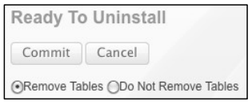
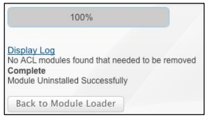
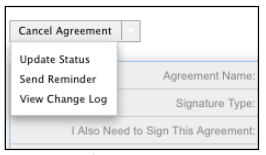

# [!DNL SugarCRM]  Guida all’installazione {#sugarcrm-install-guide}

[Contatta l&#39;assistenza clienti](https://adobe.com/go/adobesign-support-center_it)

Adobe [!DNL EchoSign] per [!DNL SugarCRM] è una soluzione leader per l&#39;eSignature e per il Web Contract Agreement che fornisce l&#39;automazione della firma elettronica in [!DNL SugarCRM] per le firme elettroniche e le firme fax. Gli utenti possono inviare direttamente contratti da SugarCRM, visualizzare la cronologia dei contratti e salvare i contratti firmati con account, contatti, preventivi e altro ancora.
Adobe [!DNL EchoSign] per [!DNL SugarCRM] è disponibile per tutte le versioni supportate di SugarCRM, incluso 6.3 - 6.7 per le soluzioni on demand o on-premise.

Questo documento è una guida per gli amministratori [!DNL SugarCRM] per informazioni su come installare e configurare Adobe [!DNL EchoSign] per il plug-in [!DNL SugarCRM].

## Installa il plug-in {#install-plugin}

1. Ottenere il file di archivio Adobe [!DNL EchoSign] per [!DNL SugarCRM] dall&#39;elenco [SugarExchange](http://www.sugarexchange.com/product_details.php?product=1123).
1. Accedere a [!DNL SugarCRM] con l&#39;account amministratore.
1. Passare a **[!UICONTROL Amministrazione]** > **[!UICONTROL Caricatore moduli]**.

   

1. Per caricare il file di archivio del plug-in Adobe [!DNL EchoSign] per [!DNL SugarCRM], selezionare **[!UICONTROL Sfoglia]**, quindi selezionare il file di archivio, quindi selezionare **[!UICONTROL Carica]**.
1. Dopo aver caricato il file di archivio, selezionare **[!UICONTROL Installa]** per iniziare l&#39;installazione.
1. Esaminare i termini e le condizioni, quindi selezionare **[!UICONTROL Accept]** > **[!UICONTROL Commit]**.
1. Se il plug-in viene installato correttamente, la barra di stato indica un successo del 100%.  Se la barra di stato non raggiunge il 100%, selezionare **[!UICONTROL Visualizza log]** per visualizzare l&#39;errore rilevato da SugarCRM.

   

1. Dopo l&#39;installazione, passare a **[!UICONTROL Amministrazione > Riparazione]** e selezionare **[!UICONTROL Riparazione rapida e ricostruzione]**.

>[!NOTE]
>
>Se si sta installando il plug-in su [!DNL SugarCRM] OnDemand, inserire un ticket di supporto con [!DNL SugarCRM] per rimuovere temporaneamente le restrizioni del controllo pacchetti per OnDemand in modo che il pacchetto possa essere installato. Questo fa parte del processo standard.

## Aggiorna plug-in {#upgrade-plugin}

Se si sta aggiornando il plug-in Adobe [!DNL EchoSign] per [!DNL SugarCRM] a una versione più recente, è necessario installare il plug-in senza disinstallare la versione precedente.
Dopo aver aggiornato il plug-in, passare a **[!UICONTROL Amministrazione]** > **[!UICONTROL Riparazione]** e selezionare **[!UICONTROL Riparazione rapida e ricostruzione]**.

**Nota:** Se si disinstalla un plug-in precedente, non rimuovere le tabelle durante la disinstallazione. In caso contrario, è possibile perdere i dati del contratto [!DNL EchoSign].

## Configura plug-in {#configure-plugin}

1. Se sei già un cliente Adobe [!DNL EchoSign], continua a passare al passo 2.

   Se non si dispone di un account [!DNL EchoSign], [iscriversi a un test gratuito di 14 giorni](https://sugarcrmintegration.echosign.com/public/login) e seguire i passaggi di registrazione online per attivare l&#39;account Adobe [!DNL EchoSign].
1. Accedi a [Account di firma eco](http://www.echosign.com) e segui la procedura seguente:
   1. Selezionare la scheda **[!UICONTROL Account]**.
   1. Selezionare **[!UICONTROL API EchoSign]** sul lato inferiore sinistro.
   1. Selezionare **[!UICONTROL Abilita accesso API]** e ottenere la chiave API dalla pagina.

   

1. In SugarCRM, passare a **[!UICONTROL Amministrazione]** > **[!UICONTROL Impostazioni Adobe EchoSign]** e immettere la chiave API nel campo contrassegnato con **[!UICONTROL Chiave API EchoSign]**.
1. È possibile configurare il plug-in con le seguenti impostazioni:

   1. Allega automaticamente PDF durante la creazione di un contratto da un preventivo: Selezionare se allegare automaticamente un PDF dell&#39;offerta se un utente [!DNL SugarCRM] crea un accordo EchoSign dal modulo Quotes.
   1. Gestisci elenco destinatari: Selezionare i moduli visualizzati nel sottopannello Destinatario nel modulo [!DNL EchoSign] Contratti. Questo aggiunge anche il sottopannello Contratti [!DNL EchoSign] a tali moduli.
   1. Aggiungere i pulsanti di invio ai seguenti moduli: Selezionare questa opzione se si desidera includere il pulsante/l&#39;azione Crea [!DNL EchoSign] Contratto con le azioni principali del modulo Preventivo.
   1. Selezionare **[!UICONTROL Salva]** per memorizzare le impostazioni.

**Nota:** Adobe  [!DNL EchoSign] per il  [!DNL SugarCRM] plug-in richiede l&#39;estensione [ SOAP ](http://www.php.net/manual/en/book.soap.php)PHP. Per attivare il supporto SOAP, configurare PHP con enable-soap.

## Ottieni aggiornamenti del contratto (per [!DNL SugarCRM] versioni 6.3 o successive) {#get-agreement-updates}

Per la versione 6.3 e successiva, è possibile utilizzare le due opzioni seguenti per ottenere gli aggiornamenti del contratto. Nelle versioni precedenti di SugarCRM, il plug-in per impostazione predefinita offre solo il metodo di callback (opzione 1).

### Opzione 1: Imposta il metodo di callback per il push degli aggiornamenti a EchoSign

Se il sito Web è aperto al pubblico, è possibile che Adobe EchoSign esegua il ping dell&#39;istanza [!DNL SugarCRM] ogni volta che si verifica un nuovo evento. [!DNL SugarCRM] aggiorna quindi lo stato del contratto, gli eventi e scarica il documento firmato (se firmato) automaticamente e in tempo reale. (Se si è dietro un firewall, è necessario elencare gli indirizzi IP del server [!DNL EchoSign] oppure utilizzare il metodo Job pianificato per aggiornare gli accordi EchoSign descritti nella sezione successiva di questa guida).

1. Passare a **[!UICONTROL Amministrazione]** > **[!UICONTROL Impostazioni Adobe EchoSign]**.
1. Selezionare la casella di controllo **[!UICONTROL Utilizzare il metodo di callback EchoSign]** per aggiornare gli eventi e gli stati degli accordi.
1. Selezionare **[!UICONTROL Salva]**.

### Opzione 2: Impostare un processo pianificato per [!DNL SugarCRM] istanze dietro un firewall

Il plug-in [!DNL EchoSign] per [!DNL SugarCRM] può inoltre utilizzare un job pianificato per eseguire una query [!DNL EchoSign] per gli aggiornamenti ai contratti in uscita per la firma. È possibile utilizzare il metodo di query del processo pianificato se si dispone di un&#39;installazione [!DNL SugarCRM] locale dietro un firewall.

Per impostare:

1. Passare a **[!UICONTROL Amministrazione]** > **[!UICONTROL Utilità di pianificazione]**.
1. Dal menu a discesa della scheda, selezionare **[!UICONTROL Crea scheduler]**.
1. Immettere un nome di processo.
1. Per il campo Job, selezionare **[!UICONTROL Adobe EchoSign Status Updater]**.
1. Impostare l&#39;esecuzione del processo con la frequenza necessaria. Suggeriamo di impostarlo per l&#39;esecuzione ogni 10 minuti, il che significa che dopo l&#39;apertura, la lettura o la firma di un accordo, potrebbe richiedere fino a 10 minuti per l&#39;aggiornamento di [!DNL SugarCRM] con tali informazioni.

   **Nota:** Se si dispone di molti contratti per la firma, l&#39;esecuzione troppo frequente potrebbe causare un rallentamento del sistema.

   

1. Passare a **[!UICONTROL Amministrazione]** > **[!UICONTROL Impostazioni Adobe EchoSign]**.
1. Deselezionare la casella **[!UICONTROL Utilizzare il metodo di callback EchoSign]** per aggiornare gli eventi e gli stati degli accordi.
1. Selezionare **[!UICONTROL Salva]**.
Nota: Attiva pianificatori in [!DNL SugarCRM] per il corretto funzionamento di questo programma.

Per aggiungere accordi EchoSign ad altri moduli [!DNL SugarCRM]:

1. Passare a **[!UICONTROL Amministrazione]** > **[!UICONTROL Studio]**.
1. Dall&#39;albero della cartella della colonna sinistra, selezionare il modulo per aggiungere i contratti [!DNL EchoSign].
1. Selezionare **[!UICONTROL Relazioni]**> **[!UICONTROL Aggiungi relazioni]**.
1. Dal menu a discesa, selezionare Tipo come **[!UICONTROL Uno a Molti]** e Modulo come **[!UICONTROL Contratti EchoSign]**.
1. Selezionare **[!UICONTROL Salva e distribuisci]**.

   

   [!DNL EchoSign] I contratti vengono ora visualizzati nel modulo e gli accordi possono essere creati e registrati in tale modulo.

   

**Altre fasi di configurazione**

* **Nascondi  [!DNL EchoSign] moduli**: È possibile nascondere i moduli  [!DNL EchoSign] Destinatari ed  [!DNL EchoSign] Eventi passando alle schede e ai pannelli secondari del modulo di visualizzazione Amministrazione e spostandoli nella colonna nascosta.
* **Disabilitazione di PackageScan**: Se è stato attivato packageScan nel proprio sistema, è necessario disattivarlo durante l&#39;installazione. Se si utilizza [!DNL SugarCRM] On-Demand, contattare il supporto [!DNL SugarCRM] per disattivare PackageScan.

## Disinstalla il plug-in {#uninstall-plugin}

1. Accedere a [!DNL SugarCRM] con l&#39;account amministratore.
1. Passare a **[!UICONTROL Amministrazione]** > **[!UICONTROL Caricatore moduli]**.
1. Selezionare **[!UICONTROL Disinstalla]** accanto al plug-in [!UICONTROL EchoSign per SugarCRM].
1. Selezionare **[!UICONTROL Impegno]** per iniziare la disinstallazione. È inoltre possibile selezionare per rimuovere le tabelle di database create per il plug-in.

   

   Se il plug-in viene disinstallato correttamente, la barra di stato indica un successo del 100%. Se la barra di stato non raggiunge il 100%, selezionare [!UICONTROL Visualizza log] per visualizzare l&#39;errore rilevato da SugarCRM.

   

## Usa Adobe [!DNL EchoSign] per [!DNL SugarCRM] {#use-echosign-for-sugarcrm}

È possibile creare un accordo Adobe [!DNL EchoSign] associato a un account, un contatto, un preventivo o altri moduli [!DNL SugarCRM]. È possibile allegare file, specificare i destinatari e inviare la firma. Adobe [!DNL EchoSign] aggiorna [!DNL SugarCRM] con lo stato corrente del contratto e memorizza il contratto firmato in [!DNL SugarCRM] una volta eseguito completamente.

### Crea e modifica un accordo Adobe [!DNL EchoSign] {#create-edit-agreements}

È possibile creare accordi tramite il modulo [!DNL EchoSign] Contratti o tramite moduli configurati da un amministratore [!DNL SugarCRM].

1. Dall&#39;elenco [!UICONTROL Azioni] nella scheda [!UICONTROL Contratti EchoSign] selezionare **[!UICONTROL Crea accordo EchoSign]**.
1. Nella sezione principale dell&#39;accordo [!DNL EchoSign], immettere le informazioni seguenti o selezionare tra varie opzioni di contratto:

   1. **[!UICONTROL Nome:]** Immettere un nome per il contratto.
   1. **[!UICONTROL Tipo firma:]** Selezionare il tipo di firma accettata per il documento. Le opzioni sono Firma elettronica e Firma fax.
   1. **[!UICONTROL Devo inoltre firmare il presente Contratto:]** indicare se il mittente deve firmare il contratto.
   1. **[!UICONTROL Ordine firma:]** Se è selezionata anche l&#39;opzione precedente che devo firmare il presente contratto, selezionare anche l&#39;ordine in cui il mittente e i destinatari devono firmare.
   1. **[!UICONTROL Richiedi ai destinatari di firmare:]** selezionare la frequenza con cui si desidera ricordare a un destinatario di firmare un documento. Le opzioni sono Daily o Weekly.
   1. **[!UICONTROL Giorni fino alla scadenza della firma:]** specificare il numero di giorni fino a quando il contratto deve essere firmato.
   1. **[!UICONTROL Anteprima, posizione della firma o aggiunta di campi modulo:]**  Selezionare questa opzione per visualizzare in anteprima il contratto prima dell&#39;invio o del trascinamento dei campi della firma, dei campi iniziali o di altri campi del modulo nel contratto prima di inviarlo ai destinatari. Dopo aver visualizzato in anteprima il documento o aver trascinato i campi che si desidera inserire nel documento, selezionare il pulsante Invia per inviare il contratto al destinatario.
   1. **[!UICONTROL Firma host per il primo firmatario:]** indicare se il mittente desidera ospitare il contratto che firma personalmente.
      * **[!UICONTROL Messaggio:]** Includi un messaggio per il destinatario.
      * **[!UICONTROL Account, Opportunità, Offerta:]** Selezionare o modificare l&#39;account, l&#39;opportunità o il preventivo associato al contratto.
      * **[!UICONTROL Lingua:]** specificare la lingua in cui vengono visualizzate le notifiche tramite la pagina di firma e la posta elettronica ai destinatari.

      

1. Nella sezione [!UICONTROL Opzioni di sicurezza] dell&#39;accordo [!UICONTROL EchoSign], immettere le informazioni seguenti:

   a) **[!UICONTROL Password necessaria per firmare:]** Indicare se è necessario immettere una password prima che il destinatario possa firmare un documento.
b) **[!UICONTROL Password necessaria per l&#39;apertura:]** Indicare se è necessario immettere una password prima che il destinatario possa aprire un PDF del contratto o del contratto firmato
c) **[!UICONTROL Password:]** Specificare la password da utilizzare per firmare o aprire un documento.
d) **[!UICONTROL Conferma password:]** Confermare la password da utilizzare per firmare o aprire un documento.

1. Nella sezione Altro dell&#39;accordo [!DNL EchoSign] immettere le seguenti informazioni:

   a) **[!UICONTROL Utente:]** Specificare un [!DNL SugarCRM] utente. L&#39;impostazione predefinita è l&#39;utente attualmente connesso al sistema.
b) **[!UICONTROL Team:]** Per modificare l&#39;assegnazione primaria del team, immettere il nome del nuovo team primario. Per assegnare altri team al record, fare clic su **[!UICONTROL Seleziona]** e selezionare un team dall&#39;elenco team oppure selezionare **[!UICONTROL Aggiungi a]** per aggiungere campi team e immettere i nomi del team. Per ulteriori informazioni, vedere &quot;Assegnazione di record agli utenti e ai team&quot; nella [!DNL SugarCRM] Application Guide.

1. Selezionare **[!UICONTROL Salva]**.

### [!DNL EchoSign] vista dettaglio accordo {#agreement-detail-view}

Dopo il salvataggio di un accordo [!DNL EchoSign], la visualizzazione dei dettagli del contratto include i seguenti sottopannelli:

* **[!UICONTROL Destinatari:]** Tutti i contatti elencati in questo sottopannello ricevono i documenti specificati nel sottopannello Documenti. È necessario aggiungere uno o più destinatari prima di inviare il contratto.
* **[!UICONTROL Documenti:]** Caricare un nuovo documento o selezionare un documento già caricato  [!DNL SugarCRM] per l&#39;invio della firma.
* **[!UICONTROL Eventi:]** Qualsiasi azione relativa al contratto, ad esempio quando il contratto è stato inviato per la firma, visualizzato o firmato, è elencata in questo sottopanel.
Per modificare un [!DNL EchoSign] Contratto, selezionare il pulsante [!UICONTROL Modifica] nella [!UICONTROL Visualizzazione dettagli] del contratto.

**Nota:** Dopo l&#39;invio di un contratto per la firma, il pulsante   Editbutton viene rimosso dalla visualizzazione Dettagli per mantenere il record degli eventi. È tuttavia possibile attivare il pulsante Modifica. A tale scopo, passare a [!UICONTROL Admin] > [!UICONTROL Adobe EchoSign Settings] e deselezionare l&#39;opzione *[!UICONTROL Dopo che un accordo è stato inviato per la firma, disattivare la possibilità di modificare o eliminare]*.

### Aggiungere un documento a un accordo [!DNL EchoSign] {#add-document}

[!DNL SugarCRM] gli utenti possono caricare un nuovo documento o selezionare un documento già caricato  [!DNL SugarCRM] utilizzando il pannello secondario Documenti di un record contratto EchoSign.
Per caricare un documento, selezionare **[!UICONTROL Carica documento]** nel sottopannello [!UICONTROL Documenti].

Per ulteriori informazioni sui singoli campi del modulo, vedere la sezione &quot;Documents Module&quot; della [!DNL SugarCRM] Application Guide.

Per selezionare un documento, fare clic su **[!UICONTROL Seleziona]** nel sottopannello Documenti. Per ulteriori informazioni su come gestire le informazioni correlate nei pannelli secondari, vedere &quot;Visualizzazione e gestione delle informazioni sui record&quot; nella [!DNL SugarCRM] Application Guide.

### Specificare un destinatario per un accordo [!DNL EchoSign] {#specify-recipient}

1. Dal sottopannello [!UICONTROL Destinatario] di un accordo [!DNL EchoSign], selezionare **[!UICONTROL Aggiungi destinatario]**.
1. Immettere le seguenti informazioni:
a) [!UICONTROL Destinatario:] Selezionare il tipo di destinatario dal menu a discesa. Digitare il nome o l&#39;indirizzo di posta elettronica del destinatario nel campo di testo. [!DNL SugarCRM] cerca il nome durante la digitazione e offre un elenco di selezioni. Selezionare un nome se viene trovata una corrispondenza. È inoltre possibile selezionare l&#39;icona a forma di freccia per selezionare un nome da una finestra popup. Per cancellare il nome dal campo, selezionare l&#39;icona **[!UICONTROL X]**.
b) [!UICONTROL Ruolo:] Selezionare un ruolo dal menu a discesa. Le opzioni sono Firmatario, Cc e Approvatore. Un approvatore non deve firmare il documento.
1. Selezionare Salva.

### Invia contratti per firma {#send-for-signature}

Quando i contratti sono pronti per essere inviati per la firma, selezionare **[!UICONTROL Invia per firma]** dal menu a discesa nella parte superiore sinistra della pagina. I destinatari ricevono quindi un&#39;e-mail che informa i destinatari dei documenti in attesa della firma. Dopo che i destinatari hanno firmato il documento, il mittente riceve una notifica tramite posta elettronica.
Se l&#39;opzione [!UICONTROL Firma host per primo firmatario] è selezionata, è possibile selezionare **[!UICONTROL Invia per firma]** per consentire al firmatario di firmare il documento con il mittente presente.

Accanto al campo [!UICONTROL Firma host per il firmatario corrente ]**viene visualizzato anche un collegamento**[!UICONTROL  Firma host per il primo firmatario], a cui è possibile accedere fino alla firma del documento. È possibile utilizzare questo collegamento per firmare il contratto host per più sottoscrittori o per riaprire la finestra popup se è stata chiusa accidentalmente.
Se è selezionata l&#39;opzione [!UICONTROL Anteprima, firma di posizione o aggiunta di campi modulo], selezionare **[!UICONTROL Invia per firma]** per consentire al mittente di visualizzare in anteprima il documento o trascinare i campi sul documento prima di inviarlo. È necessario selezionare **[!UICONTROL Invia]** in tale finestra per inviare il contratto al destinatario.

Figura 5: Selezionare Invia per firma per inviare un documento a un destinatario per una firma.

### Invia da un record di offerta {#send-from-quote-record}

Adobe [!DNL EchoSign] ha un&#39;integrazione diretta con i preventivi in [!DNL SugarCRM] in modo che il PDF del preventivo venga generato automaticamente e collegato al record del contratto.
Quando si visualizza un preventivo, selezionare **[!UICONTROL Crea contratto EchoSign]** per generare il preventivo e associarlo automaticamente al contratto. Il nuovo contratto associa inoltre automaticamente qualsiasi opportunità, account o offerta correlata.

Per disattivare l&#39;allegato automatico dell&#39;offerta PDF al contratto, passare a **[!UICONTROL Amministrazione]** > **[!UICONTROL Adobe EchoSign Settings]** e deselezionare la casella *[!UICONTROL Allega automaticamente PDF durante la creazione di un accordo da un preventivo]*.

### Annullare un accordo {#cancel-agreement}

È possibile annullare un [!DNL EchoSign] Contratto dopo che è stato inviato per una firma se tutti i destinatari non hanno ancora firmato il documento. Nella visualizzazione dei dettagli di un contratto dopo l&#39;invio di un documento per la firma viene visualizzato un pulsante [!UICONTROL Annulla contratto]. Selezionare **[!UICONTROL Annulla contratto]** per annullare il contratto.

Nota: Se viene inviato un [!DNL EchoSign] Contratto per la firma e il record viene eliminato, è necessario annullare il contratto prima di eliminarlo.

### Traccia firme {#track-signatures}

Il sottopannello [!UICONTROL Eventi] di un accordo [!DNL EchoSign] tiene traccia dello stato dei contratti inviati per la firma. Per visualizzare gli ultimi aggiornamenti su un accordo [!DNL EchoSign], selezionare **[!UICONTROL Aggiorna stato]**. Il pulsante [!UICONTROL Aggiorna stato] è disponibile solo dopo l&#39;invio di un contratto per la firma.

### Invia promemoria {#send-reminders}

Per inviare un promemoria al firmatario corrente dopo aver inviato il contratto, selezionare **[!UICONTROL Invia promemoria]**. Invia immediatamente un promemoria via e-mail al firmatario corrente sul contratto in attesa di firma.

