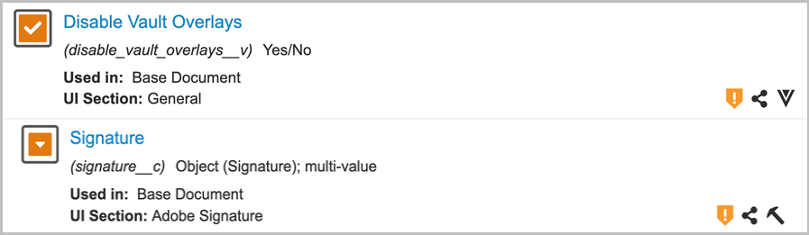

# [!DNL Veeva Vault] Guida all’installazione{#veeva-installation-guide}

[**Contatta il supporto di Adobe Sign**](https://adobe.com/go/adobesign-support-center_it)

## Panoramica {#overview}

Questo documento spiega come stabilire l&#39;integrazione di Adobe Sign con [!DNL Veeva Vault] piattaforma. [!DNL Veeva Vault] È una piattaforma ECM (Enterprise Content Management) sviluppata per le scienze della vita. Un &quot;Vault&quot; è un repository di contenuti e dati con l&#39;uso tipico per documenti normativi, rapporti di ricerca, richieste di sovvenzioni, appalti generali e altro ancora. Una singola azienda può avere più &quot;caveau&quot; che devono essere mantenuti separatamente.

I passaggi di alto livello per completare l&#39;integrazione sono:

* Attivazione dell’account amministrativo in Adobe Sign (solo per i nuovi clienti)
* Create oggetti per monitorare la cronologia del ciclo di vita di un accordo nel Vault.
* Crea un nuovo profilo di sicurezza.
* Configura un gruppo in Adobe Sign per contenere la proprietà [!DNL Veeva Vault] utente di integrazione.
* Creare campi documento ed interpretazioni.
* Configura le azioni web e aggiorna il ciclo di vita del documento.
* Crea la configurazione del tipo di documento utente e del ruolo utente.

>[!NOTE]
>
>L’amministratore di Adobe Sign deve eseguire i passaggi di configurazione di Adobe Sign in Adobe Sign.

## Configura le seguenti opzioni [!DNL Veeva Vault] {#configure-veeva}

Per configurare [!DNL Veeva Vault] per l’integrazione con Adobe Sign, crea alcuni oggetti che consentono di monitorare la cronologia del ciclo di vita di un accordo in Vault. Gli amministratori devono creare i seguenti oggetti:

* Firma
* Firmatario
* Evento firma
* Process Locker

### Crea oggetto firma  {#create-signature-object}

L’oggetto Firma viene creato per memorizzare le informazioni relative all’accordo. Un oggetto Signature è un database che contiene informazioni nei seguenti campi specifici:

**Campi oggetto firma**

| Campo | Etichetta | Tipo | Descrizione |
| --- | --- | ---| --- | 
| external_id__c | ID accordo | Stringa (100) | Contiene l’ID accordo univoco dell’Adobe Sign |
| file_hash__c | Hash file | Stringa (50) | Contiene il checksum md5 del file inviato ad Adobe Sign |
| name__v | Nome | Stringa (128) | Contiene il nome dell’accordo |
| sender_c | Mittente | Oggetto (utente) | Contiene il riferimento all’utente Vault che ha creato l’accordo. |
| signature_status__c | Stato firma | Stringa (75) | Contiene lo stato dell’accordo in Adobe Sign |
| signature_type__c | Tipo firma | Stringa (20) | Conserva il tipo di firma dell’accordo in Adobe Sign (SCRITTO o ESIGN) |
| start_date__c | Data di inizio | DateTime | Data in cui l’accordo è stato inviato per la firma |
| cancellation_date__c | Data di annullamento | DateTime | Consente di mantenere la data in cui l’accordo è stato annullato. |
| completed_date__c | Data di completamento | DateTime | Indica la data in cui l’accordo è stato completato. |
| viewable_rendition_used_c | Rendition visualizzabile utilizzata | Booleano | Flag che indica se il rendering visualizzabile è stato inviato per la firma. (per impostazione predefinita, è true) |

### Crea oggetto firmatario {#create-signatory-object}

L’oggetto firmatario viene creato per memorizzare le informazioni relative ai partecipanti di un accordo. Contiene informazioni nei seguenti campi specifici:

**Campi oggetto firmatario**

| Campo | Etichetta | Tipo | Descrizione |
| --- | --- | ---| --- | 
| email__c | E-mail | Stringa (120) | Contiene l’ID accordo univoco dell’Adobe Sign |
| external_id__c | ID partecipante | Stringa (80) | Contiene l’identificatore univoco del partecipante Adobe Sign |
| name__v | Nome | Stringa (128) | Contiene il nome del partecipante Adobe Sign |
| order__c | Ordine | Numero | Contiene il numero d’ordine del partecipante all’accordo Adobe Sign |
| role_c | Ruolo | Stringa (30) | Il ruolo del partecipante all’accordo Adobe Sign |
| signature__c | Firma | Oggetto (firma) | Contiene il riferimento al record principale della firma |
| signature_status__c | Stato firma | Stringa (100) | Contiene lo stato del partecipante all’accordo Adobe Sign |
| user__c | Utente | Oggetto (utente) | Contiene il riferimento al record utente del firmatario se il partecipante è un utente Vault |

### Crea oggetto evento firma  {#create-signature-event}

L&#39;oggetto evento firma viene creato per memorizzare le informazioni relative agli eventi di un accordo. Contiene informazioni nei seguenti campi specifici:

| Campo | Etichetta | Tipo | Descrizione |
| --- | --- | ---| --- | 
| acting_user_email__c | E-mail utente interessato | Stringa | Contiene l’e-mail dell’utente Adobe Sign che ha eseguito l’azione che ha causato la generazione dell’evento |
| acting_user_name__c | Nome utente attivo | Stringa | Contiene il nome dell&#39;utente Adobe Sign che ha eseguito l&#39;azione che ha causato la generazione dell&#39;evento |
| description__c | Descrizione | Stringa | Contiene la descrizione dell&#39;evento Adobe Sign |
| event_date__c | Data evento | DateTime | Contiene la data e l&#39;ora dell&#39;evento Adobe Sign |
| event_type__c | Tipo di evento | Stringa | Contiene il tipo di evento Adobe Sign |
| name__v | Nome | Stringa | Nome evento generato automaticamente |
| participant_comment__c | Commento del partecipante | Stringa | Contiene il commento del partecipante Adobe Sign, se presente |
| participant_email__c | Indirizzo e-mail partecipante | Stringa | Contiene l’e-mail del partecipante Adobe Sign |
| participant_role_c | Ruolo partecipante | Stringa | Il ruolo del partecipante di Adobe Sign |
| signature__c | Firma | Oggetto (firma) | Contiene il riferimento al record principale della firma |

### Creare un oggetto Process Locker  {#create-process-locker}

Viene creato un oggetto Process Locker per bloccare il processo di integrazione di Adobe Sign. Non richiede alcun campo personalizzato.

## Creare profili di protezione{#security-profiles}

Per una corretta integrazione con il Vault, è stato creato un nuovo profilo di sicurezza denominato *Profilo di integrazione Adobe Sign* viene creato e le relative autorizzazioni sono impostate per *Azioni di amministrazione di Adobe Sign*. Il profilo di integrazione Adobe Sign viene assegnato all’account di sistema e viene utilizzato dall’integrazione quando si chiamano le API Vault. Questo profilo consente le autorizzazioni per:

* API di Vault
* Lettura, creazione, modifica ed eliminazione: Oggetti Firma, Firma, Eventi firma e Blocco processi

I profili di sicurezza degli utenti che richiedono l’accesso alla cronologia di Adobe Sign nell’archivio devono disporre delle autorizzazioni di lettura per gli oggetti Signature, Signatory e Signature Event.

## Crea gruppo {#create-group}

Per configurare Adobe Sign per [!DNL Vault], un nuovo gruppo denominato *Adobe Sign Admin Group* viene creato. Questo gruppo viene utilizzato per impostare la sicurezza a livello di campo del documento per i campi correlati ad Adobe Sign e deve includere *Profilo di integrazione Adobe Sign* per impostazione predefinita.

## Crea utente {#create-user}

L’account di sistema Vault utilizzato dall’integrazione Adobe Sign deve:

* Disporre Del Profilo Di Integrazione Di Adobe Sign
* Avere un profilo di sicurezza
* Disporre di criteri di sicurezza specifici che disabilitano la scadenza della password
* Diventa membro del gruppo di amministrazione di Adobe Sign.

Per garantire che l’utente dell’account di sistema appartenga al gruppo di amministratori di Adobe Sign per il ciclo di vita del documento specifico, è necessario creare i record di impostazione del ruolo utente.

## Creare ruoli applicazione {#create-application-roles}

È necessario creare un ruolo applicazione chiamato *Ruolo di amministratore Adobe Sign*. Questo ruolo deve essere definito nel ciclo di vita di ogni tipo di documento idoneo per la firma degli Adobi. Per ciascuno degli stati del ciclo di vita specifici di Adobe Sign, il ruolo di amministratore Adobe Sign viene aggiunto e configurato con le autorizzazioni appropriate.

## Crea campi documento {#create-fields}

Per stabilire l’integrazione con Adobe Sign, gli amministratori devono creare due nuovi campi documento condivisi:

* Firma (signature__c)
* Consenti azioni utente di Adobe Sign (allow_adobe_sign_user_actions__c)

Questi campi condivisi devono essere aggiunti a tutti i tipi di documento idonei per la firma degli Adobi. Entrambi i campi devono avere una protezione specifica che consente solo ai membri del gruppo di amministrazione di Adobe Sign di aggiornare i propri valori.

Gli amministratori devono aggiungere il campo condiviso esistente *Disattivare le sovrapposizioni vettoriali (disable_vault_overlays__v)* e impostalo su Attivo per tutti i tipi di documento idonei per la firma degli Adobi. Facoltativamente, il campo può avere una protezione specifica che consente solo ai membri del gruppo di amministrazione di Adobe Sign di aggiornarne il valore.

## Creare interpretazioni documento {#create-renditions}

Gli amministratori devono creare un nuovo tipo di rendering denominato *Adobe Sign rendering (adobe_sign_rendition__c)*, che viene utilizzato dall&#39;integrazione Vault per caricare documenti PDF firmati in Adobe Sign. L’interpretazione Adobe Sign deve essere dichiarata per ogni tipo di documento idoneo per la firma dell’Adobe.

## Configurare le azioni Web {#web-actions}

L&#39;integrazione di Adobe Sign e Vault richiede la creazione e la configurazione delle seguenti due azioni Web:

* **Creare Adobe Sign**: Crea o visualizza l’accordo Adobe Sign.

   Tipo: Document Target: Visualizza nell’URL del Vault: <https://api.na1.adobesign.com/api/gateway/veevavaultintsvc/partner/agreement?docId=${Document.id}&majVer=${Document.major_version_number__v}&minVer=${Document.minor_version_number__v}&vaultid=${Vault.id}&useWaitPage=true>

   

* **Annulla Adobe Sign**: Annulla un accordo esistente in Adobe Sign e ripristina lo stato iniziale di un documento.

   Tipo: Document Target: Visualizza nell’URL del Vault: : <https://api.na1.adobesign.com/api/gateway/veevavaultintsvc/partner/agreement/cancel?docId=${Document.id}&majVer=${Document.major_version_number__v}&minVer=${Document.minor_version_number__v}&vaultid=${Vault.id}&useWaitPage=true>

   

## Aggiornamento del ciclo di vita dei documenti {#document-lifecycle}

Per ogni tipo di documento idoneo per la firma di Adobi, il ciclo di vita del documento corrispondente deve essere aggiornato aggiungendo nuovi stati e ruoli del ciclo di vita.

### Ruolo Ciclo di vita {#lifecycle-role}

Il ruolo dell’applicazione di amministrazione Adobe Sign deve essere aggiunto a tutti i cicli di vita utilizzati dai documenti idonei per la firma degli Adobi, come illustrato di seguito.

Il ruolo di amministratore deve essere creato con le seguenti opzioni:

* Abilitato Controllo accesso dinamico.
* Regole di condivisione dei documenti che includono solo il gruppo di tipi di documento, come illustrato nell&#39;immagine seguente.

### Stati del ciclo di vita {#lifecycle-states}

Il ciclo di vita degli accordi Adobe Sign ha i seguenti stati:

* BOZZA
* AUTHORING o DOCUMENTS_NOT_YET_PROCESSED
* OUT_FOR_SIGNATURE o OUT_FOR_approval
* FIRMATO O APPROVATO
* ANNULLATA
* SCADUTO

Quando un documento di archivio viene inviato ad Adobe Sign, il suo stato deve corrispondere allo stato in cui si trova l’accordo. A tale scopo, aggiungi i seguenti stati in ogni ciclo di vita utilizzato dai documenti idonei per la firma degli Adobi:

* **Prima della firma dell’Adobe** (recensito): Si tratta di un nome segnaposto per lo stato da cui è possibile inviare il documento ad Adobe Sign. In base al tipo di documento, può essere Bozza o Revisionato. L&#39;etichetta dello stato del documento può essere personalizzata in base alle esigenze del cliente. Prima di Adobe lo stato della firma deve definire due azioni utente:

   * Azione che modifica lo stato del documento in *In Adobe Sign Draft* state. Il nome di questa azione utente deve essere lo stesso per tutti i tipi di documento per qualsiasi ciclo di vita. Se necessario, i criteri per questa azione possono essere impostati su &quot;Consenti azioni utente di Adobe Sign uguale a Sì&quot;.
   * Azione che chiama l&#39;azione Web &quot;Adobe Sign&quot;. Questo stato deve avere una protezione che consenta al ruolo di amministratore di Adobe Sign di: visualizza il documento, visualizza il contenuto, modifica i campi, modifica le relazioni, scarica l’origine, gestisci le interpretazioni visualizzabili e modifica lo stato.

      

* **In Adobe Sign Draft**: Si tratta di un nome segnaposto per lo stato che indica che il documento è già stato caricato in Adobe Sign e che il suo accordo è in stato BOZZA. È uno stato obbligatorio. Questo stato deve definire cinque azioni utente:

   * Azione che modifica lo stato del documento in *In Adobe Sign Authoring* state. Il nome di questa azione utente deve essere lo stesso per tutti i tipi di documento per qualsiasi ciclo di vita. Se necessario, i criteri per questa azione possono essere impostati su &quot;Consenti azioni utente di Adobe Sign uguale a Sì&quot;.
   * Azione che modifica lo stato del documento in *In Adobe stato di firma*. Il nome di questa azione utente deve essere lo stesso per tutti i tipi di documento per qualsiasi ciclo di vita. Se necessario, i criteri per questa azione possono essere impostati su &quot;Consenti azioni utente di Adobe Sign uguale a Sì&quot;.
   * Azione che modifica lo stato del documento in *Adobe Sign annullato* state. Il nome di questa azione utente deve essere lo stesso per tutti i tipi di documento per qualsiasi ciclo di vita. Se necessario, i criteri per questa azione possono essere impostati su &quot;Consenti azioni utente di Adobe Sign uguale a Sì&quot;.
   * Azione che chiama l’azione Web &quot;Adobe Sign&quot; .
   * Azione che chiama l’azione Web &quot;Annulla Adobe Sign&quot;. Questo stato deve avere una protezione che consenta al ruolo di amministratore di Adobe Sign di: visualizza il documento, visualizza il contenuto, modifica i campi, modifica le relazioni, scarica l’origine, gestisci le interpretazioni visualizzabili e modifica lo stato.

      

* **In Adobe Sign Authoring**: Si tratta di un nome segnaposto per lo stato che indica che il documento è già stato caricato in Adobe Sign e che il relativo accordo si trova nello stato AUTHORING o DOCUMENTS_NOT_YET_PROCESSED. È uno stato obbligatorio. Questo stato deve avere quattro azioni utente definite:

   * Azione che modifica lo stato del documento in Adobe Sign annullato. Il nome di questa azione utente deve essere uguale per tutti i tipi di documento, indipendentemente dal ciclo di vita. Se necessario, i criteri per questa azione possono essere impostati su &quot;Consenti azioni utente di Adobe Sign uguale a Sì&quot;.
   * Azione che modifica lo stato del documento in Adobe stato di firma. Il nome di questa azione utente deve essere uguale per tutti i tipi di documento, indipendentemente dal ciclo di vita. Se necessario, i criteri per questa azione possono essere impostati su &quot;Consenti azioni utente di Adobe Sign uguale a Sì&quot;.
   * Azione che chiama l&#39;azione Web &quot;Adobe Sign&quot;
   * Azione che chiama l’azione Web &quot;Annulla Adobe Sign&quot;. Questo stato deve avere una protezione che consenta al ruolo di amministratore di Adobe Sign di: visualizza il documento, visualizza il contenuto, modifica i campi, modifica le relazioni, scarica l’origine, gestisci le interpretazioni visualizzabili e modifica lo stato.

      

* **In Adobe firma**: Si tratta di un nome segnaposto per lo stato che indica che il documento viene caricato in Adobe Sign e che il relativo accordo è già stato inviato ai partecipanti (stato OUT_FOR_SIGNATURE o OUT_FOR_APPROVED). È uno stato obbligatorio. Questo stato deve avere cinque azioni utente definite:

   * Azione che modifica lo stato del documento in Adobe Sign annullato. Lo stato di destinazione di questa azione può essere qualsiasi esigenza del cliente e può essere diverso per diversi tipi. Il nome di questa azione utente deve essere uguale per tutti i tipi di documento, indipendentemente dal ciclo di vita. Se necessario, i criteri per questa azione possono essere impostati su &quot;Consenti azioni utente di Adobe Sign uguale a Sì&quot;.
   * Azione che modifica lo stato del documento in Adobe Sign stato rifiutato. Lo stato di destinazione di questa azione può essere qualsiasi esigenza del cliente e può essere diverso per diversi tipi. Il nome di questa azione utente deve essere uguale per tutti i tipi di documento, indipendentemente dal ciclo di vita. Se necessario, i criteri per questa azione possono essere impostati su &quot;Consenti azioni utente di Adobe Sign uguale a Sì&quot;.
   * Azione che modifica lo stato del documento in Adobe dello stato Firmato. Lo stato di destinazione di questa azione può essere qualsiasi esigenza del cliente e può essere diverso per diversi tipi. Tuttavia, il nome di questa azione utente deve essere lo stesso per tutti i tipi di documento, indipendentemente dal ciclo di vita. Se necessario, i criteri per questa azione possono essere impostati su &quot;Consenti azioni utente di Adobe Sign uguale a Sì&quot;.
   * Azione che chiama Azione Web *Adobe Sign*.
   * Azione che chiama Azione Web *Annulla Adobe Sign*. Questo stato deve avere una protezione che consenta al ruolo di amministratore di Adobe Sign di: visualizza il documento, visualizza il contenuto, modifica i campi, modifica le relazioni, scarica l’origine, gestisci le interpretazioni visualizzabili e modifica lo stato.

      

* **Adobe firmato (approvato)**: Si tratta di un nome segnaposto per lo stato che indica che il documento viene caricato in Adobe Sign e che il suo accordo è stato completato (stato FIRMATO o APPROVATO). È uno stato obbligatorio e può essere uno stato del ciclo di vita esistente, come Approvato.
Questo stato non richiede azioni da parte dell&#39;utente. Questo stato deve avere una sicurezza che consenta al ruolo di amministratore di Adobe Sign di: visualizza documenti, visualizza contenuti e modifica campi.

Il diagramma seguente illustra le mappature tra gli stati dell’accordo Adobe Sign e del documento Vault, in cui lo stato Prima della firma dell’Adobe è Bozza.

## Creare un gruppo di tipi di documento e impostazione del ruolo utente  {#document-type-group-user-role}

### Crea gruppo di tipi di documento {#create-document-type-group}

Gli amministratori devono creare un nuovo record Gruppo tipi di documento denominato &quot;Adobe Sign documento&quot;. Questo gruppo di tipi di documento viene aggiunto per tutte le classificazioni di documenti idonee per il processo Adobe Sign. Poiché la proprietà del gruppo di tipi di documento non viene ereditata dal tipo al sottotipo né dal sottotipo al livello di classificazione, deve essere impostata per ogni classificazione del documento idonea per Adobe Sign.

### Crea impostazione ruolo utente {#create-user-role-setup}

Una volta che i cicli di vita sono stati configurati correttamente, il sistema deve garantire che l’utente amministratore di Adobe Sign sia aggiunto da DAC a tutti i documenti idonei per la procedura di Adobe Sign. A tale scopo, viene creato il record Impostazione ruolo utente appropriato che specifica:

* Gruppo di tipi di documento come &quot;Adobe Sign documento&quot;,
* Ruolo dell&#39;applicazione come &quot;ruolo di amministratore dell&#39;Adobe Sign&quot; e
* Utente di integrazione.

>[!NOTE]
>
>Se l’oggetto Impostazione ruolo utente non contiene il campo che fa riferimento all’oggetto Gruppo tipo di documento, questo campo deve essere aggiunto.

## Connetti [!DNL Veeva Vault] per Adobe Sign tramite middleware {#connect-middleware}

Dopo aver completato la configurazione per [!DNL Veeva Vault] e l’account amministratore di Adobe Sign, l’amministratore deve creare una connessione tra i due account utilizzando il middleware. Il [!DNL Veeva Vault] e la connessione all’account Adobe Sign viene avviata da Adobe Sign Identity e quindi utilizzata per memorizzare l’identità Veeva Vault.
Per garantire la sicurezza e la stabilità del sistema, l&#39;amministratore deve utilizzare una [!DNL Veeva Vault] account di sistema/servizio/utilità, ad esempio `adobe.for.veeva@xyz.com`, anziché un account utente personale, ad esempio `bob.smith@xyz.com`.

L’amministratore dell’account Adobe Sign deve seguire i passaggi riportati di seguito per connettersi [!DNL Veeva Vault] per Adobe Sign tramite middleware:

1. Vai alla [Adobe Sign per [!DNL Veeva Vault] Home page](https://static.adobesigncdn.com/veevavaultintsvc/index.html).
1. Seleziona **[!UICONTROL Login]** dall&#39;angolo superiore destro.

   

1. Nella pagina di accesso di Adobe Sign visualizzata, immetti l’indirizzo e-mail e la password dell’amministratore dell’account, quindi seleziona **[!UICONTROL Cantare]**.

   

   Dopo aver effettuato l’accesso, la pagina visualizza l’ID e-mail associato e la scheda Impostazioni, come illustrato di seguito.

   

1. Selezionate la proprietà **[!UICONTROL Impostazioni]** tab.

   La pagina Impostazioni visualizza le connessioni disponibili e non ne visualizza nessuna in caso di prima configurazione della connessione, come illustrato di seguito.

   

1. Seleziona **[!UICONTROL Aggiungi connessione]** per aggiungere una nuova connessione.

1. Nella finestra di dialogo Aggiungi connessione che si apre, fornire i dettagli necessari, tra cui [!DNL Veeva Vault] credenziali.

   Le credenziali Adobe Sign vengono compilate automaticamente dall’accesso Adobe Sign iniziale.

   

1. Seleziona **[!UICONTROL Convalidare]** per convalidare i dettagli dell’account.

   Al termine della convalida, viene visualizzata una notifica &quot;L’utente è stato convalidato correttamente&quot;, come illustrato di seguito.

   

1. Per limitare l&#39;utilizzo a un determinato gruppo di Adobe Sign, espandere la proprietà **[!UICONTROL Gruppo]** elenco a discesa e seleziona uno dei gruppi disponibili.

   

1. Seleziona **[!UICONTROL Salva]** per salvare la nuova connessione.

   La nuova connessione viene visualizzata nella scheda Impostazioni e mostra l’integrazione riuscita tra [!DNL Veeva Vault] e Adobe Sign.

   

## Ciclo di vita della distribuzione dei pacchetti {#deployment-lifecycle}

### Ciclo di vita generale della distribuzione {#general-deployment}

**Passaggio 1.** Creare un nuovo ruolo applicazione denominato &quot;Ruolo amministratore Adobe Sign&quot;.

**Passaggio 2.** Creare un nuovo gruppo di tipi di documento denominato &quot;Adobe Sign documento&quot;.

**Passaggio 3.** [Distribuire il pacchetto](https://helpx.adobe.com/content/dam/help/en/PKG-AdobeSign-Integration.zip).

**Passaggio 4.** Crea un nuovo gruppo gestito dall’utente denominato &quot;Adobe Sign Admin Group&quot;.

**Passaggio 5.** Crea un profilo Utente di integrazione con il profilo di sicurezza &quot;Profilo di integrazione Adobe Sign&quot; e assegnalo al gruppo di amministrazione di Adobe Sign.

**Passaggio 6.** Assegnare le autorizzazioni di lettura per tutti i profili di sicurezza agli oggetti Signature, Signatory e Signature Event per gli utenti che richiedono l’accesso alla cronologia di Adobe Sign in Vault.

**Passaggio 7.** Definisci il ruolo di amministratore Adobe Sign nel ciclo di vita di ogni tipo di documento idoneo per la firma degli Adobi. Per ogni stato del ciclo di vita specifico di Adobe Sign, questo ruolo viene aggiunto e configurato con le autorizzazioni appropriate.

**Passaggio 8.** Dichiarare il rendering Adobe Sign per ogni tipo di documento idoneo per la firma di Adobe.

**Passaggio 9.** Per ogni tipo di documento idoneo per la firma di Adobi, aggiorna il ciclo di vita del documento corrispondente aggiungendo nuovi stati e ruoli del ciclo di vita.

**Passaggio 10.** Aggiungete il gruppo di tipi di documento denominato &quot;Adobe Sign documento&quot; per tutte le classificazioni di documenti idonee per la procedura di Adobe Sign.

**Passaggio 11.** Una volta completate tutte le configurazioni, il sistema deve garantire che l’utente amministratore di Adobe Sign sia aggiunto dal DAC per tutti i documenti idonei per la procedura di Adobe Sign. A tale scopo, viene creato il record User Role Setup appropriato che specifica il Document Type Group come &#39;Adobe Sign Document&#39;, il ruolo dell&#39;applicazione come &#39;Adobe Sign Admin Role&#39; e un utente di integrazione.

### Ciclo di vita specifico della distribuzione {#specific-deployment}

**Passaggio 1.** Crea un nuovo ruolo applicazione denominato &quot;Ruolo amministratore Adobe Sign&quot;.

**Passaggio 2.** Creare un nuovo gruppo di tipi di documento denominato &quot;Adobe Sign documento&quot;.

**Passaggio 3.** [Distribuire il pacchetto](https://helpx.adobe.com/content/dam/help/en/PKG-AdobeSign-Integration.zip).

**Passaggio 4.** Crea un nuovo gruppo gestito dagli utenti denominato &quot;Adobe Sign Admin Group&quot;.

**Passaggio 5.** Crea un profilo Utente di integrazione con il profilo di sicurezza denominato &quot;Profilo di integrazione Adobe Sign&quot; e assegnalo al gruppo di amministrazione di Adobe Sign.
