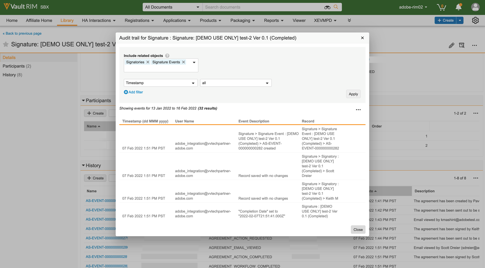
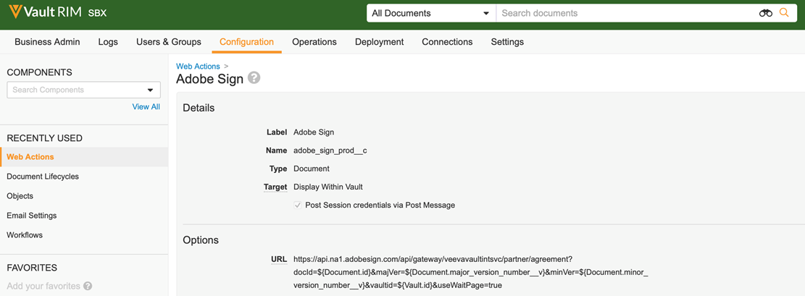
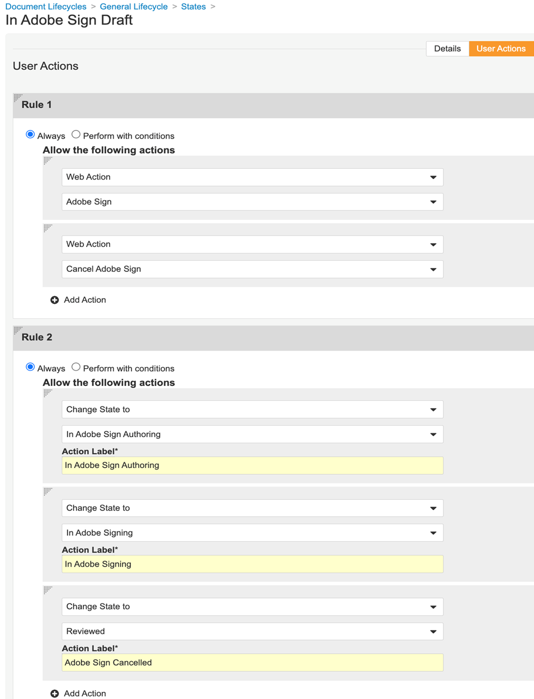
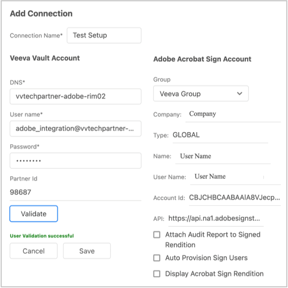

# [!DNL Veeva Vault] Guida all’installazione{#veeva-installation-guide}

[**Contatta il supporto di Adobe Sign**](https://adobe.com/go/adobesign-support-center_it)

## Panoramica {#overview}

Questo documento spiega come stabilire l&#39;integrazione di Adobe Sign con [!DNL Veeva Vault] piattaforma. [!DNL Veeva Vault] È una piattaforma ECM (Enterprise Content Management) sviluppata per le scienze della vita. Un &quot;Vault&quot; è un repository di contenuti e dati con l&#39;uso tipico per documenti normativi, rapporti di ricerca, richieste di sovvenzioni, appalti generali e altro ancora. Una singola azienda può avere più &quot;caveau&quot; che devono essere mantenuti separatamente.

I passaggi di alto livello per completare l&#39;integrazione sono:

* Attiva il tuo account amministrativo in Adobe Sign (solo per i nuovi clienti).
* Create oggetti per monitorare la cronologia del ciclo di vita di un accordo nel Vault.
* Crea un nuovo profilo di sicurezza.
* Configura un gruppo in Adobe Sign per contenere la proprietà [!DNL Veeva Vault] utente di integrazione.
* Creare campi documento ed interpretazioni.
* Configura le azioni web e aggiorna il ciclo di vita del documento.
* Crea la configurazione del tipo di documento utente e del ruolo utente.
* Collegate Veeva Vault ad Adobe Sign utilizzando il middleware.

>[!NOTE]
>
>L’amministratore di Adobe Sign deve eseguire i passaggi di configurazione di Adobe Sign in Adobe Sign.

## Configura [!DNL Veeva Vault] {#configure-veeva}

Per configurare [!DNL Veeva Vault] per l’integrazione con Adobe Sign, è necessario implementare i passaggi elencati di seguito.

### Passaggio 1. Crea gruppo {#create-group}

Per configurare Adobe Sign per [!DNL Vault], un nuovo gruppo denominato *Adobe Sign Admin Group* viene creato. Questo gruppo viene utilizzato per impostare la sicurezza a livello di campo del documento per i campi correlati ad Adobe Sign e deve includere *Profilo di integrazione Adobe Sign* per impostazione predefinita.

### Passaggio 2. Distribuire il pacchetto {#deploy-package}

[Distribuire il pacchetto](https://helpx.adobe.com/content/dam/help/en/PKG-AdobeSign-Integration.zip) e segui i passaggi. Una volta distribuito, il pacchetto crea:

* Oggetti personalizzati: Oggetto Signature, oggetto Signature, oggetto evento Signature, oggetto Process Locker
* Layout di pagina dell’oggetto firma
* Layout di pagina dell’oggetto evento firma
* Layout di pagina dell’oggetto firmatario
* Layout di pagina dell’oggetto Process Locker
* Tipo di rendering Adobe Sign
* Tipo di rendering originale
* Campo condiviso signature__c , allow_adobe_sign_user_actions__c
* Azione Web di Adobe Sign
* Annullare l’azione Web di Adobe Sign
* Insieme di autorizzazioni Azioni amministratore Adobe Sign
* Profilo di sicurezza di Adobe Sign Integration Profile
* Ruolo di amministratore Adobe Sign ruolo applicazione
* Gruppo di tipi di documento &quot;Adobe Sign documento&quot;

#### Oggetto Signature {#signature-object}

L’oggetto Firma viene creato per memorizzare le informazioni relative all’accordo. Un oggetto Signature è un database che contiene informazioni nei seguenti campi specifici:

**Campi oggetto firma**

| Campo | Etichetta | Tipo | Descrizione |
| --- | --- | ---| --- | 
| external_id__c | ID accordo | Stringa (100) | Contiene l’ID accordo univoco dell’Adobe Sign |
| file_hash__c | Hash file | Stringa (50) | Contiene il checksum md5 del file inviato ad Adobe Sign |
| name__v | Nome | Stringa (128) | Contiene il nome dell’accordo |
| sender_c | Mittente | Oggetto (utente) | Contiene il riferimento all’utente Vault che ha creato l’accordo. |
| signature_status__c | Stato firma | Stringa (75) | Contiene lo stato dell’accordo in Adobe Sign |
| signature_type__c | Tipo firma | Stringa (20) | Conserva il tipo di firma dell’accordo in Adobe Sign (SCRITTO o ESIGN) |
| start_date__c | Data di inizio | DateTime | Data in cui l’accordo è stato inviato per la firma |
| cancellation_date__c | Data di annullamento | DateTime | Consente di mantenere la data in cui l’accordo è stato annullato. |
| completed_date__c | Data di completamento | DateTime | Indica la data in cui l’accordo è stato completato. |
| viewable_rendition_used_c | Rendition visualizzabile utilizzata | Booleano | Flag che indica se il rendering visualizzabile è stato inviato per la firma. (per impostazione predefinita, è true) |

#### Oggetto firmatario {#signatory-object}

L’oggetto firmatario viene creato per memorizzare le informazioni relative ai partecipanti di un accordo. Contiene informazioni nei seguenti campi specifici:

**Campi oggetto firmatario**

| Campo | Etichetta | Tipo | Descrizione |
| --- | --- | ---| --- | 
| email__c | E-mail | Stringa (120) | Contiene l’ID accordo univoco dell’Adobe Sign |
| external_id__c | ID partecipante | Stringa (80) | Contiene l’identificatore univoco del partecipante Adobe Sign |
| name__v | Nome | Stringa (128) | Contiene il nome del partecipante Adobe Sign |
| order__c | Ordine | Numero | Contiene il numero d’ordine del partecipante all’accordo Adobe Sign |
| role_c | Ruolo | Stringa (30) | Il ruolo del partecipante all’accordo Adobe Sign |
| signature__c | Firma | Oggetto (firma) | Contiene il riferimento al record principale della firma |
| signature_status__c | Stato firma | Stringa (100) | Contiene lo stato del partecipante all’accordo Adobe Sign |
| user__c | Utente | Oggetto (utente) | Contiene il riferimento al record utente del firmatario se il partecipante è un utente Vault |

#### Oggetto evento firma {#signature-event}

L&#39;oggetto evento firma viene creato per memorizzare le informazioni relative agli eventi di un accordo. Contiene informazioni nei seguenti campi specifici:

| Campo | Etichetta | Tipo | Descrizione |
| --- | --- | ---| --- | 
| acting_user_email__c | E-mail utente interessato | Stringa | Contiene l’e-mail dell’utente Adobe Sign che ha eseguito l’azione che ha causato la generazione dell’evento |
| acting_user_name__c | Nome utente attivo | Stringa | Contiene il nome dell&#39;utente Adobe Sign che ha eseguito l&#39;azione che ha causato la generazione dell&#39;evento |
| description__c | Descrizione | Stringa | Contiene la descrizione dell&#39;evento Adobe Sign |
| event_date__c | Data evento | DateTime | Contiene la data e l&#39;ora dell&#39;evento Adobe Sign |
| event_type__c | Tipo di evento | Stringa | Contiene il tipo di evento Adobe Sign |
| name__v | Nome | Stringa | Nome evento generato automaticamente |
| participant_comment__c | Commento del partecipante | Stringa | Contiene il commento del partecipante Adobe Sign, se presente |
| participant_email__c | Indirizzo e-mail partecipante | Stringa | Contiene l’e-mail del partecipante Adobe Sign |
| participant_role_c | Ruolo partecipante | Stringa | Il ruolo del partecipante di Adobe Sign |
| signature__c | Firma | Oggetto (firma) | Contiene il riferimento al record principale della firma |

#### Oggetto Process Locker {#process-locker}

Viene creato un oggetto Process Locker per bloccare il processo di integrazione di Adobe Sign. Non richiede alcun campo personalizzato.

Gli oggetti Signature, Signatory, Signature Event e Process Locker che fanno parte del pacchetto di distribuzione hanno la proprietà &quot;Audit data changes for this object&quot; attivata per impostazione predefinita.

**Nota:** È possibile fare in modo che il Vault acquisisca le modifiche dei dati dei record di oggetto nei registri di controllo abilitando l&#39;impostazione di verifica delle modifiche dei dati. Questa impostazione è disattivata per impostazione predefinita. Dopo aver attivato questa impostazione e creato i record, non è più possibile disattivarla. Se questa impostazione è disattivata e sono presenti dei record, solo il proprietario dell’archivio può aggiornarla.

#### **Visualizzare i partecipanti e la cronologia per l’oggetto firma** {#display-participants-history}

L&#39;oggetto Signature che fa parte del pacchetto di distribuzione viene fornito con la proprietà [Layout di pagina Dettagli firma](https://vvtechpartner-adobe-rim.veevavault.com/ui/#admin/content_setup/object_schema/pagelayout?t=signature__c&amp;d=signature_detail_page_layout__c). Il layout di pagina contiene sezioni per i partecipanti e la cronologia.

* Il *Partecipanti* la sezione Oggetti correlati è configurata come nell&#39;immagine seguente.

   

* Potete modificare le colonne da visualizzare per i partecipanti, come illustrato di seguito.

   

* Il *Storia* la sezione Oggetti correlati è configurata come nell&#39;immagine seguente.

   

* Potete modificare le colonne da visualizzare per la Cronologia, come illustrato di seguito.

   

#### **Visualizzare i partecipanti e la cronologia di audit per il documento Adobe Sign** {#view-participants-audit-history}

* Per visualizzare i partecipanti e la cronologia di audit per il documento Adobe Sign, seleziona il collegamento nella sezione &quot;Adobe firma&quot; del documento.

   

* La pagina che si apre visualizza i partecipanti e la cronologia del documento Adobe Sign, come illustrato di seguito.

   

* Visualizza la traccia di verifica per la firma come illustrato di seguito.

   

### Passaggio 3. Configurazione dei profili di protezione {#security-profiles}

La distribuzione del pacchetto riuscita al Passaggio 2 crea il profilo di integrazione Adobe Sign. Il profilo di integrazione Adobe Sign viene assegnato all’account di sistema e viene utilizzato dall’integrazione quando si chiamano le API Vault. Questo profilo consente le autorizzazioni per:

* API di Vault
* Lettura, creazione, modifica ed eliminazione: Oggetti Firma, Firma, Eventi firma e Blocco processi

È necessario aggiornare Adobe Sign Admin Group (creato al passaggio 1) impostando il profilo di sicurezza incluso su Adobe Sign Integration Profile, come illustrato nell&#39;immagine seguente.

### Passaggio 4. Crea utente {#create-user}

L’account di sistema Vault utilizzato dall’integrazione Adobe Sign deve:

* Disporre di un profilo di integrazione Adobe Sign
* Avere un profilo di sicurezza
* Disporre di criteri di sicurezza specifici che disabilitano la scadenza della password
* Diventa membro del gruppo di amministrazione di Adobe Sign.

A tale scopo, effettua le seguenti operazioni:

1. Create un account di sistema Vault per gli utenti dell&#39;integrazione con Adobe Sign.

   

2. Aggiungi l’utente al gruppo di amministrazione di Adobe Sign.

   

### Passaggio 5. Configurare il gruppo di tipi di documento {#create-document-type-group}

Quando distribuisci il pacchetto Adobe Sign, viene creato un record Gruppo tipi di documento denominato &quot;Adobe Sign documento&quot;.

È necessario aggiungere questo gruppo di tipi di documento per tutte le classificazioni di documenti idonee per il processo Adobe Sign. Poiché la proprietà del gruppo di tipi di documento non viene ereditata dal tipo al sottotipo né dal sottotipo al livello di classificazione, deve essere impostata per ogni classificazione del documento idonea per Adobe Sign.

**Nota:** Se l’oggetto Impostazione ruolo utente non contiene il campo che fa riferimento all’oggetto Gruppo tipo di documento, è necessario aggiungere il campo. A tale scopo, passare a **[!UICONTROL Oggetto]** > **[!UICONTROL Impostazione ruolo utente]** > **[!UICONTROL Campi]** e completare i passaggi richiesti, come illustrato nell&#39;immagine seguente.

### Passaggio 6. Crea impostazione ruolo utente {#create-user-role-setup}

Una volta che i cicli di vita sono stati configurati correttamente, il sistema deve garantire che l’utente amministratore di Adobe Sign sia aggiunto da DAC a tutti i documenti idonei per la procedura di Adobe Sign. A tale scopo, viene creato il record Impostazione ruolo utente appropriato che specifica:

* Gruppo di tipi di documento come documento Adobe Sign
* Ruolo dell’applicazione come ruolo di amministratore Adobe Sign
* Utente di integrazione

### Passaggio 7. Imposta campi documento {#create-fields}

La distribuzione del pacchetto crea due nuovi campi documento condivisi necessari per stabilire l&#39;integrazione:

* Firma (signature__c)
* Consenti azioni utente di Adobe Sign (allow_adobe_sign_user_actions__c)

Per configurare i campi documento:

1. Vai alla scheda Configuration e seleziona **[!UICONTROL Campi documento]** > **[!UICONTROL Campi condivisi]**.
1. Nel campo Sezione di visualizzazione, seleziona **[!UICONTROL Sezione Crea visualizzazione]** e assegnare **[!UICONTROL Adobe firma]** come etichetta Sezione.

   

1. Per i due campi documento condivisi (signature__c e allow_adobe_sign_user_actions__c), aggiornare la sezione dell’interfaccia utente con **[!UICONTROL Adobe firma]** come etichetta di sezione.
1. Aggiungi i tre campi condivisi a tutti i tipi di documento idonei per la firma degli Adobi. A tale scopo, nella pagina del documento di base, selezionate **[!UICONTROL Aggiungi]** > **[!UICONTROL Campo condiviso esistente]** dall&#39;angolo superiore destro.

   

   

   

1. Entrambi i campi devono avere una protezione specifica che consente solo ai membri del gruppo di amministratori di Adobe Sign di aggiornare i propri valori.

   

Disattiva le sovrapposizioni vettoriali (disable_vault_overlays__v) è un campo condiviso esistente. Facoltativamente, il campo può avere una protezione specifica che consente solo ai membri del gruppo di amministrazione di Adobe Sign di aggiornarne il valore.

### Passaggio 8. Dichiarare le interpretazioni dei documenti {#declare-renditions}

Il nuovo tipo di rendering chiamato *Adobe Sign rendering (adobe_sign_rendition__c)* viene utilizzato dall’integrazione Vault per caricare documenti PDF firmati in Adobe Sign. È necessario dichiarare il rendering Adobe Sign per ogni tipo di documento idoneo per la firma di Adobe.

Il nuovo tipo di rendering chiamato *Rendition originale (original_rendition__c)* viene utilizzato dall’integrazione Vault come nome del rendering da utilizzare per memorizzare il rendering visualizzabile originale se il documento firmato viene importato come rendering visualizzabile.

### Passaggio 9. Aggiorna azioni Web {#web-actions}

L&#39;integrazione di Adobe Sign e Vault richiede la creazione e la configurazione delle seguenti due azioni Web:

* **Creare Adobe Sign**: Crea o visualizza l’accordo Adobe Sign.

   Tipo: Document Target: Visualizza all’interno delle credenziali di archivio: Abilita le credenziali post-sessione tramite URL post-messaggio: <https://api.na1.adobesign.com/api/gateway/veevavaultintsvc/partner/agreement?docId=${Document.id}&majVer=${Document.major_version_number__v}&minVer=${Document.minor_version_number__v}&vaultid=${Vault.id}&useWaitPage=true>

   

* **Annulla Adobe Sign**: Annulla un accordo esistente in Adobe Sign e ripristina lo stato iniziale di un documento.

   Tipo: Document Target: Visualizza all’interno delle credenziali di archivio: Abilita le credenziali post-sessione tramite URL post-messaggio: : <https://api.na1.adobesign.com/api/gateway/veevavaultintsvc/partner/agreement/cancel?docId=${Document.id}&majVer=${Document.major_version_number__v}&minVer=${Document.minor_version_number__v}&vaultid=${Vault.id}&useWaitPage=true>

   

### Passaggio 10. Aggiornamento del ciclo di vita dei documenti {#document-lifecycle}

Per ogni tipo di documento idoneo per la firma di Adobi, è necessario aggiornare il ciclo di vita del documento corrispondente aggiungendo nuovi stati e ruoli del ciclo di vita.

Il ciclo di vita degli accordi Adobe Sign ha i seguenti stati:

* BOZZA
* AUTHORING o DOCUMENTS_NOT_YET_PROCESSED
* OUT_FOR_SIGNATURE o OUT_FOR_approval
* FIRMATO O APPROVATO
* ANNULLATA
* SCADUTO

Per aggiornare il ciclo di vita del documento, effettua le seguenti operazioni:

1. Aggiungi il ruolo Ciclo di vita. Il ruolo dell’applicazione di amministrazione Adobe Sign deve essere aggiunto a tutti i cicli di vita utilizzati dai documenti idonei per la firma degli Adobi, come illustrato di seguito.

   

   Il ruolo di amministratore deve essere creato con le seguenti opzioni:

   * Abilitato Controllo accesso dinamico.
   * Regole di condivisione dei documenti che includono solo il gruppo di tipi di documento, come illustrato nell&#39;immagine seguente.

   

2. Creare gli stati del ciclo di vita. A tale scopo, passare a **[!UICONTROL Impostazioni]** > **[!UICONTROL Configurazione]** > **[!UICONTROL Cicli di vita documento]** > **[!UICONTROL Cicli di vita generali]** > **[!UICONTROL Stati]** > **[!UICONTROL Crea]**. Quindi, creare i seguenti stati:

   * In Adobe Sign Draft

   

   * In Adobe Sign Authoring

   

   * In Adobe firma

   

3. Aggiungi le azioni utente agli stati elencati di seguito.

   Quando un documento di archivio viene inviato ad Adobe Sign, il suo stato deve corrispondere allo stato in cui si trova l’accordo. A tale scopo, aggiungi i seguenti stati in ogni ciclo di vita utilizzato dai documenti idonei per la firma degli Adobi:

   * **Prima della firma dell’Adobe** (recensito): Si tratta di un nome segnaposto per lo stato da cui è possibile inviare il documento ad Adobe Sign. In base al tipo di documento, può essere Bozza o Revisionato. L&#39;etichetta dello stato del documento può essere personalizzata in base alle esigenze del cliente. Prima di Adobe lo stato della firma deve definire due azioni utente:

      * Azione che modifica lo stato del documento in *In Adobe Sign Draft* state. Il nome di questa azione utente deve essere lo stesso per tutti i tipi di documento per qualsiasi ciclo di vita. Se necessario, i criteri per questa azione possono essere impostati su &quot;Consenti azioni utente di Adobe Sign uguale a Sì&quot;.
      * Azione che chiama l&#39;azione Web &quot;Adobe Sign&quot;. Questo stato deve avere una protezione che consenta al ruolo di amministratore di Adobe Sign di: visualizza il documento, visualizza il contenuto, modifica i campi, modifica le relazioni, scarica l’origine, gestisci le interpretazioni visualizzabili e modifica lo stato.

      

   * **In Adobe Sign Draft**: Si tratta di un nome segnaposto per lo stato che indica che il documento è già stato caricato in Adobe Sign e che il suo accordo è in stato BOZZA. È uno stato obbligatorio. Questo stato deve definire cinque azioni utente:

      * Azione che modifica lo stato del documento in *In Adobe Sign Authoring* state. Il nome di questa azione utente deve essere lo stesso per tutti i tipi di documento per qualsiasi ciclo di vita. Se necessario, i criteri per questa azione possono essere impostati su &quot;Consenti azioni utente di Adobe Sign uguale a Sì&quot;.
      * Azione che modifica lo stato del documento in *In Adobe stato di firma*. Il nome di questa azione utente deve essere lo stesso per tutti i tipi di documento per qualsiasi ciclo di vita. Se necessario, i criteri per questa azione possono essere impostati su &quot;Consenti azioni utente di Adobe Sign uguale a Sì&quot;.
      * Azione che modifica lo stato del documento in *Adobe Sign annullato* state. Il nome di questa azione utente deve essere lo stesso per tutti i tipi di documento per qualsiasi ciclo di vita. Se necessario, i criteri per questa azione possono essere impostati su &quot;Consenti azioni utente di Adobe Sign uguale a Sì&quot;.
      * Azione che chiama l’azione Web &quot;Adobe Sign&quot; .
      * Azione che chiama l’azione Web &quot;Annulla Adobe Sign&quot;. Questo stato deve avere una protezione che consenta al ruolo di amministratore di Adobe Sign di: visualizza il documento, visualizza il contenuto, modifica i campi, modifica le relazioni, scarica l’origine, gestisci le interpretazioni visualizzabili e modifica lo stato.

      

   * **In Adobe Sign Authoring**: Si tratta di un nome segnaposto per lo stato che indica che il documento è già stato caricato in Adobe Sign e che il relativo accordo si trova nello stato AUTHORING o DOCUMENTS_NOT_YET_PROCESSED. È uno stato obbligatorio. Questo stato deve avere quattro azioni utente definite:

      * Azione che modifica lo stato del documento in Adobe Sign annullato. Il nome di questa azione utente deve essere uguale per tutti i tipi di documento, indipendentemente dal ciclo di vita. Se necessario, i criteri per questa azione possono essere impostati su &quot;Consenti azioni utente di Adobe Sign uguale a Sì&quot;.
      * Azione che modifica lo stato del documento in Adobe stato di firma. Il nome di questa azione utente deve essere uguale per tutti i tipi di documento, indipendentemente dal ciclo di vita. Se necessario, i criteri per questa azione possono essere impostati su &quot;Consenti azioni utente di Adobe Sign uguale a Sì&quot;.
      * Azione che chiama l&#39;azione Web &quot;Adobe Sign&quot;
      * Azione che chiama l’azione Web &quot;Annulla Adobe Sign&quot;. Questo stato deve avere una protezione che consenta al ruolo di amministratore di Adobe Sign di: visualizza il documento, visualizza il contenuto, modifica i campi, modifica le relazioni, scarica l’origine, gestisci le interpretazioni visualizzabili e modifica lo stato.

      

   * **In Adobe firma**: Si tratta di un nome segnaposto per lo stato che indica che il documento viene caricato in Adobe Sign e che il relativo accordo è già stato inviato ai partecipanti (stato OUT_FOR_SIGNATURE o OUT_FOR_APPROVED). È uno stato obbligatorio. Questo stato deve avere cinque azioni utente definite:

      * Azione che modifica lo stato del documento in Adobe Sign annullato. Lo stato di destinazione di questa azione può essere qualsiasi esigenza del cliente e può essere diverso per diversi tipi. Il nome di questa azione utente deve essere uguale per tutti i tipi di documento, indipendentemente dal ciclo di vita. Se necessario, i criteri per questa azione possono essere impostati su &quot;Consenti azioni utente di Adobe Sign uguale a Sì&quot;.
      * Azione che modifica lo stato del documento in Adobe Sign stato rifiutato. Lo stato di destinazione di questa azione può essere qualsiasi esigenza del cliente e può essere diverso per diversi tipi. Il nome di questa azione utente deve essere uguale per tutti i tipi di documento, indipendentemente dal ciclo di vita. Se necessario, i criteri per questa azione possono essere impostati su &quot;Consenti azioni utente di Adobe Sign uguale a Sì&quot;.
      * Azione che modifica lo stato del documento in Adobe dello stato Firmato. Lo stato di destinazione di questa azione può essere qualsiasi esigenza del cliente e può essere diverso per diversi tipi. Tuttavia, il nome di questa azione utente deve essere lo stesso per tutti i tipi di documento, indipendentemente dal ciclo di vita. Se necessario, i criteri per questa azione possono essere impostati su &quot;Consenti azioni utente di Adobe Sign uguale a Sì&quot;.
      * Azione che chiama Azione Web *Adobe Sign*.
      * Azione che chiama Azione Web *Annulla Adobe Sign*. Questo stato deve avere una protezione che consenta al ruolo di amministratore di Adobe Sign di: visualizza il documento, visualizza il contenuto, modifica i campi, modifica le relazioni, scarica l’origine, gestisci le interpretazioni visualizzabili e modifica lo stato.

      

      * **Adobe firmato (approvato)**: Si tratta di un nome segnaposto per lo stato che indica che il documento viene caricato in Adobe Sign e che il suo accordo è stato completato (stato FIRMATO o APPROVATO). È uno stato obbligatorio e può essere uno stato del ciclo di vita esistente, come Approvato.
Questo stato non richiede azioni da parte dell&#39;utente. Deve disporre di una protezione che consenta al ruolo di amministratore di Adobe Sign di: visualizza documenti, visualizza contenuti e modifica campi.

   Il diagramma seguente illustra le mappature tra gli stati dell’accordo Adobe Sign e del documento Vault, in cui lo stato Prima della firma dell’Adobe è Bozza.

   

### Passaggio 11. Aggiungere lo stage Adobe Sign ai gruppi di Lifecycle Stage Generali

### Passaggio 12. Impostare le autorizzazioni per il ruolo utente nello stato del ciclo di vita

È necessario impostare autorizzazioni appropriate per ogni ruolo utente nello stato del ciclo di vita, come illustrato nell&#39;immagine seguente.

### Passaggio 13. Configurare la sicurezza atomica in base allo stato del documento e al ruolo utente

### Passaggio 14. Creazione di messaggi di documento per Adobe Sign Annulla

## Connetti [!DNL Veeva Vault] per Adobe Sign tramite middleware {#connect-middleware}

Dopo aver completato la configurazione per [!DNL Veeva Vault] e l’account amministratore di Adobe Sign, l’amministratore deve creare una connessione tra i due account utilizzando il middleware. Il [!DNL Veeva Vault] e la connessione all&#39;account Adobe Sign viene avviata da Adobe Sign Identity e viene quindi utilizzata per memorizzare[!DNL Veeva Vault]identità.
Per garantire la sicurezza e la stabilità del sistema, l&#39;amministratore deve utilizzare una [!DNL Veeva Vault] account di sistema/servizio/utilità, ad esempio `adobe.for.veeva@xyz.com`, anziché un account utente personale, ad esempio `bob.smith@xyz.com`.

L’amministratore dell’account Adobe Sign deve seguire i passaggi riportati di seguito per connettersi [!DNL Veeva Vault] per Adobe Sign tramite middleware:

1. Vai alla [Adobe Sign per [!DNL Veeva Vault] Home page](https://static.adobesigncdn.com/veevavaultintsvc/index.html).
1. Seleziona **[!UICONTROL Login]** dall&#39;angolo superiore destro.

   

1. Nella pagina di accesso di Adobe Sign visualizzata, immetti l’indirizzo e-mail e la password dell’amministratore dell’account, quindi seleziona **[!UICONTROL Accedi]**.

   

   Dopo aver effettuato l’accesso, la pagina visualizza l’ID e-mail associato e la scheda Impostazioni, come illustrato di seguito.

   

1. Selezionate la proprietà **[!UICONTROL Impostazioni]** tab.

   La pagina Impostazioni visualizza le connessioni disponibili e mostra *Nessuna connessione disponibile* in caso di prima configurazione della connessione, come illustrato di seguito.

   

1. Seleziona **[!UICONTROL Aggiungi connessione]** per aggiungere una nuova connessione.

1. Nella finestra di dialogo Aggiungi connessione che si apre, fornire i dettagli necessari, tra cui [!DNL Veeva Vault] credenziali.

   Le credenziali Adobe Sign vengono popolate automaticamente dall’accesso Adobe Sign iniziale.

   

1. Seleziona **[!UICONTROL Convalidare]** per convalidare i dettagli dell’account.

   Al termine della convalida, viene visualizzata una notifica &quot;L’utente è stato convalidato correttamente&quot;, come illustrato di seguito.

   

1. Per limitare l&#39;utilizzo a un determinato gruppo di Adobe Sign, espandere la proprietà **[!UICONTROL Gruppo]** elenco a discesa e seleziona uno dei gruppi disponibili.

   

1. Per allegare il report di audit all’interpretazione firmata, seleziona la casella di controllo **[!UICONTROL Allega report di audit a rendering firmato]**.

   

1. Per consentire il provisioning automatico degli utenti in Adobe Sign, seleziona la casella di controllo **[!UICONTROL Fornitura automatica per gli utenti di Sign]**.

   **Nota:** Il provisioning automatico dei nuovi utenti di Adobe Sign funziona solo se è stato abilitato a livello di account Adobe Sign in Adobe Sign, oltre all’attivazione **[!UICONTROL Fornitura automatica per gli utenti di Sign]** per la[!DNL Veeva Vault]Integrazione con Adobe Sign come illustrato di seguito dall’amministratore dell’account Adobe Sign.

   

1. Per configurare la visualizzazione di Adobe Sign rendering in Veeva anziché nella versione originale, selezionate la casella di controllo **[!UICONTROL Visualizzazione del rendering Adobe Sign]**.

   

1. Seleziona **[!UICONTROL Salva]** per salvare la nuova connessione.

   La nuova connessione viene visualizzata nella scheda Impostazioni e mostra l’integrazione riuscita tra [!DNL Veeva Vault] e Adobe Sign.

   

