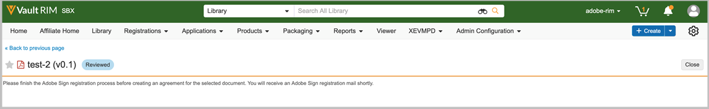
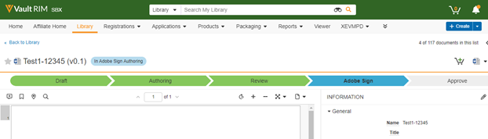

# Adobe Acrobat Sign per [!DNL Veeva Vault]: Guida utente {#veeva-vault-user-guide}

[**Contatta il supporto Adobe Acrobat Sign**](https://adobe.com/go/adobesign-support-center_it)

Questo documento è progettato per facilitare [!DNL Veeva Vault] i clienti imparano a utilizzare Adobe Acrobat Sign per [!DNL Veeva Vault] integrazione per l’invio di un accordo.

## Panoramica {#overview}

Integrazione con Adobe Acrobat Sign [!DNL Veeva Vault] facilita il processo di ottenimento di una firma o approvazione per qualsiasi documentazione che richieda firme legali o un’elaborazione dei documenti verificabile.

Il processo complessivo di invio dei documenti per la firma è simile all’invio di un’e-mail, quindi è facile da adottare per la maggior parte degli utenti.

Integrazione con Adobe Acrobat Sign [!DNL Veeva Vault] semplifica e velocizza i flussi di lavoro relativi a documenti e firme. Utilizzando il flusso di lavoro di integrazione, è possibile:

* Risparmia tempo e risorse dedicate alle lumache, alle riprese notturne o ai fax.
* Invia contratti per la firma elettronica o l’approvazione da [!DNL Veeva Vault], accedere alla cronologia dei contratti in tempo reale e visualizzare i contratti salvati.
* Monitora le trattative in tempo reale nell’organizzazione e ottieni aggiornamenti quando gli accordi vengono visualizzati, firmati, annullati o rifiutati.
* Utilizza eSign in più di 20 lingue e supporta il servizio fax-back in più di 50 località in tutto il mondo.
* Crea modelli di accordo riutilizzabili per le opzioni di invio.

## Invia un accordo utilizzando Adobe Acrobat Sign per [!DNL Veeva Vault] {#send-sign-vault-agreement}

Per inviare un accordo utilizzando Adobe Acrobat Sign per Veeva:

1. Vai alla [[!DNL Veeva Vault] pagina di login](https://login.veevavault.com/) e immetti il nome utente e la password. Viene aperta la home page del Vault, come illustrato di seguito.

   

1. Seleziona **[!UICONTROL Libreria]** , quindi seleziona **[!UICONTROL Crea]** dall&#39;angolo superiore destro.

   

1. Seleziona **[!UICONTROL Carica e continua]**.

1. Carica qualsiasi documento dall’unità locale.

1. Nella finestra di dialogo visualizzata, seleziona **[!UICONTROL Tipo]** as *[!UICONTROL Clinico]* quindi selezionare un **[!UICONTROL Sottotipo]** e **[!UICONTROL Classificazione]**, se necessario.

   

1. Per chiudere la finestra di dialogo, selezionate **[!UICONTROL Ok]**.

1. Seleziona **[!UICONTROL Avanti]**.

1. Nella finestra visualizzata, compila tutti i campi obbligatori nella sezione dei metadati e seleziona **[!UICONTROL Salva]**.

   

1. Crea un documento di prova in **[!UICONTROL Bozza]** , come mostrato di seguito.

   

1. Dall’angolo superiore destro, seleziona  menu a discesa e seleziona **[!UICONTROL Avvia revisione]**.

   

1. Selezionate la proprietà **[!UICONTROL Revisore]** e **[!UICONTROL Data scadenza revisione]**.

1. Seleziona **[!UICONTROL Inizio]**. Modifica lo stato del documento in [!UICONTROL IN REVISIONE].

   

1. Completare l’attività assegnata per conto dei revisori. Al termine, lo stato del documento viene modificato in [!UICONTROL REVISIONATO].

   

1. Seleziona  menu a discesa e seleziona **[!UICONTROL Adobe Sign]**.

   

1. Se la funzione Utenti in più gruppi è abilitata nell’account Adobe Acrobat Sign e il mittente appartiene a più gruppi, viene visualizzata una finestra di dialogo come illustrato di seguito. Nella finestra di dialogo, selezionate il gruppo, quindi selezionate **[!UICONTROL Avanti]**.

   

1. Nella finestra iFrame visualizzata in Vault, immetti l’indirizzo e-mail del destinatario e seleziona **[!UICONTROL Avanti]**.

   

   **Nota:** Se non esiste un account utente Adobe Acrobat Sign per l’e-mail del mittente, nella finestra iFrame viene visualizzato un messaggio, come illustrato di seguito. Inoltre, invia all&#39;utente un&#39;e-mail con le istruzioni per attivare l&#39;account.

   

   

   Tuttavia, se *Fornitura automatica per gli utenti di Sign* la funzione è disattivata, la creazione dell&#39;utente di Adobe Acrobat Sign non riesce e nella finestra iFrame viene visualizzato un messaggio che richiede all&#39;utente di contattare l&#39;amministratore dell&#39;account Adobe Acrobat Sign. L’amministratore dell’account Adobe Acrobat Sign può effettuare una delle seguenti operazioni:

   * Abilita la proprietà *Fornitura automatica per gli utenti di Sign* per l&#39;account.
   * Create l&#39;utente in Adobe Acrobat Sign prima di utilizzare l&#39;integrazione con Veeva Vault Adobe Acrobat Sign.

   

1. Una volta elaborato il documento, trascina i campi Firma dal pannello a destra e seleziona **[!UICONTROL Invia]**.

   

1. Invia il documento ai destinatari per la firma. Quando il destinatario riceve l’e-mail del documento, lo stato del documento cambia da [!UICONTROL Revisionato] a [!UICONTROL In Adobe firma].

   

1. Una volta che tutte le firme sono state acquisite e completate in Adobe Acrobat Sign, lo stato del documento nell’archivio cambia in [!UICONTROL Approvato].

1. Seleziona **[!UICONTROL File documento]** ed espandere la proprietà **[!UICONTROL Renditions]** nel Vault. Una volta che il documento è in stato Approvato, viene creato automaticamente un rendering denominato &quot;Adobe Sign rendering&quot;.

   

1. Scarica il modulo di rendering di Adobe Sign per la convalida della firma del destinatario.

   

## Annullare un accordo utilizzando Adobe Acrobat Sign per [!DNL Veeva Vault] {#cancel-sign-vault-agreement}

1. Vai alla [[!DNL Veeva Vault] pagina di login](https://login.veevavault.com/) e immetti il nome utente e la password. Viene aperta la home page del Vault, come illustrato di seguito.

   

1. Seleziona **[!UICONTROL Libreria]** , quindi selezionare il documento. Lo stato del documento può essere: [!UICONTROL In Adobe Sign Draft], [!UICONTROL In Adobe Sign Authoring]o [!UICONTROL In Adobe firma].

   

1. Seleziona **[!UICONTROL Annulla Adobe Sign]**.

   

1. Attiva l&#39;azione Web e carica la finestra iFrame in [!UICONTROL Vault].

   

1. Lo stato del documento cambia automaticamente in [!UICONTROL Revisione].

   

Dopo che lo stato del documento diventa Revisione, puoi inviarlo nuovamente per la firma.
