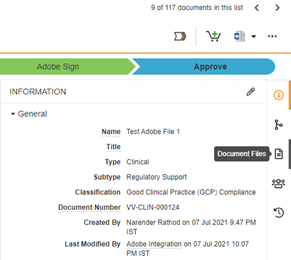

# Firma Adobe per [!DNL Veeva Vault]: Guida dell&#39;utente {#veeva-vault-user-guide}

[**Contatta il supporto di Adobe Sign**](https://adobe.com/go/adobesign-support-center_it)

Questo documento è stato progettato per aiutare [!DNL Veeva Vault] i clienti a imparare come utilizzare Adobe Sign per [!DNL Veeva Vault] l&#39;integrazione per inviare un contratto.

## Panoramica {#overview}

L&#39;integrazione di Adobe Sign con [!DNL Veeva Vault] facilita il processo di ottenimento di una firma o approvazione per qualsiasi documentazione che richieda firme legali o elaborazione di documenti verificabili.

Il processo complessivo di invio dei documenti per la firma è simile all&#39;invio di un&#39;e-mail, quindi è facile da adottare per la maggior parte degli utenti.

L&#39;integrazione di Adobe Sign con [!DNL Veeva Vault] semplifica e velocizza i flussi di lavoro di documenti e firma. Utilizzando il flusso di lavoro di integrazione, è possibile:

* Risparmio di tempo e risorse spese per la posta delle lumache, la notte e il fax.
* Invia contratti per firma elettronica o approvazione da [!DNL Veeva Vault], accedi alla cronologia dei contratti in tempo reale e visualizza i contratti salvati.
* Tenere traccia delle transazioni in tempo reale in tutta l&#39;organizzazione e ottenere aggiornamenti quando i contratti vengono visualizzati, firmati, annullati o rifiutati.
* Utilizza eSign in più di 20 lingue e supporta il servizio fax-back in più di 50 località in tutto il mondo.
* Creare modelli di contratto riutilizzabili per le opzioni di invio.

## Invia un accordo utilizzando Adobe Sign per [!DNL Veeva Vault] {#send-sign-vault-agreement}

Per inviare un accordo utilizzando Adobe Sign per Veeva:

1. Accedere alla [[!DNL Veeva Vault] pagina di accesso](https://login.veevavault.com/) e immettere il nome utente e la password. Apre la home page dell&#39;insieme di credenziali, come mostrato di seguito.

   

1. Selezionare la scheda **[!UICONTROL Libreria]**, quindi selezionare **[!UICONTROL Crea]** dall&#39;angolo superiore destro.

   

1. Selezionare **[!UICONTROL Carica e continuazione]**.

1. Caricare qualsiasi documento dall&#39;unità locale.

1. Nella finestra di dialogo visualizzata, selezionare **[!UICONTROL Tipo]** come *[!UICONTROL Clinica]* e quindi selezionare **[!UICONTROL Sottotipo]** e **[!UICONTROL Classificazione]**, se necessario.

   

1. Selezionare **[!UICONTROL OK]** per chiudere la finestra di dialogo.

1. Selezionare **[!UICONTROL Avanti]**.

1. Nella finestra visualizzata, inserire tutti i campi necessari nella sezione dei metadati e selezionare **[!UICONTROL Salva]**.

   

1. Crea un documento di prova in stato **[!UICONTROL Bozza]**, come illustrato di seguito.

   

1. Dall&#39;angolo in alto a destra, selezionare  menu a discesa e selezionare **[!UICONTROL Avvia revisione]**.

   

1. Selezionare **[!UICONTROL Reviewer]** e **[!UICONTROL Review Due Date]**.

1. Selezionare **[!UICONTROL Start]**. Cambia lo stato del documento in [!UICONTROL IN REVISIONE].

   

1. Completare l&#39;attività assegnata per conto dei revisori. Al termine, il documento viene modificato in [!UICONTROL REVIEWED].

   

1. Selezionare il menu a discesa  e selezionare **[!UICONTROL Adobe Sign]**.

   

1. Nella finestra iFrame visualizzata nell&#39;insieme di credenziali, immettere l&#39;indirizzo e-mail del destinatario e selezionare **[!UICONTROL Avanti]**.

   

1. Una volta elaborato il documento, trascinare e rilasciare i campi Firma dal pannello destro e selezionare **[!UICONTROL Invia]**.

   

1. Invia il documento al destinatario per la firma. Quando il destinatario riceve il messaggio di posta elettronica del documento, lo stato del documento passa da [!UICONTROL Reviewed] a [!UICONTROL In Adobe Signing].

   

1. Una volta acquisite e completate tutte le firme in Adobe Sign, lo stato del documento nell&#39;insieme di credenziali diventa [!UICONTROL Approvato].

1. Selezionare l&#39;opzione **[!UICONTROL File di documento]** ed espandere la sezione **[!UICONTROL Renditions]** nell&#39;insieme di credenziali. Crea automaticamente una nuova copia trasformata denominata &#39;Adobe Sign Rendition&#39; una volta che il documento è in stato Approvato.

   

1. Scaricare la copia trasformata di Adobe Sign per la convalida della firma del destinatario.

   

## Annulla un accordo utilizzando Adobe Sign per [!DNL Veeva Vault] {#cancel-sign-vault-agreement}

1. Accedere alla [[!DNL Veeva Vault] pagina di accesso](https://login.veevavault.com/) e immettere il nome utente e la password. Apre la home page dell&#39;insieme di credenziali, come mostrato di seguito.

   

1. Selezionare la scheda **[!UICONTROL Libreria]**, quindi selezionare il documento. Lo stato del documento può essere: [!UICONTROL In Adobe Sign Draft], [!UICONTROL In Adobe Sign Authoring] o [!UICONTROL In Adobe Signing].

   

1. Selezionare **[!UICONTROL Annulla simbolo Adobe]**.

   

1. Attiva l&#39;azione Web e carica la finestra iFrame in [!UICONTROL Vault].

   

1. Lo stato del documento passa automaticamente a [!UICONTROL Review].

   

Dopo la modifica dello stato del documento in Revisione, è possibile inviarlo nuovamente per la firma.
