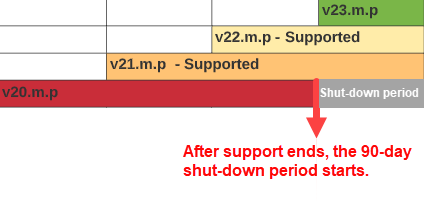

# Versioni del prodotto e ciclo di vita {#version}

La convenzione di gestione delle versioni di Adobe Sign e il ciclo di vita del supporto per i servizi integrati si allineano con altri prodotti di Adobe che forse conoscete.

## Numeri di versione

La versione del pacchetto utilizza un sistema di numerazione in tre parti per identificare il numero di build sequenziale della versione rilasciata e l&#39;importazione relativa dell&#39;aggiornamento in termini di contenuti nuovi o in evoluzione.

Il numero di versione segue questo modello: N.m.p

Dove, N = versione principale; m = versione minore; p = Versione corretta.

Ad esempio, un pacchetto di integrazione versione 23.2.1 indica uno stato di rilascio di:

* Versione principale: 23
* Versione secondaria: 2
* Versione patch: 1

Quando gli ingegneri sviluppano nuove &quot;build&quot; del pacchetto, incrementano il numero di versione in base alla natura degli aggiornamenti al codice.

* Le principali modifiche alle versioni comportano un&#39;aggiunta significativa di funzionalità o un cambiamento importante nei sistemi centrali.
* Gli aggiornamenti di versioni minori includono aggiornamenti di funzionalità minori e patch di sicurezza. Adobe Sign potrebbe richiedere un aggiornamento alla versione patch più recente in caso di aggiornamenti di sicurezza o per risolvere un problema segnalato.
* Le versioni patch sono quasi esclusivamente correzioni di bug e regolazioni dell’interfaccia utente

>[!NOTE]
>
>Tutte le versioni non vengono rilasciate al pubblico mentre il prodotto continua lo sviluppo. Quindi, potrebbero esserci salti significativi nella versione patch tra le varie versioni.

Gli amministratori devono mantenere la loro versione aggiornata per garantire che l’account abbia accesso completo a tutte le funzioni e che tutti i problemi di sicurezza noti siano corretti. Adobe Sign potrebbe richiedere un aggiornamento alla versione patch più recente in caso di problemi di sicurezza o per risolvere un problema critico del sistema.

## Ciclo di vita del supporto delle versioni

Il ciclo di vita del supporto delle versioni di un prodotto di integrazione Adobe Sign è definito in base alla versione principale del pacchetto e indica il periodo di tempo entro il quale Adobe Sign supporta attivamente la singola versione dell’integrazione.

Adobe Sign supporta la versione corrente di un pacchetto e le due versioni principali precedenti (inclusi tutti gli aggiornamenti delle patch e delle versioni minori correlati). Le versioni principali sono espresse come segue:

* Versione corrente (N): La versione principale più recente del pacchetto
* Versione precedente (N-1): Una versione principale precedente all&#39;ultima versione
* Ultima versione supportata (N-2): Due versioni principali precedenti alla versione corrente

Ad esempio, se la versione corrente disponibile del pacchetto è 23.2.1, allora:

* La versione principale corrente (N) è 23
* La versione principale precedente (N-1) di questo pacchetto è 22
* L’ultima versione principale supportata (N-2) di questo pacchetto è 21
* Ogni versione precedente alla 21.0.0 non è supportata

## Ciclo di vita del servizio delle versioni

Il ciclo di vita del servizio di versione definisce l&#39;ambito completo di quando il servizio è utilizzabile. La timeline corrisponde al ciclo di vita del supporto delle versioni con l’aggiunta di un periodo di tolleranza di 90 giorni che consente ai clienti di completare l’aggiornamento.

* Durante il periodo di tolleranza di una versione non supportata, il supporto viene fornito solo per l’aggiornamento a una versione più recente, non per mantenere una versione non supportata
* Dopo il periodo di tolleranza, la versione non è più in servizio

* Adobe Sign non accetta richieste da versioni non in servizio
* Una volta aggiornata l’integrazione alla versione corrente, le comunicazioni tra Adobe Sign e l’integrazione riprenderanno normalmente

Per qualsiasi domanda, contatta il tuo rivenditore o l&#39;assistenza clienti.
