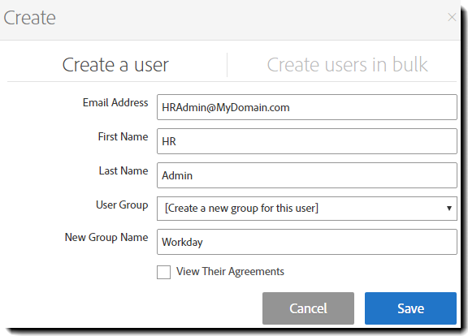

# [!DNL Workday] Guida all’installazione{#workday-installation-guide}

[**Contatta il supporto di Adobe Sign**](https://adobe.com/go/adobesign-support-center_it)

## Panoramica {#overview}

Questo documento spiega come integrare Adobe Sign nel tenant [!DNL Workday]. Per utilizzare Adobe Sign all&#39;interno di [!DNL Workday], è necessario sapere come creare e modificare [!DNL Workday] elementi quali:

* Framework di processo aziendale
* Configurazione e configurazione tenant
* Reporting e integrazione in studio [!DNL Workday]

Le fasi di alto livello per completare l&#39;integrazione sono:

* Attiva il tuo account amministrativo in Adobe Sign (solo nuovi clienti)
* Configurare un gruppo in Adobe Sign per mantenere l&#39;utente di integrazione [!DNL Workday]
* Stabilire la relazione OAuth tra [!DNL Workday] e Adobe Sign

## Attiva l&#39;account di Adobe Sign {#activating-your-adobe-sign-account}

I clienti esistenti con account consolidati possono passare all&#39;argomento [Configura Adobe Sign per [!DNL Workday]](#config).

Per i clienti nuovi di Adobe Sign che non dispongono di un login preesistente, un esperto Adobe in modalità On-boarding fornisce l&#39;account (in Adobe Sign) per [!DNL Workday]. Una volta completato, riceverai un&#39;e-mail di conferma come mostrato di seguito.

Per inizializzare l&#39;account, è necessario seguire le istruzioni contenute nell&#39;e-mail e accedere alla pagina Adobe Sign [!UICONTROL Home].

## Configura Adobe Sign per [!DNL Workday] {#config}

Per configurare Adobe Sign per [!DNL Workday], è necessario generare due oggetti dedicati seguenti nel sistema Adobe Sign:

* **Un  [!DNL Workday] gruppo**:  [!DNL Workday] richiede un &quot;gruppo&quot; dedicato all&#39;interno dell&#39;account Adobe Sign per abilitare la funzionalità di integrazione. Il gruppo Adobe Sign viene utilizzato per controllare solo l&#39;utilizzo di [!DNL Workday] Adobe Sign. Qualsiasi altro utilizzo potenziale, come Salesforce.com o Arriba, non è interessato. Le notifiche tramite posta elettronica vengono soppresse nel gruppo [!DNL Workday] in modo che gli utenti [!DNL Workday] ricevano notifiche solo nella posta in arrivo [!DNL Workday].

* **Utente autenticante che detiene la chiave** di integrazione: Un  [!DNL Workday] gruppo deve avere un solo amministratore a livello di gruppo, che è il titolare autorevole della chiave di integrazione. Si consiglia all&#39;amministratore di utilizzare un indirizzo di posta elettronica funzionale, ad esempio `HR@MyDomain.com`, anziché un&#39;e-mail personale, per ridurre il rischio di disabilitazione dell&#39;utente in futuro e di conseguenza disattivare l&#39;integrazione.

### Creare un utente e un gruppo in Adobe Sign {#create-a-user-and-group-in-adobe-sign}

Per creare un utente in Adobe Sign:

1. Accedere ad Adobe Sign come amministratore dell&#39;account..
1. Passare a **[!UICONTROL Account]** > **[!UICONTROL Utenti]**.
1. Fare clic sull&#39;icona  per creare un nuovo utente.

   

1. Nella finestra di dialogo visualizzata, fornire i dettagli del nuovo utente:

   * Fornire un&#39;e-mail funzionale a cui è possibile accedere.
   * Immettere un valore appropriato per il nome e il cognome.
   * Selezionare **[!UICONTROL Crea un nuovo gruppo per l&#39;utente]** dal gruppo utenti.
   * Fornire il **[!UICONTROL Nuovo nome gruppo]** con un nome intuitivo come *[!DNL Workday]*.

   

1. Fai clic su **[!UICONTROL Salva]**.

   Viene visualizzata nuovamente la pagina [!UICONTROL Utenti] che elenca il nuovo utente con uno stato **[!UICONTROL CREATED]**.

   

Per verificare l&#39;indirizzo di posta elettronica dell&#39;utente con stato &quot;Creato&quot;:

1. Accedere all&#39;e-mail del nuovo utente.
2. Trova l&#39;e-mail &quot;Benvenuto in Adobe Sign&quot;.
3. Fare clic sul punto in cui è indicato **[!UICONTROL Fare clic qui per impostare la password]**.
4. Impostare la password.

Una volta verificato l&#39;indirizzo di posta elettronica, lo stato dell&#39;utente passa da [!UICONTROL CREATED] a [!UICONTROL ACTIVE].

### Definire l&#39;utente che esegue l&#39;autenticazione {#define-the-authenticating-user}

Per promuovere il nuovo utente nel gruppo [!DNL Workday]:

1. Passare alla pagina [!UICONTROL Utenti] (se non è già presente).
2. Fare doppio clic sull&#39;utente nel gruppo [!DNL Workday].

   Verrà aperta una pagina [!UICONTROL Modifica] per le autorizzazioni utente.

3. Selezionare il comando **[!UICONTROL Amministratore gruppo]**.
4. Fai clic su **[!UICONTROL Salva]**.

## Configurare il tenant [!DNL Workday] {#configure-workday}

Per completare la connessione tra il tenant [!DNL Workday] e Adobe Sign, è necessario stabilire una relazione attendibile tra i servizi. Una volta completato, è possibile aggiungere un passo Revisione documento che consente il processo di firma tramite Adobe Sign.

>[!NOTE]
>
>Adobe Sign è contrassegnato come Adobe Document Cloud in tutto l&#39;ambiente [!DNL Workday].

Per stabilire la relazione di affidabilità:

1. Accedere a [!DNL Workday] come amministratore dell&#39;account.
1. Aprire la pagina **[!UICONTROL Modifica impostazione tenant - Processi aziendali]**.
1. Individua la sezione [!UICONTROL eSignature Configuration] (Configurazione firma elettronica):

   

1. Fare clic su **[!UICONTROL Autenticate con Adobe]**.

   Viene avviata la sequenza di autenticazione OAuth2.0.

1. Quando richiesto, fornire le credenziali per l&#39;amministratore Adobe Sign Group creato in precedenza.
1. Approva l&#39;accesso a Adobe Sign.

>[!NOTE]
>
>Prima di procedere, assicurarsi di disconnettersi completamente da qualsiasi altra istanza di Adobe Sign.

Una volta effettuata la connessione, la casella di controllo Adobe configuration enabled (Configurazione di Adobe attivata) è impostata e puoi iniziare a utilizzare Adobe Sign con [!DNL Workday].

### Configura il passaggio del documento di revisione {#configure-review}

Il documento per la fase di revisione del documento può essere uno dei seguenti:

* Un documento statico
* Documento generato da un passaggio Genera documento all&#39;interno dello stesso processo aziendale
* Report formattato creato con Progettazione report [!DNL Workday]

È possibile aggiungere questi documenti con [Adobe Text Tags](https://adobe.com/go/adobesign_text_tag_guide_it) per controllare l&#39;aspetto e la posizione dei componenti specifici di Adobe Signing. È necessario specificare l&#39;origine del documento nella definizione del processo aziendale. Non è possibile caricare un documento ad hoc durante l&#39;esecuzione del processo aziendale.

L&#39;utilizzo esclusivo di Adobe Sign con un passaggio di revisione del documento è la possibilità di disporre di gruppi di firme serializzati. Ciò consente di specificare gruppi basati su ruoli per la firma in sequenza. Adobe Sign non supporta gruppi di firma paralleli.

Per assistenza nella configurazione del passaggio del documento di revisione, fare riferimento alla [Guida di avvio rapido](https://adobe.com//go/adobesign_workday_quick_start){target=&quot;_blank&quot;}.

## Supporto {#support}

### [!DNL Workday] sostegno {#workday-support}

[!DNL Workday] è il responsabile del processo di integrazione e deve essere considerato come il principale riferimento di contatto per domande relative a integrazione, richieste di funzionalità o problemi nelle operazioni quotidiane dell’integrazione.

Per informazioni sulla risoluzione dei problemi di integrazione e la generazione di documenti, consultare i seguenti articoli della community [!DNL Workday]:

* [Risoluzione dei problemi relativi alle integrazioni eSignature](https://doc.workday.com/#/reader/3DMnG~27o049IYFWETFtTQ/zhA~hYllD3Hv1wu0CvHH_g)
* [Passaggio di verifica documenti](https://doc.workday.com/#/reader/3DMnG~27o049IYFWETFtTQ/TboWWKQemecNipWgxLAjqg)
* [Generazione di documenti dinamici](https://community.workday.com/saml/login?destination=/articles/176443)
* [Suggerimenti per la generazione dei documenti](https://community.workday.com/node/183242)

### Supporto di Adobe Sign {#adobe-sign-support}

In quanto partner per integrazione, è necessario contattare il supporto di Adobe Sign se l’integrazione non è in grado di ottenere firme o se si verificano problemi di notifica delle firme in sospeso.

I clienti Adobe Sign possono contattare il proprio Customer Success Manager (CSM) per ricevere assistenza. In alternativa, è possibile rivolgersi al supporto tecnico di Adobe telefonando al numero 1-866-318-4100 e digitando 4 in seguito all’elenco dei prodotti, quindi 2 (quando richiesto).

* [Aggiunta di tag di testo Adobe ai documenti](https://adobe.com/go/adobesign_text_tag_guide)
* [Esaminare la configurazione del documento e gli esempi](https://www.adobe.com/go/adobesign_workday_quick_start)

## Domande frequenti {#faq}

### Perché lo stato non viene aggiornato all&#39;interno di [!DNL Workday] anche quando il documento è completamente firmato? {#why-is-the-status-not-being-updated-within-workday-even-the-document-is-fully-signed}

Lo stato del documento in [!DNL Workday] potrebbe non riflettere se il candidato non fa clic sul pulsante &#39;[!UICONTROL Invia]&#39; dopo aver effettuato la firma in Adobe Sign.

Come per [!DNL Workday] attività Controlla stato firma eSignature: Per avviare il processo, l&#39;utente può inviare l&#39;attività Posta in arrivo associata.

In base a [!DNL Workday] Sviluppo: La firma originale completa il processo solo se l&#39;utente invia l&#39;attività Posta in arrivo dopo aver firmato il documento. Dopo la firma, l&#39;immagine viene chiusa e l&#39;utente viene reindirizzato alla stessa attività, dove può fare clic sul pulsante [!UICONTROL Invia] per completare il processo.
