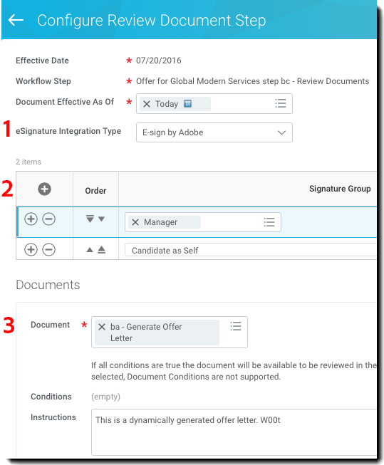

# [!DNL Workday] Guida introduttiva{#workday-quick-start-guide}

[**Contatta il supporto di Adobe Sign**](https://www.adobe.com/go/adobesign-support-center)

## Panoramica {#overview}

Questo documento è progettato per facilitare [!DNL Workday] gli amministratori comprendono come personalizzare [!DNL Workday] Processi aziendali per includere Adobe Sign per ottenere firme elettroniche. Per utilizzare Adobe Sign all&#39;interno di [!DNL Workday], devi sapere come creare e modificare [!DNL Workday] elementi quali:

* [!UICONTROL Business Process Framework]
* Configurazione e configurazione del tenant
* Segnalazione e [!DNL Workday] Integrazione con studio

## Accesso ad Adobe Sign in [!DNL Workday] {#access-adobe-sign}

[!UICONTROL Funzionalità di firma elettronica di Adobe Sign] viene visualizzata come [!UICONTROL Passaggio Rivedi documento] all&#39;interno del [!UICONTROL Business Process Framework (BPF)] e come attività Distribuisci documenti.

## [!UICONTROL Passaggio Review Document (Rivedi documento)] {#review-document-step}

Adobe Sign per [!DNL Workday] viene esposto tramite [!UICONTROL Passaggio Rivedi documento] che puoi aggiungere a uno degli oltre 400 processi aziendali all&#39;interno di [!DNL Workday], tra cui [!UICONTROL Offerta], [!UICONTROL Distribuire documenti e attività], [!UICONTROL Proposta di compensazione]e altro ancora.

È possibile fare riferimento alla proprietà [[!DNL Workday] articoli comunitari su [!UICONTROL Passaggio Rivedi documento]](https://doc.workday.com/#/reader/3DMnG~27o049IYFWETFtTQ/TboWWKQemecNipWgxLAjqg).

Esiste una relazione 1:1 tra [!UICONTROL [!UICONTROL Passaggio Rivedi documento]s] e transazioni fatturabili con Adobe Sign. È possibile combinare più documenti in un unico documento [!UICONTROL Passaggio Rivedi documento] e sono presentati come un unico pacchetto per la firma.

**Nota**: Solo un *Dinamico* è possibile fare riferimento a un documento specifico [!UICONTROL Passaggio Rivedi documento].

Definizione di una funzione [!UICONTROL Passaggio Rivedi documento]:

1. Inserire un [!UICONTROL Passaggio Rivedi documento].
1. Specifica i gruppi (ruoli) che possono agire sulla [!UICONTROL Passaggio Rivedi documento].

Per configurare la proprietà [!UICONTROL Passaggio Rivedi documento]:

1. Specificare il parametro *[!UICONTROL Tipo di integrazione eSignature]* as *[!UICONTROL eSign per Adobe]*.

1. Aggiungi righe alla griglia delle firme.

   * La griglia delle firme specifica l’ordine seriale secondo cui il documento viene indirizzato per la firma. Ogni riga può contenere uno o più ruoli e ogni riga rappresenta un passaggio del processo di firma..
   * A ogni membro del ruolo all&#39;interno di un determinato passaggio viene notificato che un evento di firma è in attesa.
   * Una volta che una singola persona del ruolo firma, il passaggio della riga viene completato e il documento viene spostato al passaggio della riga successiva.
   * Quando tutte le righe sono state firmate, la proprietà [!UICONTROL Passaggio Rivedi documento] è completo.

1. Specifica il documento da firmare. Se il documento è [!UICONTROL Offer BP], potete usarlo da un passaggio Genera documento. In caso contrario, seleziona un documento o report esistente.

1. Ripeti il passaggio 3 per tutti i documenti interessati..

   

1. Facoltativamente, aggiungi un &quot;utente di reindirizzamento&quot; per acquisire le azioni di &quot;rifiuto di firmare&quot;. Quando gli utenti rifiutano, [!DNL Workday] reindirizza i documenti a un gruppo di sicurezza configurato per la revisione.

Dal menu Azioni correlate di un [!UICONTROL Passaggio Rivedi documento], seleziona **[!UICONTROL Processo aziendale]** > **[!UICONTROL Mantieni reindirizzamento]**. Quindi, selezionate una delle seguenti opzioni:

* **[!UICONTROL Porta indietro]**: Per consentire ai membri del gruppo di sicurezza di inviare un passo indietro rispetto a un passaggio precedente nel processo aziendale. Il processo aziendale riparte quindi da tale passaggio.
* **[!UICONTROL Passa al passaggio successivo]**: Per consentire ai membri del gruppo di sicurezza di passare al passaggio successivo del processo aziendale.
* **[!UICONTROL Gruppi di sicurezza]**: Per reindirizzare i passaggi del flusso del processo aziendale. I gruppi di sicurezza visualizzati a questo prompt sono selezionati nella policy di protezione dei processi aziendali nella sezione Reindirizzamento.

## Note sulle fasi del processo aziendale {#business-process-step-notes}

[!UICONTROL Il quadro per i processi aziendali] è potente; tuttavia, devi assicurarti che:

* Ogni processo aziendale deve avere una fase di completamento, che è idealmente alla fine del processo aziendale.

* Un passaggio di completamento è impostato dal menu azioni correlate dell’icona di ricerca. Ciò è possibile solo durante la &quot;visualizzazione&quot; della pressione e non durante la &quot;modifica&quot;.

* Ogni fase del processo aziendale viene eseguita in sequenza.

   È possibile modificare l’ordine di un passaggio modificando il valore dell’ordine. Ad esempio, per inserire un passaggio tra gli elementi &quot;c&quot; e &quot;d&quot;, specificate un nuovo elemento come &quot;ca&quot;.

### Esempio: offerta {#example-offer}

Il processo aziendale Offer è un processo secondario del [!UICONTROL Job Application Dynamic BP] deve essere configurato per eseguire il processo aziendale Offer. Viene attivato quando lo stato della candidatura viene spostato in &quot;[!UICONTROL Offerta]&quot; o &quot;[!UICONTROL Fai un&#39;offerta]&quot;.

Nell&#39;esempio seguente, un [!UICONTROL Passaggio Rivedi documento] utilizza un passaggio Dynamic Document per il Nord America e il Giappone.

![[!DNL Workday]Esempio di un processo aziendale di ](images/bp-for-offersmaller-575.png)

Questo processo aziendale prevede i seguenti passaggi:

* Chiede al promotore del BP di proporre un risarcimento per il candidato (passaggio b).
* Utilizza una condizione step per verificare se il paese corrente NON è il Giappone.

   Se true, viene eseguito il passaggio &quot;ba&quot; che utilizza un documento in lingua inglese.

   Se è false, viene eseguito il passaggio &quot;bb&quot; che utilizza un documento in lingua giapponese.

* Definisce il processo di firma nel metodo [!UICONTROL Passaggio Rivedi documento] &quot;bc&quot;.
* Definisce il punto decisionale per fare un&#39;offerta nel passaggio di completamento richiesto &quot;d&quot;.

Il documento dinamico generato nel passaggio “ba” è denominato [!UICONTROL Offer Letter] (Lettera di offerta) e contiene un singolo blocco di testo denominato [!UICONTROL Rapid Offer] (Offerta rapida). Potete aggiungere più blocchi di testo, ad esempio intestazione, formula di saluto, compenso, stock, chiusura, termini e altro ancora.

![[!DNL Workday] pagina visualizza documento](images/offer-letter-575.png)

La lettera di offerta dinamica riportata di seguito viene creata nel [!DNL Workday] editor rich text. Gli elementi evidenziati in *grigio* sono [!DNL Workday] oggetti forniti che fanno riferimento a dati contestuali.

Gli elementi tra {{parentesi}} sono [tag di testo di Adobe](https://adobe.com/go/adobesign_text_tag_guide_it).

All&#39;interno della [!UICONTROL Passaggio Rivedi documento], al documento dinamico viene fatto riferimento dal passaggio precedente e viene definito il processo di firma sequenziale tramite due gruppi di firma.

Il comportamento illustrato di seguito indirizza il documento generato dinamicamente prima al responsabile delle assunzioni e poi al candidato.

![[!DNL Workday] gruppi di firma da definire](images/configure-rd-stepsmaller-575.png)

### Esempio: Distribuire i documenti {#example-distribute-documents}

Introdotto in [!DNL Workday] 30, l&#39;attività Distribuisci in massa documenti o attività può essere utilizzata per inviare un singolo documento a un gruppo di grandi dimensioni (&lt;20 K) di singoli firmatari. È soggetta alla limitazione di una singola firma per documento. La creazione di una distribuzione viene eseguita accedendo alla proprietà &quot;[!UICONTROL Creare documenti o attività]Azione dalla barra di ricerca.

Esempio: Invia un modulo di scelta del valore netto del dipendente a tutti i responsabili con [!UICONTROL Global Modern Services]. Se necessario, puoi filtrarlo ulteriormente per singoli manager.

È anche possibile accedere alla proprietà **Visualizzazione di documenti o attività di distribuzione** per tenere traccia dell&#39;avanzamento della distribuzione.

### Esempio: generazione di report {#example-reporting}

[!DNL Workday] ha una potente infrastruttura per la generazione di report. Per visualizzare i dettagli sul processo di Adobe Sign, analizza gli elementi relativi alla voce *Review Document Event* (Evento Rivedi documento).

Di seguito viene riportato un semplice report personalizzato che può essere eseguito in tutti i processi aziendali per cercare transazioni Adobe Sign e il relativo stato.

![[!DNL Workday]Esempio di un report personalizzato di ](images/review-document-eventsmaller-575.png)

Il report seguente è stato generato con riferimento ai processi aziendali Offer (Offerta), Onboarding (On-boarding) e Propose Compensation (Proponi compenso) all’interno di un titolare di implementazione.

È possibile visualizzare:

* i documenti inviati per la firma;
* il passaggio del processo aziendale associato;
* la persona successiva in attesa di firma.

![[!DNL Workday]Esempio di un report di mediante tre oggetti](images/workday-reportsmaller-575.png)

## Documenti firmati {#signed-documents}

Il [!DNL Workday] il ciclo di firma elimina tutte le notifiche e-mail di Adobe Sign. Gli utenti vengono informati delle azioni in sospeso all&#39;interno del proprio [!DNL Workday] posta in arrivo.

Una volta che un documento è stato firmato da tutti i gruppi di firma, una copia del documento firmato viene distribuita a tutti i membri del gruppo di firma tramite e-mail.

Per eliminare questo comportamento, è possibile contattare il [!UICONTROL Adobe Sign Success Manager] o la [Team di supporto di Adobe Sign](https://adobe.com/go/adobesign-support-center).

All&#39;interno [!DNL Workday], puoi accedere ai documenti firmati nel record completo del processo. Puoi trovare:

* I documenti del lavoratore nel profilo del lavoratore e
* Documenti candidati (lettere di offerta) nel profilo Candidato.

L&#39;immagine seguente mostra una lettera di offerta firmata per il candidato Chris Foxx.

![Esempio [!DNL Workday] lettera di offerta](images/offer.png)

## Supporto {#support}

### [!DNL Workday] supporto {#workday-support}

[!DNL Workday] è il responsabile del processo di integrazione e deve essere considerato come il principale riferimento di contatto per domande relative a integrazione, richieste di funzionalità o problemi nelle operazioni quotidiane dell’integrazione.

Il [!DNL Workday] la community contiene diversi articoli utili su come risolvere i problemi di integrazione e generare documenti:

* [Risoluzione di problemi relativi alle integrazioni di firma elettronica](https://doc.workday.com/#/reader/3DMnG~27o049IYFWETFtTQ/zhA~hYllD3Hv1wu0CvHH_g)
* [Passaggio di revisione dei documenti](https://doc.workday.com/#/reader/3DMnG~27o049IYFWETFtTQ/TboWWKQemecNipWgxLAjqg)
* [Generazione di documenti dinamici](https://community.workday.com/node/176443)
* [Suggerimenti per la configurazione relativa alla generazione di documenti di offerta](https://community.workday.com/node/183242)

### Supporto Adobe Sign {#adobe-sign-support}

In quanto partner per integrazione, è necessario contattare il supporto di Adobe Sign se l’integrazione non è in grado di ottenere firme o se si verificano problemi di notifica delle firme in sospeso.

I clienti Adobe Sign devono contattare il proprio Customer Success Manager per assistenza. In alternativa, [!UICONTROL Adobe supporto tecnico] è possibile raggiungerlo per telefono: 1-866-318-4100, attendi l&#39;elenco dei prodotti e inserisci: 4 e poi 2 (come richiesto).

* [Aggiunta di tag di testo di Adobe ai documenti](https://www.adobe.com/go/adobesign_text_tag_guide)

<!--
[Download PDF](images/adobe-sign-for-workday-quick-start-guide-2016.pdf)
-->
