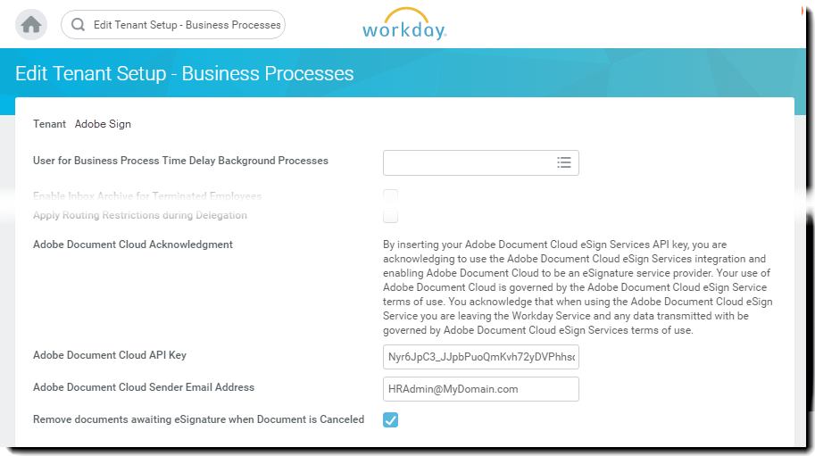

# [!DNL Workday] Installazione della versione di prova{#workday-trial-installation}

## Panoramica {#overview}

Questo documento è stato progettato per aiutare [!DNL Workday] i clienti a imparare come attivare un account di prova con Adobe Sign e quindi integrarlo nel [!DNL Workday] tenant. Per utilizzare Adobe Sign all&#39;interno di [!DNL Workday], è necessario sapere come creare e modificare [!DNL Workday] elementi quali:

* Framework di processo aziendale
* Configurazione e configurazione tenant
* Reporting e [!DNL Workday] integrazione in studio

**Nota**: Se si dispone di un account Adobe Sign esistente, non è necessario avviare una prova. È possibile contattare Client Success Manager per richiedere l&#39;integrazione [!DNL Workday].

I principali passaggi per completare l&#39;integrazione sono:

* Attivazione dell&#39;account di prova con Adobe Sign
* Genera una chiave di integrazione in Adobe Sign
* Installare la chiave di integrazione nel tenant [!DNL Workday]

## Attiva l&#39;account di valutazione di Adobe Sign {#activate-sign-trial-account}

Per richiedere una prova di 30 giorni di Adobe Sign, è necessario compilare questo modulo di registrazione .

**Nota**: È consigliabile utilizzare un indirizzo di posta elettronica funzionale valido per creare la versione di valutazione e non un messaggio di posta elettronica temporaneo. Per verificare l&#39;account, è necessario accedere a questa e-mail, quindi l&#39;indirizzo deve essere valido.

Entro un giorno lavorativo, un tecnico Adobe Sign-On-boarding fornisce il tuo account (in Adobe Sign) per [!DNL Workday]. Una volta completato, riceverai un&#39;e-mail di conferma come mostrato di seguito.

Seguire le istruzioni indicate nell&#39;e-mail per inizializzare l&#39;account e accedere alla pagina Adobe Sign [!UICONTROL Home].

## Genera una chiave di integrazione {#generate-an-integration-key}

Per le nuove installazioni, è necessario generare una chiave di integrazione in Adobe Sign, quindi immetterla in [!DNL Workday]. Questa chiave autentica gli ambienti Adobe Sign e [!DNL Workday] in modo da poterli fidare l&#39;uno dell&#39;altro e condividere il contenuto.

Per generare una chiave di integrazione in Adobe Sign:

1. Accedi alla pagina di amministrazione di Adobe Sign..
1. Passare a **[!UICONTROL **Account]** > **[!UICONTROL Preferenze personali]** > **[!UICONTROL Token di accesso**]**.
1. Fare clic sull&#39;icona **cerchiato più sul lato destro della finestra.**

   Apre l&#39;interfaccia [!UICONTROL Crea chiave di integrazione].

   

1. Fornire un nome intuitivo per la chiave, ad esempio [!DNL Workday].

   È necessario che i seguenti elementi della chiave di integrazione siano abilitati:

   * agreement_read
   * agreement_write
   * agreement_send
   * widget_read
   * library_read

   

1. Fai clic su **[!UICONTROL Salva]**.

   Viene visualizzata la pagina [!UICONTROL Token di accesso] in cui sono riportate le chiavi definite per il tuo account.

1. Fai clic sulla definizione della chiave creata per [!DNL Workday].

   Il collegamento [!UICONTROL Chiave di integrazione] è esposto nella parte superiore della definizione.

1. Fare clic sul collegamento **[!UICONTROL Tasto di integrazione]**.

   Espone la chiave di integrazione.

   

1. Copiare questo tasto e salvarlo in un luogo sicuro per il passaggio successivo.
1. Fai clic su **[!UICONTROL OK]**.

   

## Configurare il tenant [!DNL Workday] {#configuring-the-workday-tenant}

### Installa la chiave di integrazione {#install-the-integration-key}

L&#39;installazione della chiave di integrazione nel tenant [!DNL Workday] stabilisce la relazione di trust con Adobe Sign. Una volta stabilita la relazione, qualsiasi processo aziendale può avere aggiunto un [!UICONTROL Verifica fase documento] che abilita il processo di firma.

**Nota**[!DNL Workday]: Adobe Sign è indicato come &quot;Adobe Document Cloud&quot; nell&#39;ambiente di 

Per installare la chiave di integrazione:

1. Accedere a [!DNL Workday] come amministratore dell&#39;account.
1. Cercare e aprire la pagina **[!UICONTROL Modifica impostazione tenant - Processi aziendali]**.

1. Fornire informazioni per i quattro campi seguenti:

   * **[!UICONTROL Riconoscimento]** cloud di Adobe Document: Conferma di testo fisso dell&#39;integrazione.

   * **[!UICONTROL Chiave]** API cloud Adobe Document: Dove è installata la chiave di integrazione

   * **[!UICONTROL Indirizzo]** e-mail mittente cloud Adobe Document: Indirizzo di posta elettronica dell&#39;amministratore a livello di gruppo in Adobe Sign

   * **[!UICONTROL Rimuovi documenti in attesa di eSignature quando il documento viene annullato]**: Configurazione facoltativa che rimuove i documenti dal ciclo di firma se un documento viene annullato in  [!DNL Workday].

   

1. Completare l&#39;installazione:

   1. Incolla la chiave di integrazione nel campo [!UICONTROL Chiave di integrazione API Adobe Sign.]
   1. Immettere l&#39;indirizzo di posta elettronica dell&#39;amministratore di Adobe Sign nel campo [!UICONTROL Indirizzo e-mail mittente cloud Adobe Document].
   1. Fai clic su **[!UICONTROL OK]**.

   

È ora possibile aggiungere la funzionalità di Adobe Sign a a qualsiasi processo aziendale aggiungendo un [!UICONTROL Review Document Step] e configurandola per utilizzarla come tipo eSignature con **[!UICONTROL eSign da Adobe]**.

### Configura il passaggio del documento di revisione {#configure-the-review-document-step}

Il documento per la fase di revisione del documento può essere un documento statico; un documento generato da una fase Genera documento all&#39;interno dello stesso processo aziendale; oppure, un report formattato creato con la finestra di progettazione report [!DNL Workday]. Per ognuno dei casi riportati è possibile usufruire dei [tag di testo di Adobe](https://adobe.com/go/adobesign_text_tag_guide_it) per controllare l&#39;aspetto e la posizione di specifici componenti di Adobe Sign. È necessario specificare l&#39;origine del documento nella definizione del processo aziendale. Non è possibile caricare un documento ad hoc durante l&#39;esecuzione del processo aziendale.

L&#39;utilizzo esclusivo di Adobe Sign con un passaggio di revisione del documento è la possibilità di disporre di gruppi di firme serializzati. I gruppi di firme consentono di specificare i gruppi basati su ruoli che eseguono l&#39;accesso in sequenza. Adobe Sign non supporta gruppi di firma paralleli.

Per assistenza nella configurazione della fase di revisione del documento, è possibile fare riferimento alla [Guida di avvio rapido](https://adobe.com//go/adobesign_workday_quick_start){target=&quot;_blank&quot;}.

## Supporto {#support}

### [!DNL Workday] sostegno {#workday-support}

[!DNL Workday] è il responsabile del processo di integrazione e deve essere considerato come il principale riferimento di contatto per domande relative a integrazione, richieste di funzionalità o problemi nelle operazioni quotidiane dell’integrazione.

La comunità [!DNL Workday] dispone di numerosi articoli validi su come risolvere i problemi relativi all&#39;integrazione e generare documenti:

* [Risoluzione di problemi relativi alle integrazioni di firma elettronica](https://doc.workday.com/#/reader/3DMnG~27o049IYFWETFtTQ/zhA~hYllD3Hv1wu0CvHH_g)
* [Passaggio di revisione dei documenti](https://doc.workday.com/#/reader/3DMnG~27o049IYFWETFtTQ/TboWWKQemecNipWgxLAjqg)
* [Generazione di documenti dinamici](https://community.workday.com/node/176443)

* [Suggerimenti per la configurazione relativa alla generazione di documenti di offerta](https://community.workday.com/node/183242)

### Supporto di Adobe Sign {#adobe-sign-support}

In quanto partner per integrazione, è necessario contattare il supporto di Adobe Sign se l’integrazione non è in grado di ottenere firme o se si verificano problemi di notifica delle firme in sospeso.

I clienti Adobe Sign possono contattare il proprio Customer Success Manager (CSM) per ricevere assistenza. In alternativa, è possibile contattare il supporto tecnico Adobe per telefono: 1-866-318-4100; attendere l&#39;elenco prodotti, quindi immettere: 4 e 2 (come richiesto).

* [Aggiunta di tag di testo di Adobe ai documenti](https://adobe.com/go/adobesign_text_tag_guide)

* [Configurazione ed esempi per la revisione di documenti](https://experienceleague.adobe.com/docs/dc-sign-integrations/using/workday/quick-start.html)

[**Contatta il supporto di Adobe Sign**](https://adobe.com/go/adobesign-support-center_it)
